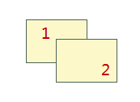

在图层列表中，选中一个矢量图层时，用户可以对以下内容进行设置，如下图所示：

  
  
  * **可显示**

"可显示"用来控制矢量图层的可见性。勾选“可显示”前面的复选框，表示该图层可见；否则不可见。

如果取消勾选“可显示”，则“可选择”、“可编辑”、“可捕捉”设置项均不可用。

  * **可选择**

“可选择”用来控制该图层是否可以选择，即图层中的对象能否被选中。勾选“可选择”前面的复选框，表示该图层可选择，即图层中的对象可选择；否则不可选择。

  * **可编辑**

“可编辑”用来控制矢量图层是否可编辑，即图层中的对象是否可以被编辑。单击“可编辑”前面的复选框，表示该图层可编辑，即图层中的对象可编辑；否则不可编辑。

  * **可捕捉**

“可捕捉”用来控制矢量图层是否可以捕捉，即在矢量图层中进行选择、编辑等操作时，是否可以捕捉到该图层中的对象。

  * **图层名称**

“图层名称”右侧的文本框用来显示该图层的图层名称。不可对图层名称进行修改，图层的名称在图层所在的地图中唯一标识此图层。

  * **图层标题**

“图层标题”右侧的文本框用来显示该图层的图层标题。可以对图层标题进行修改，修改后该图层在图层管理器中的显示名称发生变化，但是空间管理器中对应的数据集的名称不会发生改变。

  * **透明度**

透明度用于设置该图层的透明度。在右侧的文本框中输入透明度数值或者单击右侧的箭头符号，在弹出透明度设置滑块中拖动滑块调整图层的透明度。透明度的数值范围为 0
至 100 之间的整数。0 代表不透明，100 代表完全透明。

  * **最小可见比例尺**

设置选中的图层的最小可见比例尺。在右侧的文本框中输入需要设置的比例尺数值即可，如1：500000，或单击下拉按钮选择相应比例尺进行设置。图层设置最小可见比例尺后，若地图的比例尺小于选中的图层所设置的最小可见比例尺时，选中的图层将不可见。默认值为1：0，表示对该图层不设置最小可见比例尺。

  * **最大可见比例尺**

设置选中的图层的最大可见比例尺。在右侧的文本框中输入需要设置的比例尺数值即可，如1：100000，或单击下拉按钮选择相应比例尺进行设置。图层设置最大可见比例尺后，若地图的比例尺大于选中的图层所设置的最大可见比例尺时，选中的图层将不可见。默认值为1：0，表示对该图层不设置最大可见比例尺。

  * **重新指定数据集**

用来为当前图层重新指定所引用的数据集，即关联显示为指定的新数据集。单击文本框右侧的的按钮 ，
在弹出的“重新指定数据集”对话框，可以为该图层重新指定新的引用数据集。分别单击“数据源”和“数据集”右侧的下拉箭头，选择要引用的数据集以及该数据集所在的数据源。更多内容请参见：[重新指定数据集](DTv2_BindDataNew.htm)。

  * **显示完整线型**

用来设置线图层的符号是否完整显示。如果线的长度小于线符号周期长度，或者线长度不够线符号周期长度的整数倍时，不足线符号的周期的那部分线就不能完全显示。勾选显示完整线型后，会对线符号进行处理，使该符号完整显示出来，最终达到优化线符号的显示效果。

更多有关显示完整线型的内容，请参见：[显示完整线型](../AdvanceSetting/Linedisplay.htm)。

  * **符号随图缩放**

用来设置在地图放大、缩小浏览操作过程中，图层中的地图符号对象是否也随之放大或者缩小。“符号随图缩放”复选框可应用于点状符号、线状符号、面填充符号及其边框。
勾选“符号随图缩放”复选框后，当前图层中的地图符号会随地图缩放。用户每执行一次地图放大或缩小操作，当前图层中的符号对象缩放的程度由缩放基准比例尺和地图缩放后的比例尺共同来确定。具体操作原理请参见：[启用符号随图缩放](../AdvanceSetting/SymbolZoom.htm)。

  * **十字路口优化**

设置线图层是否使用十字路口优化效果。适用于图层风格为双线线型的线图层和网络线图层。更多有关十字路口优化的内容，请参见：[启用十字路口优化](../AdvanceSetting/RoadCross.htm)。

  * **反走样显示**

用于减少或消除图层信息失真的现象，优化图层显示效果。反走样需要同时开启地图反走样和图层反走样才可生效，“地图反走样”操作请参见：[地图显示优化](../../Optimization/MapOptimization/MapOptimization.htm#1)。

  * **显示压盖对象**

用于控制是否显示产生压盖现象的对象，若勾选该复选框，发生压盖现象的所有对象都会显示，需同时勾选“地图属性”面板中“显示压盖对象”复选框，图层显示压盖对象效果才生效，还可在压盖设置中进行详细设置，具体内容请参阅[压盖设置](../../Optimization/MapOptimization/OverlaySetting.htm)。

  * **对象显示顺序字段** ：对象的绘制顺序会影响对象在地图上的显示顺序。地图中的对象会依据设置的字段中数值的顺序进行显示。如果该字段的字段值相同或为空，则采用该引擎默认的显示顺序，一般情况下取字段 SmID、排序为升的规则相同的显示。目前仅支持对单个矢量图层或单个专题图图层设置对象显示顺序字段。如下图所示，对象1的 SmID 为1，对象2的 SmID 为2，按照 SmID 字段分别进行升序和降序排列，结果如下所示：

字段|排序|图示  
---|---|---  
SmID|升序|  
SmID|降序|  
  
* **对象最小尺寸（毫米）**

设置当前图层中对象显示的最小尺寸。在右侧的文本框中输入数值即可，单位为毫米。当前地图放大或缩小时，若该图层中任意一个几何对象的最小外接矩形的宽度和高度之中的较大值小于此设置值时，则该几何对象不可见。此功能不适用于点图层。

  * **显示过滤条件**

该设置用来过滤该图层中哪些对象可显示，哪些对象不显示。单击文本框右侧的的按钮， 在弹出的“SQL表达式”对话框中构建过滤表达式，设置完成后单击“确定”按钮即可对该图层过滤条件，使图层中满足过滤条件的对象可见。更多有关 SQL表达式的内容，请参见：[SQL 表达式对话框](../../Query/SQLDia.htm)。

“显示过滤条件:”空间组合框用来设置当前图层的显示过滤条件，过滤图层中哪些对象可显示哪些对象不可显示，便于用户根据需要显示感兴趣的要素而过滤掉暂时不需要显示的要素。单击“设置图层关联属性表...”按钮，设置关联字段连接外部表，进而通过构建有外部表字段参与的过滤条件来过滤显示图层中的内容，其具体的操作步骤请参见：[过滤显示地图中的对象。](../AdvanceSetting/FilterObjects.htm)

### 注意事项

  1. 网络数据集加载到地图窗口中的时候，会包含网络节点图层和网络图层两个图层。网络节点图层的图层控制类似于普通点图层，网络线图层的图层控制类似于普通线图层。

###  相关主题

 [图层控制](LayerControl.htm)

