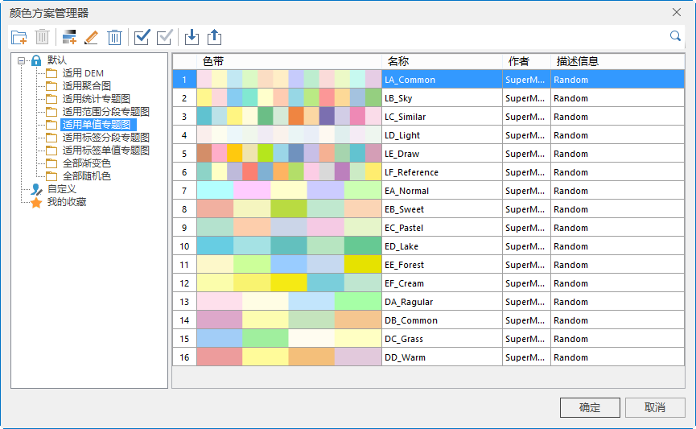

颜色方案管理器用来对程序中的颜色方案进行定制和管理。SuperMap
在颜色管理器中保存了一系列常用的颜色方案。其中有些颜色方案是为特定的领域准备的，比如用于显示高程的颜色方案。同时也支持用户创建自定义的颜色方案，以满足不同的应用需求。

系统一共提供了190多种默认颜色方案。每一种默认颜色方案的配色方案文件单独保存在文件夹中。默认的保存位置为："安装目录\Templates\
ColorScheme \"下的 Default 子文件夹中。

**启用颜色方案管理器**

在“ **开始** ”选项卡->“ **颜色管理** ”组中->单击“ **颜色方案**
”按钮，进入颜色方案管理器。通过颜色方案管理器，可以对颜色方案进行添加、编辑、删除、导入、导出、自定义、收藏等操作。

下图为颜色方案管理器的主界面。

  
---  
图：“颜色方案管理器”主界面  
  
颜色方案管理器根据数据的适用情况，将颜色方案分为适用DEM、适用聚合图、适用统计专题图、适用范围分段专题图、适用单值专题图、适用标签分段专题图、适用标签单值专题图、全部渐变色、全部随机色九个分组，便于用户根据使用情况选择颜色方案。

### 恢复默认颜色方案

颜色方案管理器由现有的状态恢复至系统默认的状态。

在“颜色管理器”中，点击“默认颜色方案”按钮，将颜色方案管理器由现有的状态恢复至系统默认的状态。

### 重置颜色方案

恢复为起始颜色方案。可以将颜色方案管理器恢复至上一次修改之前的状态。

在“颜色管理器”中，点击“重置颜色方案”按钮，将颜色方案重置，恢复至上一次修改之前的状态。

### 删除颜色方案

将不常用的或者不用的颜色方案从颜色管理器中移除，方便对其他颜色方案的管理和操作。

在“颜色管理器”中，选中一种或多种颜色方案，单击“删除颜色方案”按钮，即可从“颜色方案管理器”中移除选中的颜色方案。

### 相关主题

 [管理颜色方案](ManageColorRamp)