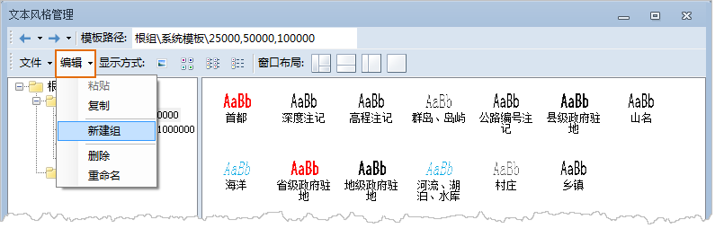

下图为文本风格管理窗口功能区域的编辑菜单，下面详细介绍编辑菜单中的菜单项提供的功能。

  

1. **粘贴**

“粘贴”：在文本风格管理窗口中，将在上面复制操作所复制的某个选中的子分组（除根组外）目录，复制到指定的子分组下。具体操作为：

  * 在文本风格管理窗口中，在模板库分组管理区域中选中目标子分组，即将所复制的子分组目录复制到的地方；
  * 点击编辑菜单下的“粘贴”项，即可将所复制的子分组目录，复制到目标子分组目录下。
2. **复制**

“复制”：在文本风格管理窗口中，将某个选中的子分组（除根组外）目录，包括该子分组下的模板和其他子分组复制到剪切板中。具体操作为：

  * 在文本风格管理窗口中，在模板库分组管理区域中选中某个子分组（除根组外）；
  * 点击编辑菜单下的“复制”项，即可将所选中的子分组目录，包括该子分组下的模板和其他子分组目录。
3. **新建组**

“新建组”：在文本风格管理窗口中，在某个选中的子分组（包括根组）下新建一个新的子分组。具体操作为：

  * 在文本风格管理窗口中，在模板库分组管理区域中选中某个子分组（包括根组）；
  * 点击编辑菜单下的“新建组”项，即可在选中的子分组下新建一个子分组。
4. **删除**

“删除”：在文本风格管理窗口中，删除某个选中的子分组（除根组外）目录，包括该子分组下的所有模板和其他子分组目录。具体操作为：

  * 在文本风格管理窗口中，在模板库子分组管理区域中选中某个子分组（除根组外）；
  * 点击编辑菜单下的“删除”项，即可删除选中的子分组目录，包括该子分组下的所有模板和其他子分组目录。
5. **重命名**

“重命名”：在文本风格管理窗口中，对某个选中的子分组（包括根组）的名称进行重命名。具体操作为：

  * 在文本风格管理窗口中，在模板库分组管理区域中选中某个子分组（包括根组）；
  * 点击编辑菜单下的“重命名”项；
  * 模板库分组管理区域中选中的子分组的名称变为可编辑状态，此时，可以修改该子分组的名称。

