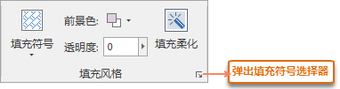
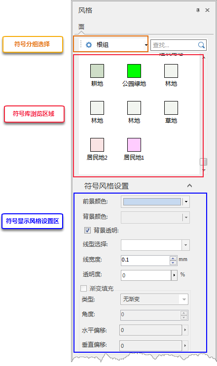

用户可通过 **风格设置选项卡** 和 **图层风格面板** 两种方式对面图层进行风格设置。

###  风格设置选项卡

“ **对象风格** ”选项卡的“ **填充风格** ”组用于设置面图层中面对象的填充风格，该组中的功能只有在当前图层为面图层时才可用。

  
---  
图：“填充风格”组  
  
* **填充符号**

“ **风格设置** ”组的“ **填充符号**
”下拉按钮用于设置面图层中面对象的填充样式，该按钮只有在“填充风格”组中“渐变模式:”为“无渐变”时才生效。

  * 点击“填充符号”下拉按钮弹出填充符号资源列表， 列表的上部分显示出了用户最近使用的填充符号样式，列表的下部提供了系统默认的根组符号库，用户可根据需要选择符号列表中的符号作为当前面图层中面对象的填充符号样式。
  * 用户还可以点击填充符号资源列表底部的“更多符号...”按钮，在弹出的“填充符号选择器”窗口中，设置面对象的填充符号样式。
  * 当用户选择了某个填充符号样式后，当前面图层中的所有面对象都会按选中的填充符号样式实时显示。
* **前景色**

“前景色”下拉按钮用于设置填充符号的前景色，即设置填充符号本身花纹的颜色。

  * 点击“前景色”下拉按钮，用户可以在弹出颜色面板中选取默认颜色，或点击颜色面板底部的 “其它色彩...”按钮，获取更多自定义颜色。
  * 在用户使用“其它色彩...”进行颜色设置后，在颜色面板底部还会列出“最近使用的颜色”。
* **透明度**

“透明度(%):”标签右侧的组合框用于设置面图层中面对象的透明度。

  * 点击该按钮， 用户可使用滑块来调整面对象的透明度，或者直接在文本框中输入数值，设置的透明效果将在地图上实时显示。
  * 透明度的数值范围为 0 至 100 之间的整数。透明度值越大，面图层的透明程度越高，0 代表完全不透明，100 代表完全透明。此处的设置只作用于面图层中面对象填充的透明度，不会影响面对象边框线的透明度。
* **组对话框**

用户可在“填充符号”组的组对话框中，修改当前面图层的符号风格，实现符合需求的显示效果。

  * 点击组对话框按钮，弹出“风格设置”窗口，具体操作参见：[填充符号风格设置](FillSymStyle.htm)。

###  风格面板

双击面图层打开面图层风格面板，在面板中可对填充风格进行设置。该面板组织方式同“ **填充符号选择器**
”，风格设置详细说明请参考[填充符号风格设置](FillSymStyle.htm)。

**注意** :当前设置是对整个线图层中的所有线对象都实时生效。

  
---  
图：填充风格面板  
  
###  相关主题

[保存到风格模板库](DTv2_SaveStyleTempl.htm)

[地图填充柔化](MapSoften.htm)

* * *

  
  
---

