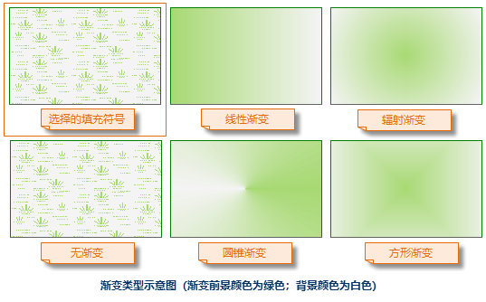

如下所示，符号库窗口（风格设置窗口）当前所加载的为填充符号库，下面介绍如何通过符号库窗口设置填充符号：

1. **选择填充符号：** 在填充符号选择器中，选中所需符号。

2. **设置符号的显示风格：**

符号库窗口符号风格设置区域中的“预览”区来预览用户所设置的符号风格。

在符号库窗口符号风格设置区域中，可以设置选择的填充符号所使用风格样式，包括以下几方面：

  

* **前景颜色：** 设置填充符号填充内容的颜色，单击其右侧的下拉按钮，用户可以在弹出颜色面板中选取默认颜色，或单击颜色面板底部的 “其它色彩...”按钮，获取更多自定义颜色。
* **背景颜色：** 设置填充符号非填充内容的颜色，单击其右侧的下拉按钮，用户可以在弹出颜色面板中选取默认颜色，或单击颜色面板底部的 “其它色彩...”按钮，获取更多自定义颜色。
* **背景透明：** 勾选该复选框后，填充符号的非填充内容将设置为透明效果，此时“背景颜色:”的设置无效。
* **透明度：** 设置填充符号的透明效果。用户可以在其右侧的数字显示框中输入数值来设置；也可以单击数字显示框右侧的箭头，使用弹出的滑块来调整透明度。透明度的数值为 0 至 100 之间的任意一个整数，0 代表完全不透明；100 代表完全透明。
* **渐变填充：** 勾选该复选框后，将使用渐变颜色作为填充符号的填充内容，此时，填充符号的填充内容为颜色，即用户在第 1 步中选中的填充符号无效。在渐变填充模式下， “前景颜色”和“背景颜色”将作为渐变的两种颜色，即渐变模式为双色渐变，从前景色渐变到背景色。
* **渐变填充的其他参数设置：** 如果勾选了“渐变填充”复选框，则复选框下面区域的功能变为可用状态，用来设施渐变的参数：

**类型：** 设置渐变的方式。包括以下五种方式：

（1）无渐变：不使用渐变颜色作为填充符号的填充内容，而是使用第 1 步所选中的填充符号的填充内容；

（2）线性：渐变为线性渐变；

（3）辐射：渐变为辐射状渐变，从中心向周围渐变；

（4）圆锥：渐变为圆锥体方式渐变；

（5）方形：渐变为方形渐变。

  

**角度：** 设置渐变填充的旋转角度。

**水平偏移：**
设置渐变填充中心点相对于填充范围中心点的水平偏移百分比。用户可以在其右侧的数字显示框中输入数值来设置；也可以单击数字显示框右侧的箭头，使用弹出的滑块来调整数值。

**垂直偏移：**
设置渐变填充中心点相对于填充范围中心点的垂直偏移百分比。用户可以在其右侧的数字显示框中输入数值来设置；也可以单击数字显示框右侧的箭头，使用弹出的滑块来调整数值。

* **线型选择：** 设置填充符号的边框线风格。单击其右侧的按钮，将弹出另一个符号库窗口，显示所加载的线符号库，在此设置填充符号的边框线风格，具体参见 [线符号风格设置](LineSymStyle)。
3. 设置完成后，单击符号库窗口中的“确定”按钮，即可应用符号风格的参数设置。

### 备注

当对矢量缓存图层设置图层风格时，仅支持设置三维符号。
