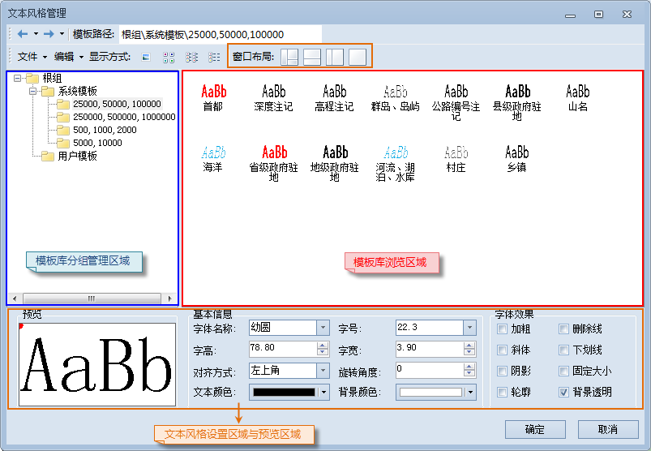
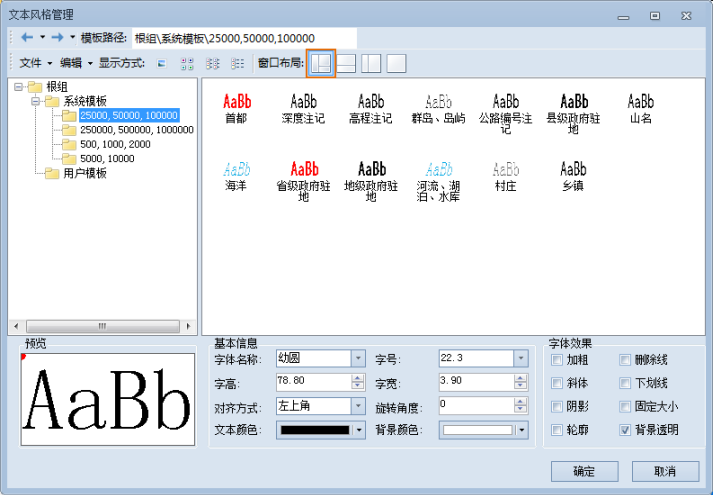
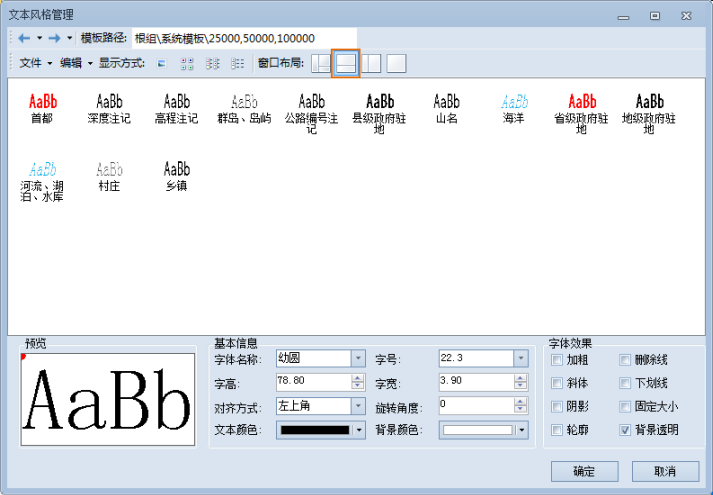
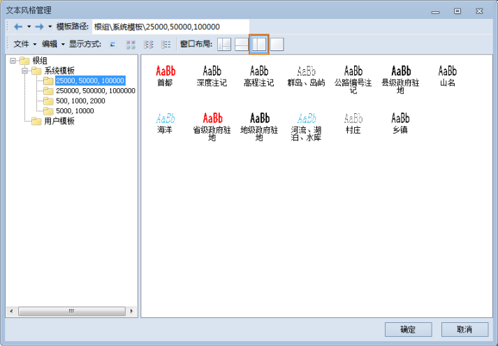
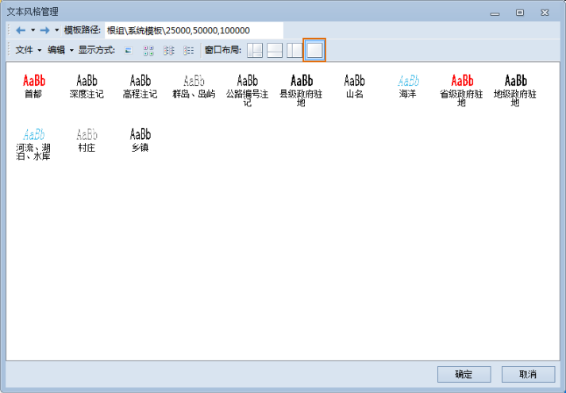

如下图所示，文本风格管理窗口的窗口布局按钮用来控制文本风格模板在窗口的布局形式，主要分为四种形式，点击“窗口布局:”右侧的相应的按钮即可切换文本风格管理窗口的布局样式。

  

  
* **显示所有面板：** 文本风格管理窗口中的文本风格模板分组管理区域、模板库浏览区域和文本风格管理区域全部显示。
  

* **显示模板与风格设置面板：** 只显示文本风格管理窗口的模板库浏览区域和文本风格管理区域。
  

* **显示分组与模板面板：** 只显示文本风格管理窗口的模板库分组管理区域和模板库浏览区域。
  

* **只显示模板面板：** 只显示文本风格管理窗口的模板库浏览区域。
  

