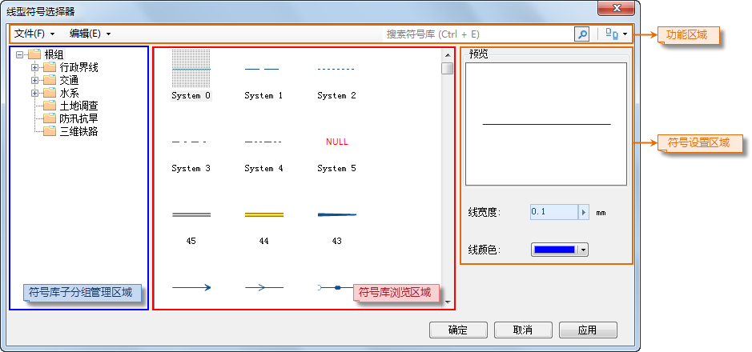

如下所示，符号库窗口（风格设置窗口）当前所加载的为线符号库，下面介绍如何通过符号库窗口设置线符号：

1. **选择线符号：** 在线符号选择器中，选中所需符号。

在符号库窗口中，找到需要的线符号，然后，选中该符号；

2. **设置符号的显示风格：**

符号库窗口符号风格设置区域中的“预览”区来预览用户所设置的符号风格。

在符号库窗口符号风格设置区域中，可以设置选择的线符号所使用风格样式，包括以下几方面：

  

* **线宽度：** 设置线的粗细，用户可以在其右侧的数字显示框中输入数值来设置；也可以单击数字显示框右侧的箭头，使用弹出的滑块来调整线宽。
* **线颜色：** 设置线符号的颜色，单击其右侧的下拉按钮，用户可以在弹出颜色面板中选取默认颜色，或单击颜色面板底部的 “其它色彩...”按钮，获取更多自定义颜色。
3. 设置完成后，单击符号库窗口中的“确定”按钮，应用所做的符号设置。

### 备注

当对矢量缓存图层设置图层风格时，仅支持设置三维符号。
