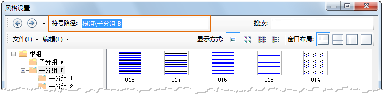
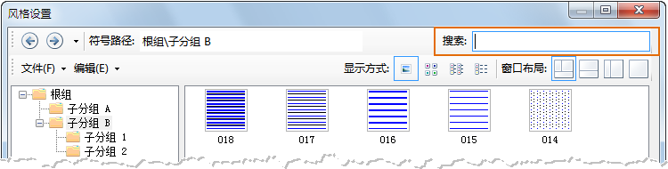
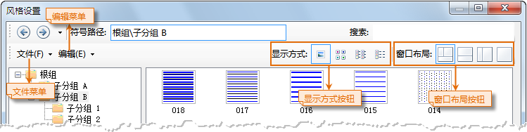

符号库窗口（风格设置窗口）功能区域分为两大部分：检索工具部分和菜单工具条部分。

* **检索工具部分**

符号库窗口的检索工具提供了以下三种功能：

1. **浏览历史：** 在符号库窗口中浏览当前所加载的符号库中的符号时，记录了用户多次浏览符号的路径信息，即符号所在的子分组目录。 点击下图所示的下拉箭头，弹出下拉菜单，列出了用户在当前符号库中浏览的历史记录，主要记录符号的子分组目录，点击历史记录中的任意一条，将自动跳转到相应的子分组目录下， 在符号浏览区域将显示该子分组目录下的符号及其中所包含的子分组。另外，前进和后退按钮也可以对浏览的历史记录进行跳转。
  
---  
2. **符号路径：** “符号路径:”右侧的文本框用来显示设置和显示当前度浏览的符号路径，即符号的子分组目录，用户可以输入所要浏览符号的子分组目录路径，此时符号浏览区域将显示该子分组目录下的符号，但不显示该子分组中包含的子分组。
  
---  
3. **搜索功能：** 根据在“搜索:”右侧的文本框中输入的内容，在当前符号库中搜索相关的内容。
  
---  
* **菜单工具条部分**

符号库窗口的菜单工具条部分提供了文件和编辑两个菜单项以及窗口布局、显示方式按钮。

  
---  

  [文件菜单提供的功能](SymManagerFile)

  [编辑菜单提供的功能](SymManagerEdit)

  [窗口布局按钮](SymManagerLayout)

  [显示方式按钮](SymManagerDisplay)

