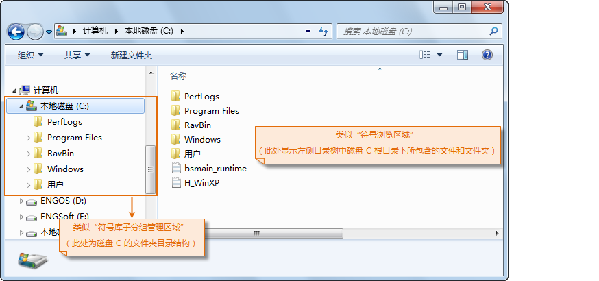

符号库管理窗口中的符号库子分组管理区域及符号浏览区域用来管理符号库中的符号分组以及浏览符号库中的符号资源，其作用和呈现形式类似于 Windows
的资源管理器。

### 符号库子分组管理

符号库对于符号的组织和管理形式采用逻辑分组的方式，便于符号的归类和管理，每个符号库有且仅有一个根组，根组存放了该符号库中的所有符号资源， 根组类似于
Windows 资源管理器中的某个磁盘的根目录，根组中保存的符号资源则类似于存储在该磁盘下的所有文件，磁盘下的文件既可以直接存放在磁盘根目录下，也可以
逻辑存储在该磁盘中的不同文件夹下，
文件夹可以层层嵌套，与这种结构类似，对于符号库根组所保存的所有符号资源，这些符号既可以直接存放在根组下，也可以进行逻辑分组，每个分组中保存具有类似意义的一类符号，
这里将符号分组成为子分组，并且子分组可以嵌套，即每个子分组中既可以包含零个或多个符号也可以包含零个或多个子分组。

符号库子分组管理区域是可视化管理符号库中子分组的区域，该区域以树状目录结构形象地呈现和管理当前所加载的符号库的逻辑组织结构，即分组结构，目录树的根结点对应符号库的根组，根结点下的子结点为
根组下的子分组，子分组下的子结点对应该子分组所包含的其他子分组，以此类推，层层嵌套。

点击符号库子分组管理区域的目录树中的结点，在符号浏览区域，将显示该子分组下所包含的所有符号和其他子分组，在符号浏览区域子分组显示为文件夹，如下图所示，符号浏览区域显示的是当前
所加载的填充符号库根组下所包含的符号和子分组。

  

  

### 符号浏览区域

符号库管理窗口的符号浏览区域用来显示当前所浏览的符号子分组目录路径下的内容，即符号库子分组管理区域中所选中的结点对应的符号库子分组中所包含的符号和其他子分组，
或者在功能区域中“符号路径:”右侧文本框中输入的符号子分组目录路径下的符号和其他子分组。

在符号库管理窗口的功能区域中，“显示方式:”右侧的按钮，可以控制符号浏览区域的显示风格，分为小图标风格、大图标风格、
列表风格和详细信息风格，点击相应的按钮，即可切换符号浏览区域的显示风格。

