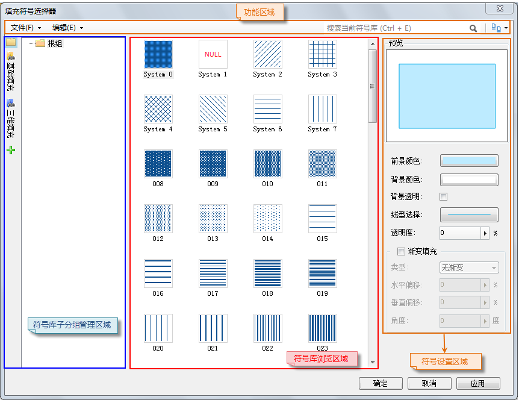

符号库窗口中的符号风格设置区域用来设置选中的符号的风格，进而应用到目标图层中对象的风格。

根据符号库窗口当前所加载的符号库的类型不同，符号风格设置区域的内容不同，相应地分为三种类型：点符号、线符号、填充符号的风格设置，下面分别进行介绍。

**注意：** 系统对加载到地图、布局窗口和场景窗口中的点符号的设置支持程度不同，下面分别进行介绍。

  

 [点符号风格设置（地图和布局）](PointSymStyle)

 [点符号风格设置（场景）](Scene_PointSymStyle)

 [线符号风格设置](LineSymStyle)

 [填充符号风格设置](FillSymStyle)

