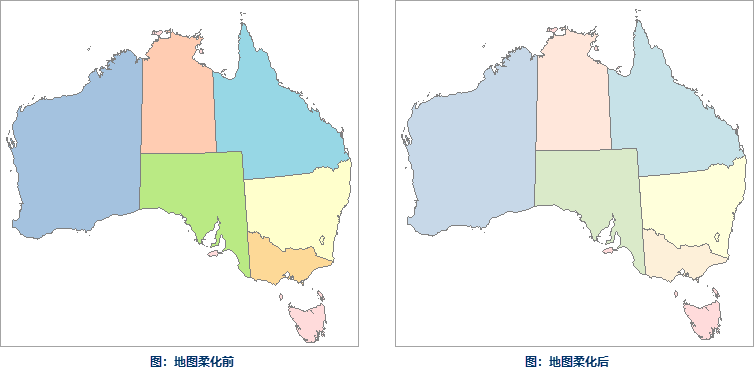

### 使用说明

“填充柔化”功能，可对当前地图窗口中的面图层填充颜色进行柔化，即降低填充颜色的饱和度，调整色相和亮度值，优化地图中面图层的填充颜色。

### 操作步骤

  1. 在地图窗口中打开需进行填充颜色柔化的地图。
  2. 在“风格设置”选项卡的“填充风格”组中，单击“填充柔化”按钮，即可将地图中的面图层填充颜色进行柔化，降低颜色饱和度，优化地图的显示效果。  
  
 |   
---|---  
地图柔化前 | 地图柔化后  

###  注意事项

  1. 填充柔化功能只对地图中面图层及基于面制作的单值、分段专题图图层的填充颜色进行柔化，不会改变其他图层颜色。
  2. 该功能不支持回退，建议用户做好图层颜色备份工作。

