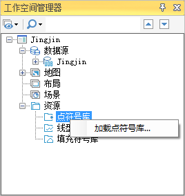
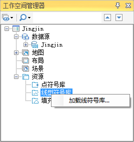
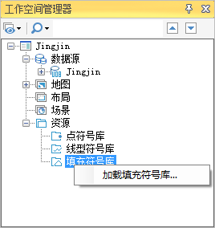

在应用程序中，符号库窗口有两种表现形式，一种为“符号选择器”窗口，主要用于加载、浏览、管理符号库文件；另一种为“风格设置”窗口，既可用于设置点、线、面对象的风格，也可加载、浏览、管理符号库文件。这两种类型的符号库窗口的界面和操作方式基本相同，若无特殊之处不作另外的介绍。

打开符号库窗口的途径有以下几种：

1. **通过工作空间管理器打开符号库窗口：**

在工作空间管理器中，展开资源结点，其下有三个子结点，分别为：符号库、线型库和填充库，分别对应管理点符号、线符号和填充符号，
而符号库窗口则可以通过任意子结点的右键菜单打开，具体如下：

* 右键点击符号库子结点，在弹出的右键菜单中选择“加载点符号库...”，打开“符号选择器”窗口，默认加载的是系统提供的预定义点符号库；
* 右键点击线型库子结点，在弹出的右键菜单中选择“加载线符号库...”，打开“符号选择器”窗口，默认加载的是系统提供的预定义线符号库；
* 右键点击填充库子结点，在弹出的右键菜单中选择“加载填充符号库...”，打开“符号选择器”窗口，默认加载的是系统提供的预定义填充符号库。  

| |   
---|---|---  

2. **通过图层管理器打开风格设置窗口：**

在图层管理器中，双击某个图层结点的符号图标，可以打开风格设置窗口。

  * 双击点类型图层的符号图标，弹出风格设置窗口，默认加载的是系统提供的预定义点符号库；
  * 双击线类型图层的符号图标，弹出风格设置窗口，默认加载的是系统提供的预定义线符号库；
  * 双击填充类型图层的符号图标，弹出风格设置窗口，默认加载的是系统提供的预定义填充符号库。

  3. **通过功能区中的“风格设置”选项卡打开风格设置窗口：**

功能区中与地图窗口（或布局窗口）关联的“风格设置”选项卡可用于设置地图图层（或布局元素）的符号风格，在设置符号风格时也可以打开风格设置窗口，具体如下：

  * 设置点符号风格时，点击“风格设置”选项卡>“点风格”组按钮，弹出风格设置窗口，默认加载的是系统提供的预定义点符号库；
  * 设置线符号风格时，点击“风格设置”选项卡>“线风格”组按钮，弹出风格设置窗口，默认加载的是系统提供的预定义线符号库；
  * 设置填充符号风格时，点击“风格设置”选项卡>“填充风格”组按钮，弹出风格设置窗口，默认加载的是系统提供的预定义填充符号库。
  4. **其他方式：**

除了以上途径，还有其它方式打开符号库窗口。例如，在制作专题图时，修改专题图要素的风格时，也可以打开风格设置窗口；以及其它设置对象风格的地方，同样可以打开符号库窗口。

