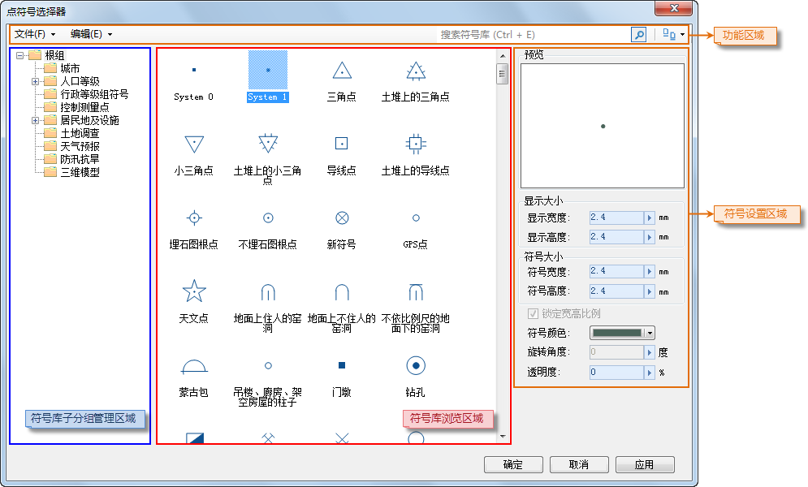

如下所示，符号库窗口当前所加载的为点符号库，下面介绍如何通过符号库窗口设置点符号：

  
---  
图：符号库窗口（风格设置窗口）  
  
  1. **选择点符号：**

在符号库窗口中，找到需要的点符号，然后，选中该符号。

  2. **设置符号的显示风格：**

符号库窗口符号风格设置区域中的“预览”区来预览用户所设置的符号风格。

在符号库窗口符号风格设置区域中，可以设置选中点符号的风格样式，包括以下参数：

* **符号大小：** 该区域用于设置点符号的大小。
  * **符号宽度：** 设置点符号的宽度。用户可以在其右侧的数字显示框中输入数值；也可以点击数字显示框右侧的箭头，使用弹出的滑块调整符号的宽度。单位：0.1mm。
  * **符号高度：** 设置点符号的高度。用户可以在其右侧的数字显示框中输入数值；也可以点击数字显示框右侧的箭头，使用弹出的滑块调整符号的高度。单位：0.1mm。
  * **锁定宽高比例：** 该复选框用于设置是否在改变符号宽度或符号高度时，固定符号的宽度与高度的比例。系统默认为勾选该复选框。若勾选该复选框，则无论对符号宽度和符号高度两个参数中的哪一项进行设置，另一项会相应改变。注意：此项设置只对栅格符号有效，即对矢量数据，无论是否勾选该复选框，符号的宽高比例都固定。
* **旋转角度：** 设置点符号的旋转角度值，用户可以在其右侧的数字显示框中输入数值来设置；也可以点击数字显示框右侧的箭头，使用弹出的滑块来调整角度数值。 点击Enter （回车）键或当该文本框失去焦点时，即可应用点符号角度的设置。
  * 旋转角度为正值时，逆时针旋转；否则顺时针旋转；
  * 点符号旋转角度的数值精度为0.1，单位为度。
* **透明度：** 设置点符号的透明效果。用户可以在其右侧的数字显示框中输入数值来设置；也可以点击数字显示框右侧的箭头，使用弹出的滑块来调整透明度。透明度的数值为 0 至 100 之间的任意一个整数，0 代表完全不透明；100 代表完全透明。
* **符号颜色：** 设置点符号的颜色，点击其右侧的下拉按钮，用户可以在弹出颜色面板中选取默认颜色，或点击颜色面板底部的 “其它色彩...”按钮，获取更多自定义颜色。
  3. 设置完成后，点击符号库窗口中的“确定”按钮，应用所做的符号设置。

### 备注

当点图层设置风格时，如果使用的点符号为 TrueType
字体时，不支持设置宽高值不相等的符号大小，即符号宽高比例始终为1：1。当用户设置了宽高值不相等的符号大小时，系统自动将符号大小的宽高值取为相等的值，并且都等于用户所指定的高度值。

