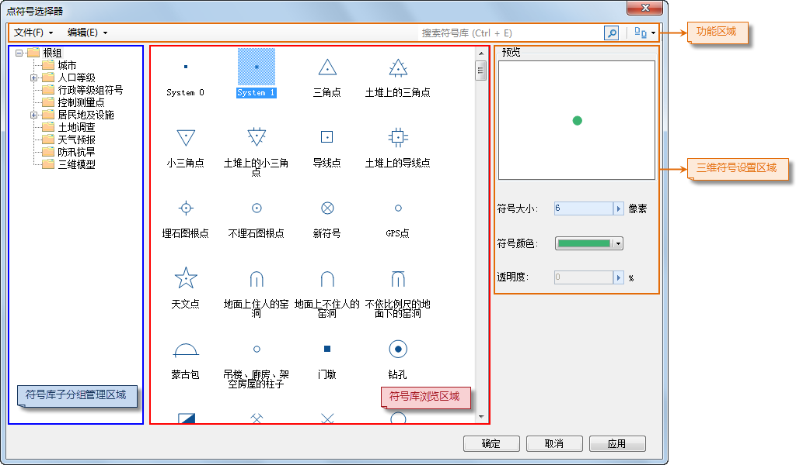

如下图所示，符号库窗口当前所加载的为点符号库，下面介绍如何通过符号库窗口设置点符号：

  
---  
图：符号库窗口（风格设置窗口）  

* **选择点符号：** 在点符号选择器中，选中所需符号。
* **设置符号的显示风格：** 系统支持矢量点符号、栅格点符号和三维模型符号三种类型的点符号。

符号库窗口符号风格设置区域中的"预览"区来预览用户所设置的符号风格。

在符号库窗口符号风格设置区域中，可以根据选中的点符号的类型设置风格样式，下面对每种类型的点符号的设置参数分别进行介绍。

**矢量型点符号**

* **符号大小：** 该区域用于设置点符号的大小。 
* **透明度：** 设置点符号的透明效果。用户可以在其右侧的数字显示框中输入数值来设置；也可以单击数字显示框右侧的箭头，使用弹出的滑块来调整透明度。透明度的数值为 0 至 100 之间的任意一个整数，0 代表完全不透明；100 代表完全透明。
* **符号颜色：** 设置点符号的颜色，单击其右侧的下拉按钮，用户可以在弹出颜色面板中选取默认颜色，或单击颜色面板底部的"其它色彩..."按钮，获取更多自定义颜色。

**栅格型点符号**

* **透明度：** 设置点符号的透明效果。用户可以在其右侧的数字显示框中输入数值来设置；也可以单击数字显示框右侧的箭头，使用弹出的滑块来调整透明度。透明度的数值为 0 至 100 之间的任意一个整数，0 代表完全不透明；100 代表完全透明。

**三维模型符号**

* **符号大小：** 该区域用于设置点符号的大小。 
  * **X 轴缩放比：** 设置三维模型符号在 X 轴的缩放比。用户可以在其右侧的数字显示框中输入数值；也可以单击数字显示框右侧的箭头，使用弹出的滑块调整符号的宽度。在预览效果中，模型符号的快照在宽度上发生变化。
  * **Y 轴缩放比：** 设置三维模型符号在 Y 轴的缩放比。用户可以在其右侧的数字显示框中输入数值；也可以单击数字显示框右侧的箭头，使用弹出的滑块调整符号的高度。在预览效果中，模型符号的快照在高度上发生变化。
  * **Z 轴缩放比：** 设设置三维模型符号在 Z 轴的缩放比。用户可以在其右侧的数字显示框中输入数值；也可以单击数字显示框右侧的箭头，使用弹出的滑块调整符号的高度。由于预览的是模型符号的快照，Z 轴缩放比的设置在预览中显示不出来。
  * **锁定宽高比例：** 该复选框用于设置是否在改变符号X、Y、Z轴缩放比时，固定符号X、Y、Z轴比例。系统默认为不勾选该复选框。若勾选该复选框，则哪一项进行设置，另外两项会相应改变。
* **透明度：** 该参数对三维模型符号无效，用户无法设置。

* 设置完成后，单击符号库窗口中的"确定"按钮，应用所做的符号设置。

### 备注

当对矢量缓存图层设置图层风格时，仅支持设置三维符号。

