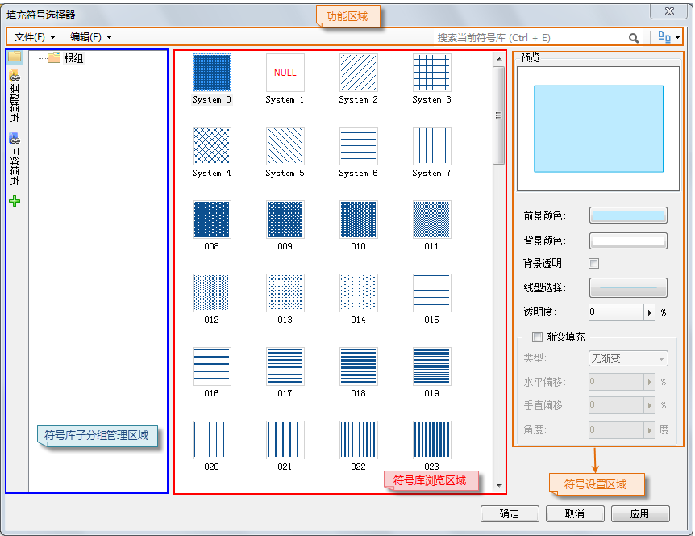

### 使用说明

“符号库”下拉按钮用来打开符号库窗口，从而进行各种类型的符号库的管理，包括点符号库、线符号库和填充符号库。

点击“符号库”下拉按钮弹出下拉菜单，选择下拉菜单中的任意一项都可以打开符号库窗口，如下所示。只是符号库窗口中所能加载的符号库的类型有所不同，下面详细进行介绍。

  
---  
  
### 操作步骤

  * **选择下拉菜单中的“点符号库”**

选择下拉菜单中的“点符号库”，打开符号库窗口，符号库窗口默认加载了系统提供的默认点符号库，并且，通过此方式打开的符号库窗口中只能管理点符号库。

  * **选择下拉菜单中的“线符号库”**

选择下拉菜单中的“线符号库”，打开符号库窗口，符号库窗口默认加载了系统提供的默认线符号库，并且，通过此方式打开的符号库窗口中只能管理线符号库。

  * **选择下拉菜单中的“填充符号库”**

选择下拉菜单中的“填充符号库”，打开符号库窗口，符号库窗口默认加载了系统提供的默认填充符号库，并且，通过此方式打开的符号库窗口中只能管理填充符号库。

### 注意事项

通过“符号库”下拉按钮打开的符号库窗口只是符号库的场所，而不能进行符号风格的设置，因此，符号库窗口中只包含功能区域、符号库子分组管理区域和符号浏览区域，而不包含符号风格设置区域。有关符号库窗口的界面布局及其相关操作，请参见：[符号库窗口](ResourcesManager)。

