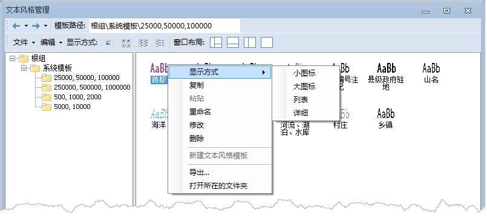

符号库窗口（风格设置窗口）中的右键菜单分为以下几种：

  * 符号库子分组管理区域中根组的右键菜单；
  * 符号库子分组管理区域中子分组的右键菜单；
  * 符号浏览区域中选中的符号和子分组的右键菜单。

下面对这几类右键菜单所提供的功能进行详细介绍。

符号库子分组管理区域中根组的右键菜单

如下所示，右键点击符号库子分组管理区域的根组，弹出右键菜单，右键菜单各个菜单项的功能如下：

  

  1. **新建组**

“新建组”：选择右键菜单中的“新建组”项后，将在该根组下新建一个子分组。

  2. **重命名**

“重命名”：选择右键菜单中的“重命名”项后，根组的名称变为可编辑状态，此时，可以修改根组的名称。

  3. **粘贴**

“粘贴”：用来将在复制操作中所复制的某个选中的子分组（除根组外）目录，复制到根组下。

  4. **导出**

“导出”：用来将根组目录下的所有内容，导出为一个新的符号库文件，选择“导出”项后，将弹出另存为对话框，在对话框中指定新的符号库文件所保存的路径和新符号库文件的文件名，然后，点击“保存”按钮。

符号库文件格式为：*.sym （点符号库文件）、*.lsl （线符号库文件）、*.bru （填充符号库文件）。

  5. **导入**

“导入”：用来在当前符号库窗口中导入其他符号库文件，即其他符号库。选择“导入”项后，弹出打开对话框，在对话框中选择要打开的符号库对应的符号库文件，然后，点击“打开”按钮，即可在当前符号库窗口中加载该符号库资源。

符号库文件格式为：*.sym （点符号库文件）、*.lsl （线符号库文件）、*.bru （填充符号库文件）。

**符号库子分组管理区域中子分组的右键菜单**

如下所示，右键点击符号库子分组管理区域的某个子分组，弹出右键菜单，右键菜单各个菜单项的功能如下：
  

1. **新建组：** 在选中的子分组下新建一个子分组。具体操作：
  * 在符号库窗口中，右键点击选中符号库子分组管理区域中某一个子分组；
  * 在弹出的右键菜单中选择“新建组”项，即可在选中的子分组下新建一个子分组。
2. **复制：** 将某个选中的子分组（除根组外）目录，包括该子分组下的符号和其他子分组复制到剪切板中。具体操作：
  * 在符号库窗口中，右键点击选中符号库子分组管理区域中某一个子分组（除根组外）；
  * 在弹出的右键菜单中选择“复制”项，即可将所选中的子分组目录，包括该子分组下的符号和其他子分组目录。
3. **粘贴：** 将在上面复制操作所复制的某个选中的子分组（除根组外）目录，复制到指定的子分组下。具体操作为：
  * 在符号库窗口中，右键点击选中符号库子分组管理区域中某一个子分组，即将所复制的子分组目录复制到的地方；
  * 在弹出的右键菜单中选择“粘贴”项，即可将所复制的子分组目录，复制到选中的目标子分组目录下。
4. **删除：** 删除选中的子分组，包括该子分组中的所有符号及子分组目录。具体操作：
  * 在符号库窗口中，右键点击选中符号库子分组管理区域中某一个子分组；
  * 在弹出的右键菜单中选择“删除”项；
  * 弹出提示对话框，询问用户是否真的删除选中的子分组，如果确认删除，点击“确定”按钮，即可删除选中的子分组及其目录下的所有内容；如果点击“取消”按钮，取消删除操作。
5. **重命名：** 对某个选中的子分组的名称进行重命名。具体操作为：
  * 在符号库窗口中，右键点击选中符号库子分组管理区域中某一个子分组；
  * 在弹出的右键菜单中选择“重命名”项；
  * 符号库子分组管理区域中选中的子分组的名称变为可编辑状态，此时，可以修改该子分组的名称。
6. **导出：** 用来将选中的子分组目录下的所有内容导出为一个符号库文件。具体操作：
  * 在符号库窗口中，右键点击选中符号库子分组管理区域中某一个子分组；
  * 在弹出的右键菜单中选择“导出”项；
  * 弹出“另存为”对话框，在对话框中指定新的符号库文件所保存的路径和新符号库文件的文件名，然后，点击“保存”按钮。

符号库文件格式为：*.sym （点符号库文件）、*.lsl （线符号库文件）、*.bru （填充符号库文件）。

**符号浏览区域中选中的符号和子分组的右键菜单**

当选中了符号库窗口中符号浏览区域中的符号或者子分组，右键点击鼠标，弹出的右键菜单如下所示，下面详细介绍右键菜单各个菜单项的功能：

  

1. **显示方式：** 控制符号浏览区域中图标的显示样式，分为大图标、小图标、列表和详细四种显示风格。具体操作：
  * 在符号库窗口中符号浏览区域，在空白位置处右键点击鼠标；
  * 在弹出的右键菜单中，鼠标指向“显示方式”项，在其下一级的菜单中选择某个风格样式。
  * 如果在符号浏览区域中选中了一个或多个符号或者子分组，然后，右键点击鼠标，弹出的右键菜单中也包含有“显示方式”项，通过该项也可以设置图标的显示风格。
2. **复制：** 将符号浏览区域中选中的多个子分组或者符号复制到剪切板中。具体操作：
  * 在符号库窗口的符号浏览区域中，选中多个子分组或者符号，选择的方式同在 Windows 资源管理器中选中多个文件或文件夹的方式相同，即子分组类似于文件夹，符号类似于文件；
  * 右键点击鼠标，在弹出的右键菜单中选择“复制”项，即可将所选中的符号以及子分组，包括子分组下的符号和其他子分组目录复制到剪切板中。
3. **粘贴：** 将在上面复制操作所复制的子分组和符号，复制到指定的子分组下。具体操作为：
  * 在符号库窗口中，定位到复制内容要复制的目标路径下，即符号浏览窗口中显示目标路径的目录；
  * 在目标目录下的空白区域右键点击鼠标，在弹出的右键菜单中选择“粘贴”项，即可将所复制的子分组和符号，复制到目标目录下。
4. **重命名：** 对某个选中的子分组的名称进行重命名。具体操作为：
  * 在符号库窗口的符号浏览区域中，右键点击选中某一个子分组；
  * 在弹出的右键菜单中选择“重命名”项；
  * 该选中的子分组的名称变为可编辑状态，此时，可以修改该子分组的名称。
5. **删除：** 删除选中的多个符号及子分组，包括该子分组中的所有符号及子分组目录。具体操作：
  * 在符号库窗口的符号浏览区域中，选中多个子分组或者符号，选择的方式同在 Windows 资源管理器中选中多个文件或文件夹的方式相同，即子分组类似于文件夹，符号类似于文件；
  * 右键点击鼠标，在弹出的右键菜单中选择“删除”项；
  * 弹出提示对话框，询问用户是否真的删除所选中的内容，如果确认删除，点击“确定”按钮，即可删除选中的符号及子分组，包括子分组中的所有符号和子分组；如果点击“取消”按钮，取消删除操作。
6. **导出：** 用来将选中的多个符号及子分组，包括选中子分组目录下的所有内容导出为一个符号库文件。具体操作：
  * 在符号库窗口的符号浏览区域中，选中多个子分组或者符号，选择的方式同在 Windows 资源管理器中选中多个文件或文件夹的方式相同，即子分组类似于文件夹，符号类似于文件；
  * 右键点击鼠标，在弹出的右键菜单中选择“导出”项；
  * 弹出“另存为”对话框，在对话框中指定新的符号库文件所保存的路径和新符号库文件的文件名，然后，点击“保存”按钮。

符号库文件格式为：*.sym （点符号库文件）、*.lsl （线符号库文件）、*.bru （填充符号库文件）。

