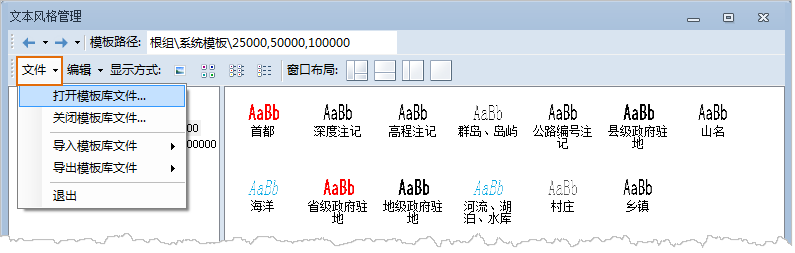

如下所示，为符号库窗口（风格设置窗口）功能区域的文件菜单，下面详细介绍文件菜单中的菜单项提供的功能。

  

  1. **打开符号库文件...**

“打开符号库文件...”：用来在当前符号库窗口中加载其他符号库文件，即其他符号库，符号库文件格式为：*.sym （点符号库文件）、*.lsl
（线符号库文件）、*.bru （填充符号库文件）。

点击“打开符号库文件...”项，弹出打开对话框，在对话框中选择要打开的符号库对应的符号库文件，然后，点击“打开”按钮，即可在当前符号库窗口中加载该符号库资源。

  2. **关闭符号库文件...**

“关闭符号库文件...”：用来关闭当前符号库窗口中所加载符号库。

  3. **导入符号库文件...**

“导入符号库文件...”：用来在当前符号库窗口中导入其他符号库文件，即其他符号库，符号库文件格式为：*.sym （点符号库文件）、*.lsl
（线符号库文件）、*.bru （填充符号库文件）。

点击“导入符号库文件...”项，弹出打开对话框，在对话框中选择要打开的符号库对应的符号库文件，然后，点击“打开”按钮，即可在当前符号库窗口中加载该符号库资源。

  4. **导出符号库文件...**

“导出符号库文件...”：用来将当前符号库窗口中所加载符号库文件，即符号库另存为其他符号库文件。

点击“导出符号库文件...”项，弹出另存为对话框，在对话框中指定新的符号库文件所保存的路径和新符号库文件的文件名，然后，点击“保存”按钮。

  5. **退出**

“退出”：用来退出和关闭符号库窗口。

