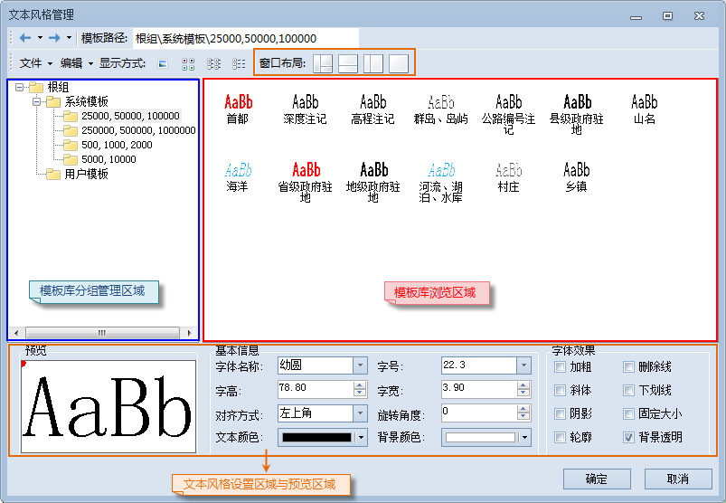
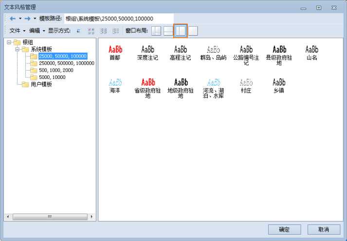

如下所示，符号库窗口（风格设置窗口）的窗口布局按钮用来控制符号库窗口的布局形式，主要分为四种形式，点击“窗口布局:”右侧的相应的按钮即可切换符号库窗口的布局样式。

  

  
  * **显示所有面板：** 符号库窗口中的符号库子分组管理区域、符号浏览区域和符号风格设置区域全部显示。
  

  * **显示符号与风格设置面板：** 只显示符号库窗口的符号浏览区域和符号风格设置区域。
  

  * **显示分组与符号面板：** 只显示符号库窗口的符号库子分组管理区域和符号浏览区域。
  

  * **只显示符号面板：** 只显示符号库窗口的符号浏览区域。
  

