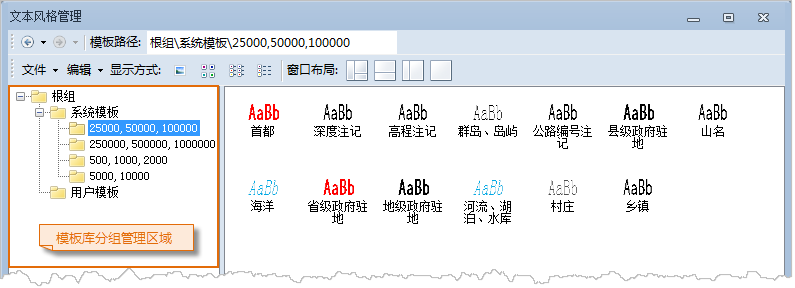
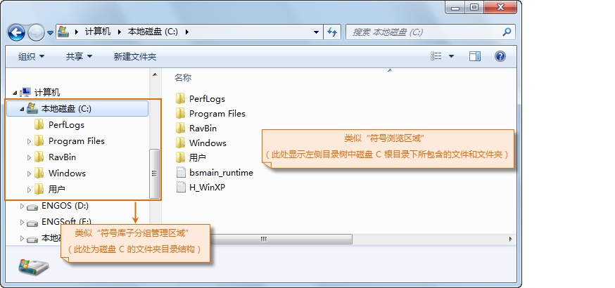
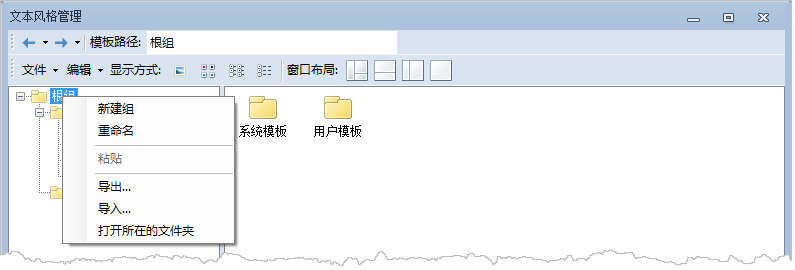
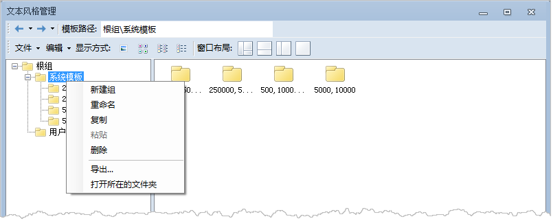

文本风格管理窗口中的模板库分组管理区域及用来管理模板库中的模板分组，其作用和呈现形式类似于 Windows 的资源管理器。

### 模板库子分组管理

模板库对于模板的组织和管理形式采用逻辑分组的方式，便于模板的归类和管理，每个模板库有且仅有一个根组，根组存放了该模板库中的所有模板资源。根组类似于
Windows 资源管理器中的某个磁盘的根目录，根组中保存的模板资源则类似于存储在该磁盘下的所有文件，磁盘下的文件既可以直接存放在磁盘根目录下，也可以
逻辑存储在该磁盘中的不同文件夹下，
文件夹可以层层嵌套。与这种结构类似，对于模板库根组所保存的所有模板资源，这些模板既可以直接存放在根组下，也可以进行逻辑分组，每个分组中保存具有类似意义的一类模板，这里将模板分组成为子分组，并且子分组可以嵌套，即每个子分组中既可以包含零个或多个模板也可以包含零个或多个子分组。

模板库分组管理区域是可视化管理模板库中子分组的区域，该区域以树状目录结构形象地呈现和管理当前所加载的模板库的逻辑组织结构，即分组结构，目录树的根结点对应模板库的根组，根结点下的子结点为根组下的子分组，子分组下的子结点对应该子分组所包含的其他子分组，以此类推，层层嵌套。

点击模板库分组管理区域的目录树中的结点，在模板库浏览区域，将显示该子分组下所包含的所有模板和其他子分组，在模板浏览区域子分组显示为文件夹，如下图所示，模板库浏览区域显示的是当前所加载的填充模板库根组下所包含的模板和子分组。

  

  

  
### 文本风格模板库分组管理区域的右键菜单

下面对模板库分组管理区域中的根组和分组管理区域的右键菜单所提供的功能进行详细介绍。

**模板库分组管理区域中根组的右键菜单**

如下图所示，右键点击模板库分组管理区域的根组，弹出右键菜单，右键菜单各个菜单项的功能如下：

  

  
  1. **新建组**

“新建组”：选择右键菜单中的“新建组”项后，将在该根组下新建一个子分组。

  2. **重命名**

“重命名”：选择右键菜单中的“重命名”项后，根组的名称变为可编辑状态，此时，可以修改根组的名称。

  3. **粘贴**

“粘贴”：用来将在复制操作中所复制的某个选中的子分组（除根组外）目录，复制到根组下。

  4. **导出**

“导出”：用来将根组目录下的所有内容，导出为一个新的模板库文件，选择“导出”项后，将弹出另存为对话框，在对话框中指定新的模板库文件所保存的路径和新模板库文件的文件名，然后，点击“保存”按钮。

  5. **导入**

“导入”：用来在当前文本风格模板设置窗口中导入其他模板库文件，即其他模板库。选择“导入”项后，弹出打开对话框，在对话框中选择要打开的模板库对应的模板库文件，然后，点击“打开”按钮，即可在当前文本风格模板设置窗口中加载该模板库资源。

模板库文件格式为：*.sym （点符号库文件）、*.lsl （线符号库文件）、*.bru （填充符号库文件）。

**模板库子分组管理区域中子分组的右键菜单**

  

  
1. **新建组：** 在选中的子分组下新建一个子分组。具体操作：
  * 在文本风格模板设置窗口中，右键点击选中模板库分组管理区域中某一个子分组；
  * 在弹出的右键菜单中选择“新建组”项，即可在选中的子分组下新建一个子分组。
2. **复制：** 将某个选中的子分组（除根组外）目录，包括该子分组下的模板和其他子分组复制到剪切板中。具体操作：
  * 在文本风格模板设置窗口中，右键点击选中模板库子分组管理区域中某一个子分组（除根组外）；
  * 在弹出的右键菜单中选择“复制”项，即可将所选中的子分组目录，包括该子分组下的模板和其他子分组目录。
3. **粘贴：** 将在上面复制操作所复制的某个选中的子分组（除根组外）目录，复制到指定的子分组下。具体操作为：
  * 在文本风格模板设置窗口中，右键点击选中模板库子分组管理区域中某一个子分组，即将所复制的子分组目录复制到的地方；
  * 在弹出的右键菜单中选择“粘贴”项，即可将所复制的子分组目录，复制到选中的目标子分组目录下。
4. **删除：** 删除选中的子分组，包括该子分组中的所有模板及子分组目录。具体操作：
  * 在文本风格模板设置窗口中，右键点击选中模板库子分组管理区域中某一个子分组；
  * 在弹出的右键菜单中选择“删除”项；
  * 弹出提示对话框，询问用户是否真的删除选中的子分组，如果确认删除，点击“确定”按钮，即可删除选中的子分组及其目录下的所有内容；如果点击“取消”按钮，取消删除操作。
5. **重命名：** 对某个选中的子分组的名称进行重命名。具体操作为：
  * 在文本风格模板设置窗口中，右键点击选中模板库子分组管理区域中某一个子分组；
  * 在弹出的右键菜单中选择“重命名”项；
  * 模板库子分组管理区域中选中的子分组的名称变为可编辑状态，此时，可以修改该子分组的名称。
6. **导出：** 用来将选中的子分组目录下的所有内容导出为一个模板库文件。具体操作：
  * 在文本风格模板设置窗口中，右键点击选中模板库子分组管理区域中某一个子分组；
  * 在弹出的右键菜单中选择“导出”项；
  * 弹出“另存为”对话框，在对话框中指定新的模板库文件所保存的路径和新模板库文件的文件名，然后，点击“保存”按钮。

