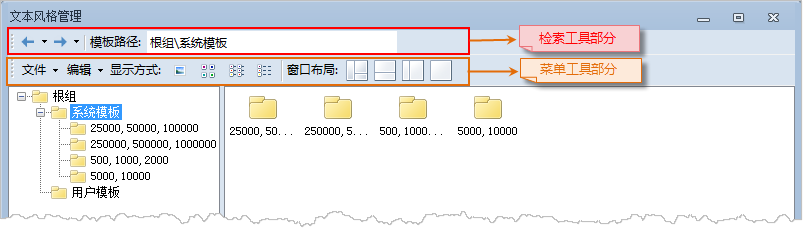
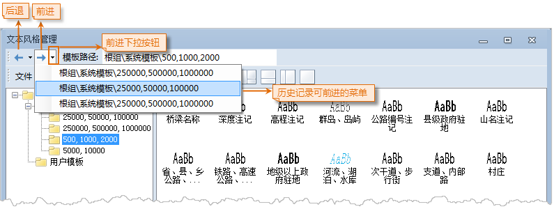
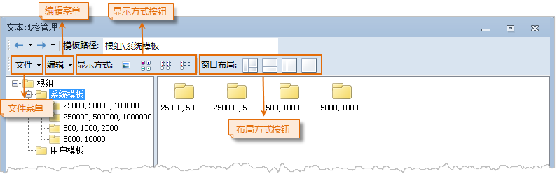
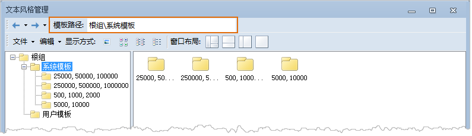

如下图所示，文本风格管理窗口的功能区域分为两大部分：检索工具部分和菜单工具条部分。

  
 
* **检索工具部分**

文本风格模板库窗口的检索工具提供了以下三种功能：

1. **浏览历史：** 在模板库窗口中浏览当前所加载的模板时，记录了用户多次浏览模板的路径信息，即模板所在的子分组目录。 点击下图所示的下拉箭头，弹出下拉菜单，列出了用户在当前模板库中浏览的历史记录，主要记录模板的子分组目录，点击历史记录中的任意一条，将自动跳转到相应的子分组目录下，在模板浏览区域将显示该子分组目录下的模板库文件夹及其中所包含的子分组。另外，前进和后退按钮也可以对浏览的历史记录进行跳转。
  
 
2. **模板路径：** “模板路径:”右侧的文本框用来显示设置和显示当前度浏览的模板路径，即模板的子分组目录，用户可以输入所要浏览模板的子分组目录路径，此时模板库浏览区域将显示该子分组目录下的模板，但不显示该子分组中包含的子分组。
  
 
* **菜单工具条部分**

文本风格管理窗口的菜单工具条部分提供了文件和编辑两个菜单项以及窗口布局、显示方式按钮。

  
 
  
  [文件菜单提供的功能](FileMenu.htm)

  [编辑菜单提供的功能](EditMenu.htm)

  [显示方式按钮](DisplayButton.htm)

  [窗口布局按钮](LayoutButton.htm)

* * *

  
  
---

