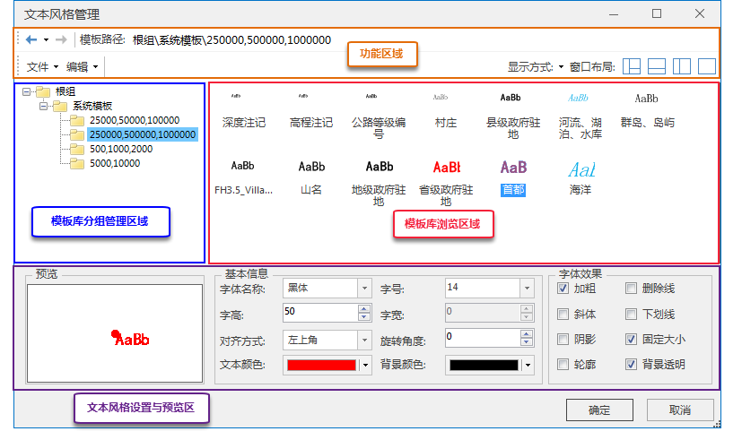

“ **风格设置** ”选项卡的“ **文本风格** ”组中，单击“ **模板管理**
”，弹出“文本风格管理”对话框。对系统模板和用户自定义的模板统一进行管理。“文本风格管理”窗口的界面构成如下图所示：

  

  
  * **功能区域：** 文本风格窗口的功能区域分为两大部分：检索工具部分和菜单工具部分。检索工具用来对文件进行前后浏览，或者查看历史浏览记录；菜单工具主要提供了文件菜单功能、编辑菜单功能、模板文件以文件夹显示方式设置、布局方式的设置等功能。具体请参见： [功能区域](TextStyleManageFunction)。
  * **模板库分组管理区域：** 点击“根组”文件夹，可以看见系统模板和用户自模板的文件夹下所有的模板文件。这里可以通过新建、重命名、删除、复制等操作对保存模板文件和文件夹进行操作，也可以通过导出命令将该文件夹下的模板导出到指定的位置。具体请参见： [模板库分组管理区域](TextStyleFolderMange)。
  * **模板库浏览区域：** 在此区域内，用户可以浏览每个模板的风格，也可以进行修改，或者新建一个新的文本风格模板。具体请参见： [模板库浏览区域](TextStyleMangeBrowse)。 

需要注意的是，“海洋”、“河流、湖泊、水库”这两个模板中，用到的字体都是左斜体，但是SuperMap中支持的“斜体”字体效果只能设置为右斜体。如果要实现左斜体的字体效果，可以借助第三方的字体库[东体](img/东体\(左斜体\).rar)，下载安装此字体后，在“字体名称”中选择“东体”即可实现左斜体的效果。左斜体效果实现时，不能勾选“字体效果”中的“斜体”。

  * **文本风格设置区域和预览区域：** 文本风格设置区域可以对字体的基本风格进行设置，包括字体、字号、字高、字宽、字体颜色、字体对齐方式、旋转角度等，也可以对字体的效果进行设置，例如粗体、斜体、下划线、删除线、阴影、固定大小、背景透明等。勾选相应的选项，就可以启用该效果。用户对模板所作的修改，会实时的显示在预览区域，可以即时预览效果。

### 注意事项

  1. 只有当文本图层中有选中的文本对象，且为可编辑状态时，该按钮才为可用状态。
  2. 若同时在地图窗口中选中多种类型的对象（文本对象、几何对象等），只有当图层管理器中，文本图层位于其它选中对象所在图层的上层时，“文本样式”组的模板按钮才为可用状态。

