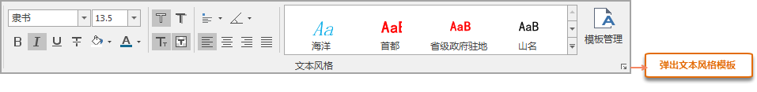

用户可通过 **风格设置选项卡** 和 **图层风格面板**
两种方式对文本进行风格设置。只有当地图窗口中有选中的文本对象，且文本图层为可编辑状态时，才可对选中文本进行风格设置。

###  风格设置选项卡

“风格设置”选项卡的“文本风格”组用于设置文本图层中文本对象的风格，该组中的功能只有在当前图层为文本图层，且该文本图层设为可编辑时，同时有选中的文本对象时才可用。

  

应用程序提供了一系列文本风格设置选项，用户可以通过设置相关参数，修改当前图层中选中的某一个或几个文本对象的文本风格。

### “文本风格”组的各标签按钮说明如下：

  *  用来设置文本图层中文本对象的字体，该标签控件右侧的组合框下拉列表中提供了丰富的字体供用户选择。用户既可以在文本框中输入字体，也可以点击右侧的下拉按钮在弹出的下拉列表中选择所需字体。此外，点击下拉按钮后，在文本框中输入字体的首字母也可以迅速定位到该字母开头的字体。 
  *  用来设置文本图层中文本字体的大小，用户既可以输入字体大小的数值，也可以从该标签控件右侧的组合框下拉列表中选择合适的字体大小。 
  *  按钮用来控制文本图层中文本对象的字体是否使用粗体，当该按钮为按下状态表示字体为粗体显示，如果按钮为非按下状态 时，字体不使用粗体显示。
  *  按钮用来控制文本图层中文本对象的字体是否使用斜体，当该按钮为按下状态表示字体采用斜体显示，如果按钮为非按下状态 字体不使用斜体显示。
  *  按钮用来控制文本图层中文本对象的字体是否有轮廓修饰，当该按钮为按下状态表示字体有轮廓修饰，如果按钮为非按下状态时，字体没有轮廓修饰。同时“文本风格”组上的  按钮为可用状态，用户可单击该按钮在弹出的颜色面板中设置文字轮廓的颜色。文字轮廓线修饰与文字背景修饰互斥，即两者对于文字的修饰不能同时使用。
  *  按钮用来控制文本图层中文本对象的文字下面是否添加下划线，当该按钮为按下状态表示文字下面有下划线，如果按钮为非按下状态时，文字下面没有下划线。
  *  按钮用来控制文本图层中文本对象的文字是否添加删除线，当该按钮为按下状态表示文字有删除线，如果按钮为非按下状态时，文字没有删除线。
  *  按钮用来控制文本图层中文本对象的文字是否有阴影，当该按钮为按下状态表示文字有阴影，同时“文本风格”组的按钮为可用状态，用户可单击该按钮在弹出的颜色面板中设置文字阴影的颜色；如果按钮为非按下状态  时，文字没有阴影，也不能进行文本阴影颜色的设置。 
  *  按钮用来控制文本图层中文本对象是否固定大小。当该按钮为按下状态表示文字大小不随地图的缩放而改变大小；如果按钮为非按下状态 表示文字大小随地图的缩放而缩放。
  *  按钮用来控制文本图层中文本对象的文字是否背景透明，当该按钮为按下状态表示文字背景透明，如果按钮为非按下状态文字背景不透明，同时“文本风格”组上的按钮为可用状态，用户可单击该按钮在弹出的颜色面板中设置文字背景的颜色。文字背景修饰与文字轮廓线修饰互斥，即两者对于文字的修饰不能同时使用。
  *  用来设置文本图层中文本对象的颜色。点击该按钮，用户可在弹出颜色面板选择和设置合适的颜色，也可单击颜色面板底部的“其它色彩…”按钮，在弹出的“颜色”对话框中自定义所需的文字颜色。 
  *  用来设置文本图层中文本对象的文字旋转角度。点击该按钮，用户可在弹出的文本框中输入文本的旋转角度，也可通过文本框右侧的微调按钮设置文字旋转角度的大小。
  *  用来设置文本图层中文本对象的对齐方式，系统提供了12种文字对齐方式：左上角、中上点、右上角、左基线、中心基线、右基线、左下角、中下点、右下角、左中点、中心、右中点。点击该按钮，用户可在下拉列表中选择所需的文字对齐方式。
  *  用来设置文本图层中文本对象与页边距的对齐方式，从左到右依次为左对齐、居中对齐、右对齐、两端对齐。用户可点击相关类型，设置文本在页边距中的对齐方式。 
  * **文本模板** ：在“文本风格”组中，通过 gallery 容器组织了提供了一些常用比例尺的文本样式模板，方便用户即时使用。选择其中一个模板，即可应用该模板的风格到选中的文本对象。 
  * **“文本风格”组的组对话框按钮** ：单击“文本风格”组的组对话框按钮，弹出“文本风格模板”面板，可以浏览到更多比例尺的的文本模板。点击面板底部的“模板管理”按钮，在弹出的“文本风格管理”对话框中，对系统模板和用户自定义的模板统一进行管理。

###  风格面板

选中当前图层中需要修改的文本对象，右键选择“对象风格”，则弹出文本风格面板。可查看或重新设置选中文本对象的各项风格参数。若当前文本图层为不可编辑状态，则只能查看属性窗口中文本对象的风格设置参数；若当前文本图层为可编辑状态，则还可以在属性窗口中重新设置文本对象的风格参数。该面板显示信息同选中文本对象的属性窗口一致。文本属性信息的详细说明请参考[文本对象属性窗口-文本信息](../Interaction/TextPropertyDia.htm)。

### 注意事项

1. 若同时在地图窗口中选中多种类型的对象（文本对象、几何对象等），只有当图层管理器中，文本图层位于其它选中对象所在图层的上层时，“文本风格”组的组对话框按钮才为可用状态。
  
