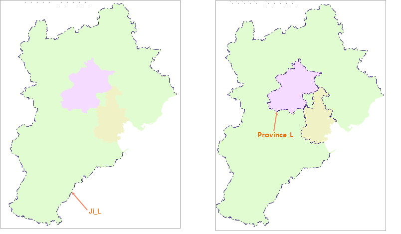

本专题文档主要通过一个输出和加载图层属性实例，介绍如何将图层属性信息输出为模板，并将模板添加至其他图层使用。

应用实例的主要内容包括图层属性设置、输出图层属性模板和加载图层属性模板几个部分。下面用示范数据中的Jingjin.smwu数据为基础，说明如何使用图层属性模板输出和加载功能。

### 操作步骤

  1. 将“BaseMap_R”数据集在地图窗口中打开.
  2. 在“ **风格设置** ”选项卡的“ **填充风格** ”组中，单击“ **前景色** ”下拉按钮，将图层前景色RGB设置为：253，234，218。
  3. 在“ **风格设置** ”选项卡的“ **线风格** ”组中，单击“颜色”下拉按钮，将图层线颜色RGB设置为：79，150，113。
  4. 在“ **图层属性** ”面板中，设置图层透明度为30%，同时将图层最小可见比例尺设置为1:20000000，最大比例尺设置为1:50000。
  

  5. 在图层管理器中选中该图层，单击右键，选择“图层属性模板”中的“输出…”选项，在弹出的“输出模板”中，选择模板输出保存路径，将模板保存为“BaseMap_R.xml”。
  6. 将“Neighbor_R”面数据集在新窗口中打开，在图层管理器中单击图层右键，选择“图层属性模板”中的“加载…”选项，选择BaseMap_R.xml模板文件，即可按模板文件中的图层风格和属性信息应用至Neighbor_R图层中，如下图所示：  
  
  
