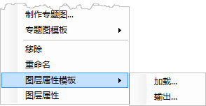

### 使用说明

加载图层属性模板功能，可以加载以 *.xml 文件格式存储的图层属性模板，将模板文件中的图层属性信息直接应用至当前图层。

图层属性模版中存储了图层属性、图层风格、专题图设置等信息。

### 操作步骤

1. 右键点击图层管理器中的图层结点，在弹出的右键菜单中选择“图层属性模板”的“加载”选项；
  
 
2. 在弹出的“加载模板”对话框中，选择所要加载的图层属性模板（*.xml 文件），点击对话框中的“打开”按钮，即可按模板文件中的图层属性信息应用至当前图层。
3. 加载图层属性模板后，该图层与模板图层共有的图层属性将与模板设置一致。

### 注意事项

* 加载图层属性模板后，图层标题不会被改变。
* 若当前图层对应的数据集与属性模板中的数据集不一致，则与数据集字段相关的属性设置不生效，需重新指定数据集字段，如显示过滤条件、对象显示顺序字段、图层关联属性表等。

