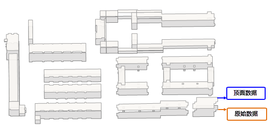

###  使用说明

平面立体地图可以将原来简单显示的平面地图变成有立体感的地图，由此用户可以更好的辨识地物，增加二维平面数据的层次；并通过设置顶面和阴影面的风格，增加地图的美观度；目前百度地图、腾讯等多家地图厂商都已推出立体地图查看模式，只需放大地图到一定的比例尺范围，就可以看到该区域建筑的立体效果。

支持将矢量面数据集，通过指定字段值作为拉伸高度值，生成建筑物顶面数据和侧面数据，使得在二维空间中呈现出立体效果的地图。如下图所示：

  

下文以实例介绍立体地图的制作：

### 操作说明

1. **数据准备** ：准备一份用于制作立体效果地图的矢量面数据集，面数据集属性中需要有一个整型或双精度类型的字段，用于存储建筑的拉升高度。
2. 在“ **数据** ”选项卡“ **数据处理** ”组中，单击“ **地图制图** ”下拉按钮，选择“ **平面立体地图** ”，弹出“ **创建平面立体地图** ”对话框。
3. 在对话框中选择创建立体效果的 **矢量面数据集** ，设置 **拉升高度字段** 和 **结果数据集名称** 。
4. 完成上述参数的设置，即可生成立体地图。生成结果得到两个数据集分别是“ **TopSideDatasetTop** ”和“ **TopSideDatasetSide** ”，即建筑物的顶面数据集和侧面数据集，两份数据同时可见才能有立体地图的展现效果。 
    
**顶面数据集**

顶面数据是将原始数据向 Y 方向偏移一定的距离，即数据生成时直接读取原始数据单个对象和对应的拉升高程值，将拉升高程值增加到对象点集中 Point2D 的 Y
值上，重新生成一份顶面数据集。效果如下图所示，但是不难发现这种偏移效果与立体效果还有一定的差距，因为两份数据中间没有侧面数据。

  
  
  **侧面数据集**

从原始数据和立体顶面数据的对比不难发现，它们有一个共同的特点，每个点的坐标只有 Y 方向有特定数值的拉高，X
坐标不变，根据这个特点就可以方便的向上构造侧面数据，取原始数据的第一个和第二个点，我们把它命名为 A 点和 B 点，以 A 点为起点，那么第二个点就是 A
点 Y 值拉伸的点 A1 ，第三个点为 B 点拉伸的点 B1 ,第四个点为 B 点，按照顺时针方向构造点集，生成侧面。原理如下图所示：

  

5. 将生成的顶面数据和侧面数据添加至同一地图窗口，通过图层风格配置，即可得到类似的立体效果地图。  

  
