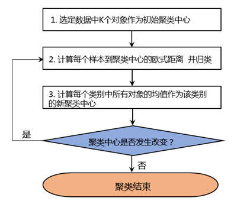
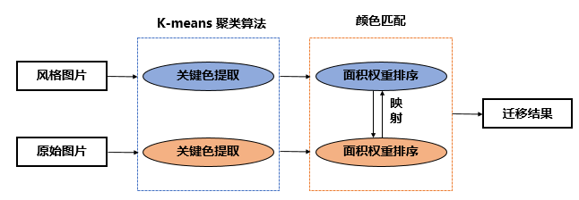
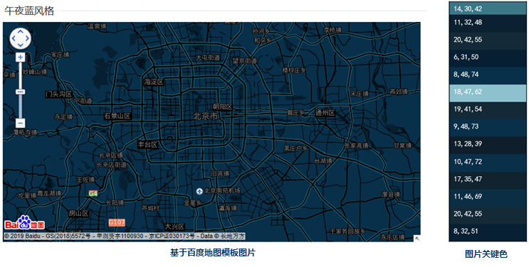
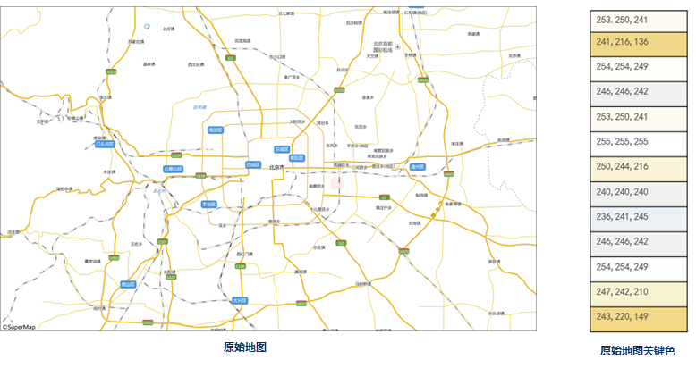
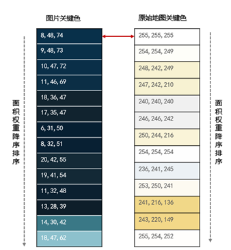

地图配图是GIS软件中最基础、最常用的功能，而传统的手工配图由于地图内容要素众多，其中的符号、线型、颜色、标签等需要反复搭配与调整，是一个复杂、费时的过程。AI
配图是利用对图像的学习，将图像风格迁移给矢量地图，即可以极大的提升配图效率，又能够解决烧脑的地图美观性问题。

SuperMap 结合机器学习的 K-means 聚类算法（k-means clustering
algorithm），根据参考地图、摄影作品等图片，自动将图片风格迁移至地图，实现快速模仿配图。

### **功能原理**

**K-means 聚类算法**

也称为K-均值，是一种迭代求解的聚类分析算法。是随机选取K个对象作为初始聚类中心，然后计算每个对象与各个聚类中心之间的距离（本文采用是RGB图像每点的欧式距离），再对相近程度进行类别划分，可以理解为一种求质心的聚类方式。

算法基本流程如下：1. 随机产生k个聚类中心（也可用户指定）。2. 计算每个样本到各个聚类中心的距离。并将样本归类到相应最接近的类别中。3.
计算每个样本的算数平均数，求出每一类中离平均数最近的点记为该类新的中心。4.
判断所有类别中中心点有没有发生变化，如果中心点改变，则再次以该中心点对所有数据聚类，直到所有的中心点都不改变为止，算法结束。

  
 

**AI配图原理**

基于K-means 算法的聚类原则分别获取风格图片和原始地图的关键色。
提取关键色之后，根据面积排序匹配算法建立风格图片与原始地图联系，将图片的关键色映射至原始地图中，从而得到一幅同图片颜色风格相同的地图。

  
---  
AI配图原理  

**第一步：提取风格图片关键色**

该步骤的主要工作是输入选定的自定义地图模板的风格图片，基于K-
means聚类算法对输入的图片进行机器学习，以提取图片特征，从而得到风格图片中的关键色。下图为选定百度地图模板“午夜蓝”作为风格图片，基于该图片提取得到关键色。

 

**第二步：提取原始地图关键色**

该步骤的主要工作是对原始地图进行特征提取，为提高地图颜色特征提取精度，先将地图输出为图片，从图片中提取地图关键色。下图为浅色调的原始地图及其关键色。

 

**第三步：面积排序匹配**

提取关键色后，需要对提取的图片关键色和地图关键色进行匹配，根据面积匹配算法，按照面积权重将图片的颜色自动匹配至原始地图。例如，图片关键色（8,48,74）面积占比最大，而原始地图关键色（255,255,255）面积占比最大，由此将原始地图关键色（255,255,255）按照图片关键色（8,48,74）进行重新渲染配图。

  

基于上述流程，迁移得到基于百度地图模板风格的深色地图，迁移结果如下图所示。

### 相关主题
 [风格迁移](SmartStyleTransfer)