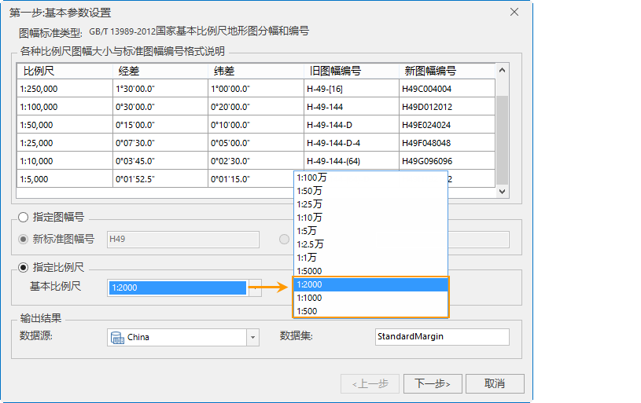
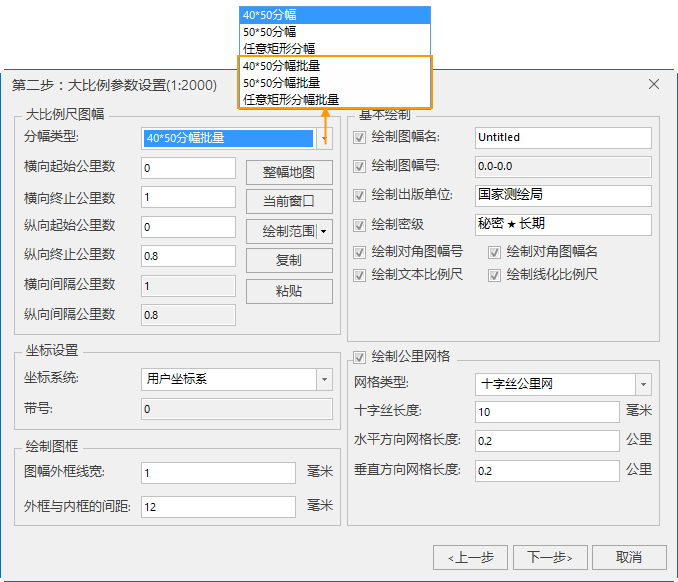
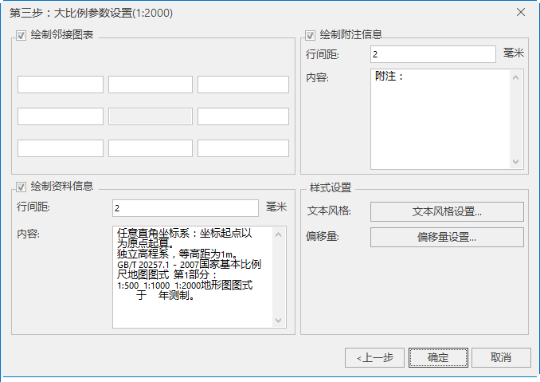
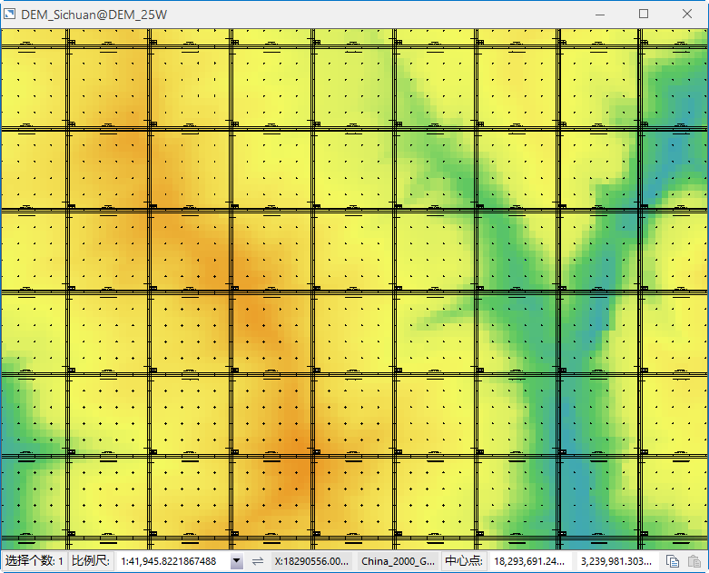

### 使用说明

支持对一定范围的数据批量生成标准图幅图框,目前仅支持大比例尺1:500、1:1000、1:2000三个比例尺。

1:2000、1:1000、1:500 地形图即可以经纬差进行分幅，也可以矩形分幅方式分幅，即可采用50cmx50cm和40cmx50cm分幅。

### 操作步骤

### 第一步：选择批量生成标准图幅图框的基本比例尺类型

打开需要批量生成图幅图框的地图。在“ **地图** ”选项卡的“ **制图** ”Gallery中，单击“ **标准图幅图框**
”按钮，弹出如下图所示的“标准图幅图框”对话框：

  
---  
第一步：基本参数设置  

* **指定比例尺** ：根据指定的比例尺和图幅范围生成图幅图框，单击右侧下拉按钮，选择一个基本比例尺即可,此处支持批量生成图幅图框的大比例尺为1:500、1:1000、1:2000三个比例尺。
* **输出结果** ：设置图幅图框数据集保存的名称和数据源。

### 第二步：大比例尺参数设置

1. 设置好第一步中的参数之后，单击“下一步”按钮，即可设置第二步参数。1:2000-1:500比例尺的图幅图框参数设置一致，设置参数如下：
  
---  
第二步：大比例尺参数设置  
2. **分幅类型** ：SuperMap 支持的批量分幅类型有： 40*50分幅批量、50*50分幅批量、任意矩形分幅批量三种类型。 
* **40*50分幅批量** ：即批量生成指定图幅的长度为50厘米，宽度为40厘米。此时可设置横向起始公里数和纵向起始公里数，横向终止公里数和纵向终止公里数会根据起始公里数和图幅大小自动计算终止公里数。
* **50*50分幅批量** ：即批量生成指定图幅的长度和宽度都为50厘米。此时可设置横向起始公里数和纵向起始公里数，横向终止公里数和纵向终止公里数会根据起始公里数和图幅大小自动计算终止公里数。
* **任意矩形分幅批量** ：用户可通过设置起始和终止公里数，自定义地图图幅大小。此时，起始公里数和终止公里数都支持设置。
3. **分幅范围** ：用于设置生成图幅图框的地图范围，应用程序提供了手动设置横纵起始/终止公里数、当前窗口、整幅地图、选择对象、复制粘贴五种设置方式，具体说明如下：
* 通过输入横向起始公里数、横向终止公里数、纵向起始公里数、纵向终止公里数的具体数值，确定生成图幅图框的范围。
  * **横向起始公里数** ：用于设置图幅横向起点的公里数。
  * **横向终止公里数** ：用于显示或设置图幅横向终止的公里数，仅在选择的分幅类型为任意矩形分幅时，才支持设置。
  * **纵向起始公里数** ：用于设置图幅纵向起点的公里数。 
  * **纵向终止公里数** ：用于显示或设置图幅纵向终止的公里数，仅在选择的分幅类型为任意矩形分幅时，才支持设置。
* **整幅地图** ：单击“整幅地图”按钮，即可将当前整幅地图设置为生成图幅图框的范围； 
* **当前窗口** ：单击“当前窗口”按钮，即可将当前视窗范围设置为生成范围。
* **绘制范围** ：提供了选择对象和绘制范围两种方式，“选择对象”是指在当前地图窗口中通过鼠标框选或点选方式，选中一个或多个对象，将选中对象范围设置为生成范围；“绘制范围”是指在当前地图窗口中，通过单击鼠标绘制，确定一个矩形区域为生成范围。 
* **复制粘帖** ：单击“复制”按钮可复制当前设置的范围，在支持粘贴的范围设置处单击“粘贴”按钮，即可将复制范围设置到当前范围。 
4. **坐标系统** ：用于设置图幅的坐标系，提供选择的坐标系有用户坐标系和国家坐标系两个。其中国家坐标系为 WGS 1984 坐标系。 
5. **基本绘制** ：用于设置绘制图幅名、图幅号、绘制出版单位、绘制密级等基本绘制参数。详细参数描述请参考[标准图幅图框](StandardMargin.html)。
6. **绘制公里网** ：勾选该复选框后，可设置公里网格的相关参数。详细参数描述请参考[标准图幅图框](StandardMargin.html)。

### 第三步：设置注释信息

1. 设置好第二步中的参数之后，单击“下一步”按钮，即可设置第三步注释信息，包括绘制邻接图表、绘制资料信息、绘制附注信息以及样式设置等参数。此处设置同标准图幅图框，详细参数描述请参考[标准图幅图框](StandardMargin.html)。
  
---  
设置注释信息  
2. 设置好标准图幅图框的相关参数之后，单击“生成”按钮，即可为指定比例尺及设置范围批量生成图幅生成图框数据。生成结果的 CAD 数据会自动添加在当前地图窗口。如下图所示1:2000 的批量生成标准图幅图框结果  ：  

  
---  

