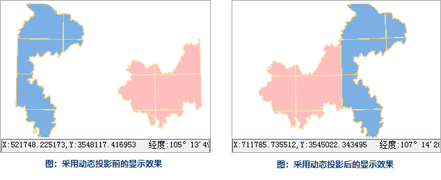

动态投影是当地图窗口中加载了投影系统不同的两个数据时，对其中一个投影坐标系进行转换（将后加载的数据转换为与当前地图投影一致的坐标系统），使两者的投影系统保持一致，保证同一区域或者相邻区域的数据能够叠加显示。

“ **地图属性** ”界面下“ **坐标系** ”选项卡中的“ **动态投影**
”项，用来控制当前地图窗口中地图的各个图层是否通过动态投影转化为同一投影进行显示，当勾选该项时，表示进行动态投影；当不勾选该项时，不进行动态投影。

如下图所示，某地区的数据被存储在两个数据集中并且两个数据集采用不同的投影方式，因此，当将这两个数据集添加到一个地图窗口中显示时，两个数据会错位显示，即与实际情形不符。

  

  
若未勾选“动态投影”复选框，将投影不同的两个数据添加到同一个地图窗口时，会弹出“坐标系提示”对话框，可单击对话框中的“是”按钮，即可自动开启动态投影。

开启动态投影后，使两个数据使用统一的投影在地图窗口中显示，显示后的效果如下所示。

 |   
---|---  
图：采用动态投影前的显示效果 | 图：采用动态投影后的显示效果  
  
在启用动态投影时，支持设置投影的转换参数，用户可单击“转换参数”按钮，在弹出的“投影转换参数设置”对话框中，设置投影转换参数。有关投影转换参数设置的详细描述请参看[数据集转换投影](../../DataProcessing/Projection/ConvertPrjCoordSysSingle)。

### 注意事项

Web 地图（包括 OGC、超图云服务、Google 地图等）、影像地图、地图缓存等类型暂不不支持动态投影。

