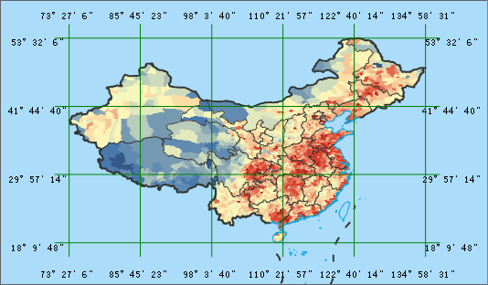

### 使用说明

地图格网可将制图区域按平面坐标或按经纬线划分格网，以格网为单位，描述或表达其中的属性分类、统计分级以及变化参数等，即在地图上表达动态时空变化的规律。其主要特点是将地图划分为大小不同的格网，以表达格网内的特征分布和变化，与自然或行政区划界线有所不同。

地图格网包括经纬格网和公里格网两种类型。经纬格网将根据设置的经度间隔和纬度间隔从坐标原点划分格网，并显示地图区域的格网；公里格网将根据设置的横向间隔和纵向间隔从坐标原点划分格网，并显示地图区域的格网。当地图坐标系为地理坐标系或投影坐标系时，格网类型可设置为经纬网或公里网；当地图坐标系为平面坐标系时，格网类型只能设置为公里网。

### 操作步骤

1. 在当前工作空间中打开地图，在“ **地图** ”选项卡的“ **制图** ”组中，单击“ **地图格网** ”按钮，弹出“地图格网工具”对话框。
2. 在“格网类型”处，可根据地图坐标系及用户需要选择经纬格网或公里格网。若为地理坐标系，则只能选择经纬网；若为平面坐标系，则只能选择公里网；若为投影坐标系，则选择任意一种都可。
3. 在“设置方式”处，可选择“自定义范围”和“使用指定数据集范围”两种方式设置生成格网的范围。
4. 根据选择格网类型和设置方式的不同，格网范围参数区域的参数有所不同，下面以不同的格网类型来介绍相应的范围参数。 
* **经纬格网**

根据经纬坐标来设置格网的范围，以及单元格的经差和纬差。注意：终止经纬度必须比的起始经纬度值大。经度取值范围为-180至180，纬度的取值范围为-90至90。

起始经度/纬度：表示格网的起始点经纬坐标。

终止经度/纬度：表示格网的终止点经纬坐标。

单元格经差：表示格网中每个单元格的左右经度差值，即单元格的宽度。该值必须小于终止经度与起始经度的差值。

单元格纬差：表示格网中每个单元格的上下纬度差值，即单元格的宽度。该值必须小于终止纬度与其实纬度的差值

**备注** ：若格网类型为经纬格网，则可勾选 **以“度:分:秒”形式显示** 复选框，将坐标输入框切换为度:分:秒的形式进行设置。

* **公里格网**

根据地理坐标来设置格网的范围，以及单元格的高度和宽度。注意：最大X/Y必须比最小X/Y的值大。

最小X/Y：表示格网的起始点平面坐标，单位为米。可以为任意值，但最好该值有地理意义，一般为整数。

最大X/Y：表示格网的终止点平面坐标，单位为米。可以为任意值，但最好该值有地理意义，一般为整数。

单元格宽度：表示格网中每个单元格的宽度，单位为米。该值必须小于最大X与最小X的差值。

单元格高度：表示格网中每个单元格的高度，单位为米。该值必须小于最大Y与最小Y的差值。

* 行数/列数：表示经由格网范围和单元宽/高度（或单元格经/纬差）计算得出的格网的行数和列数，默认将地图分为6列4行。
* 单击“数据集类型”右侧下拉按钮，可设置结果格网数据集为点数据集、线数据集、面数据集或复合数据集。 

**点数据集** ：地图格网结果数据为点数据集，该数据集为在给定格网范围内的一个格网点阵列。

**线数据集** ：地图格网结果数据为线数据集，该数据集为在给定格网范围内的一个格网线阵列。

**面数据集** ：地图格网结果数据为面数据集，该数据集为在给定格网范围内的一个格网阵列。

**复合数据集** ：地图格网结果数据为CAD数据集，该数据集可同时显示给定范围内的格网线及标注信息。

* 当数据集类型为线数据集或复合数据集时，可设置格网线的光滑系数，默认为2范围[1，5]，光滑系数为1则不进行光滑处理，不插入点，则只有单元格两个端点。
* 当数据集类型为线数据集或复合数据集时，可勾选“显示主分割线”复选框，则会在每条纵横交错的格网线与地图外框交点处，显示分割线；否则不显示。 勾选“标注格网”复选框，即可在主分割线处显示标注，同时可单击“ **AaBb** ”按钮，在“文本风格设置”对话框中，设置文本相关的属性。
* 在“结果数据”处设置格网数据所保存在的数据源和保存名称，单击“确定”按钮后，当地图窗口即可显示地图格网数据。  

  

