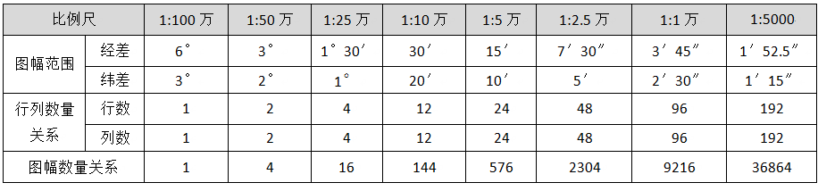
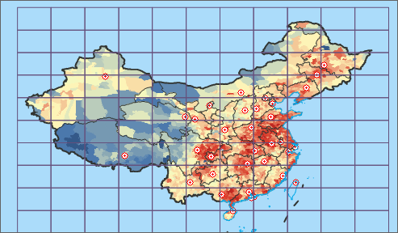

### 使用说明

接图表是指按照比例尺和地理范围参数，将地图划分为尺寸适宜的若干幅地图，生成标准的图幅数据集，以便于地图索引、制图、分块操作等。

为了便于地形图的测绘、使用和保管，需要将大范围内的地形图进行分幅，该功能采用经纬线分幅的方法。经纬度分幅的图廓线由经线和纬线组成，是当前世界各国地形图和大区域的小比例尺分幅地图所采用的主要分幅形式。

我国的各种比例尺地形图均以1:100万地形图为基础图，按各种比例尺相应的经差和纬差逐次划分图幅，并以横向为行，纵向为列，如下表所示。在地图分幅中，1：100
万地图分幅是从赤道起向两极每纬差 4°为一行，至 88°，南北半球各分为 22 横列，依次编号 A、B、... V；经度由 180°自西向东每
6°一列，全球 60 列，以 1-60 表示。SuperMap 目前只支持纬度在 0 度到 北纬 76 度之间的分幅，即横列号只支持到 S。

  
---  
表：各比例经纬差  

### 操作步骤

1. 在当前工作空间中打开地图，在“ **地图** ”选项卡的“ **制图** ”组中，单击“ **接图表** ”按钮，弹出“接图表”对话框。  

接图表对话框  
2. 单击“比例尺”下拉按钮，用户可按需要选择相应比例尺进行分幅，可选的比例尺有1:5000、1:1万、1:2.5万、1:5万、1:10万、1:25万、1：50万、1:100万8种。
3. 图幅范围有全国范围和自定义范围两种，若选择“自定义范围”，可在左上右下四个文本框中输入四个角的坐标来定义图幅范围，也可通过右侧四个功能按钮来设置范围：
* 整幅地图：当前打开的地图的全幅范围，可通过地图的全幅显示操作，在“地图属性”面板中来查看当前地图的全幅范围。
* 当前窗口：当前打开的地图的视图范围，可以通过地图的放大、缩小、修改比例尺等操作，来调整当前视图范围。
* 复制：可将左侧的四个范围值复制到剪切板中，也可直接将复制结果粘贴到其它支持设置范围的地方，比如数据集属性面板中的数据集范围。
* 粘贴：将剪切板中的四个范围值复制到对话框的左上右下四个文本框中。
4. 在“结果数据”处设置图幅数据所保存在的数据源和保存名称，单击“确定”按钮后，即可按国标进行地图分幅，可将结果数据添加到当前地图窗口中进行查看。  

  
 

### 备注

图幅数据属性表的Code字段中，保存了图幅的编号信息，可基于该图层制作标签专题图，查看图幅数据相应的图幅号。

