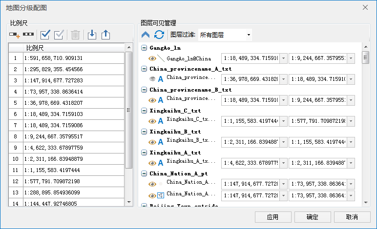
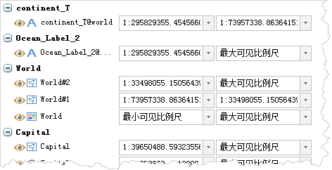

### 使用说明

通过使用分级配图功能，用户可对当前地图批量设置特定比例尺下需要显示的图层，满足用户按照分级比例尺配图的需求。这里既能方便地查看和修改每个比例尺下可显示的图层，也能查看和修改每个图层所设置的最大/最小可见比例尺。

### 操作步骤

1. 打开需要调整比例尺的地图。
2. 单击功能区 “ **地图** ”选项卡 > “ **制图** ”组中的 >“ **分级配图** ”按钮；或者在图层管理器工具栏处单击“分级配图”按钮。
3. 弹出如下图所示的 **地图分级配图** 对话框。  

  
---  
4. 管理配图所用比例尺。 

通过工具条按钮来管理配图涉及到的比例尺。

若对地图设置了固定比例尺，或者图层设置过最大/最小可见比例尺，则比例尺列表框中将默认的固定比例尺或各个图层所设置的最大/最小可见比例尺为分级比例尺，用户可在当前分级比例尺下继续修改；若地图图层未设置过固定比例尺或者最大/最小可见比例尺，则比例尺列表框内为17个常用比例尺。

**工具条按钮说明**

* “添加”按钮，添加所需的比例尺。若对话框中没有比例尺记录，添加的第一个比例尺都默认为地图当前比例尺；若选中比例尺列表中的最后一个比例尺，添加的比例尺默认为前一个比例尺的两倍；若选中比例尺不是列表中的最后一个，则添加的比例尺为选中比例尺与后一个比例尺和的二分之一。
* “添加切图比例尺”按钮，添加符合电子地图数据规范地图分级比例尺，默认为级比例尺，用户可根据需要对其进行增删调整。
* “全选”按钮，全部选中列表框内所有的比例尺。
* “反选”按钮，反选列表框内的比例尺。
* “删除”按钮，移除不需要的比例尺。
* “导入”按钮，可以将保存为 *.xml 格式的比例尺配置文件导入到“比例尺管理”区域下方的列表框中。
* “导出”按钮，可以将下方列表框中的比例尺记录以 *.xml 格式保存到文件中，便于再次使用。

5. 管理比例尺可见图层。 

**工具条按钮说明**

*  按钮：用来控制工具条下方的图层比例尺管理窗口内各图层节点的收起和展开状态。通过单击该按钮实现收起/展开状态的控制。默认按钮为  状态，单击即可收起所有图层结点；图层结点呈收起状态时，按钮变为  状态，单击即可展开所有图层节点。
*  按钮：刷新按钮，用来刷新图层比例尺管理窗口内的所有可见图层节点。
* **图层过滤** ：系统提供了两种地图图层的显示过滤方式：所有图层和可见图层。选择“所有图层”项时，下方图层比例尺管理窗口将显示地图中所有的图层；选择“可见图层”项时，下方比例尺管理窗口中地图图层的显示内容将根据比例尺的不同而变化，在选中某一个比例尺时，右侧将显示该比例尺下可显示的所有图层。此外，最大比例尺设置为“最大可见比例尺”的图层，将在全范围显示。 

最大/最小可见比例尺可在功能区 > “图层属性”选项卡 >
“过滤设置”组进行设置，具体内容请参见[设置图层可见比例尺范围](../AdvanceSetting/ScaleRanges)。

### 图层比例尺管理窗口

按照图层的叠加顺序分类，分类名称用粗体表示，名称左侧按钮可展开/收起该类下的所有图层。图层比例尺管理窗口如下图所示：

  
---  
* **可显示** ：数据集类型图示前面的"显示"按钮，用来控制该数据集在地图窗口中的显示。通过单击该按钮实现可见性的控制。当按钮处于高亮状态时，按钮所在图层可在地图窗口中显示；当按钮处于灰色状态时，按钮所在图层不可见。
* **图层名称** ：该图层在图层管理器窗口中显示的名称，名称前面为该图层的数据集类型的图示。
* **最小比例尺** ：控制该图层在地图窗口缩放时可显示的最小值。下拉菜单中列出左侧比例尺列表框内所有比例尺，默认为最小可见比例尺。设置最小比例尺后，若地图的比例尺小于该图层的最小比例尺时，该图层将不可见。
* **最大比例尺** ：控制该图层在地图窗口缩放时可显示的最大值。下拉菜单中列出左侧比例尺列表框内所有比例尺，默认为最大可见比例尺。设置最大比例尺后，若地图的比例尺大于该图层的最大比例尺或与最大比例尺相同时，该图层将不可见。
* **批量设置图层比例尺** ：在对话框左侧比例尺列表中选中一个比例尺后，在图层列表中通过 Shift 或 Ctrl 键选中多个图层，单击鼠标右键可将选中比例尺设置为选中图层的最大或最小可见比例尺，也可清除选中图层设置的可见比例尺范围。

