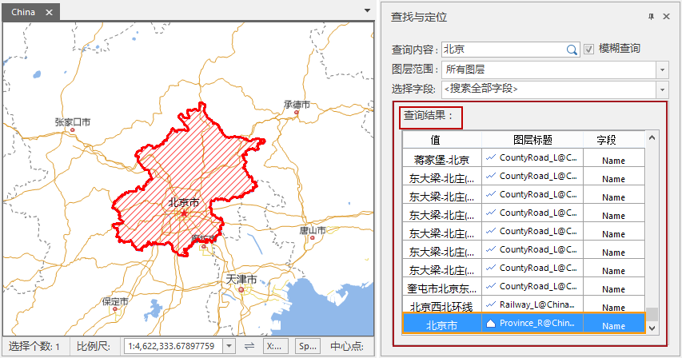

### 使用说明

地图查找与定位，提供了查询当前地图中某一属性值的功能。用户可以查找当前地图中所有图层的任意属性值，也可设置具体的查询范围，选择固定图层或图层中的某一具体字段中进行查询。支持精确查询和模糊查询。

### 操作步骤

1. 在当前工作空间中打开所要查询的地图，在“ **地图** ”选项卡的“ **浏览** ”组中，单击“ **查找与定位** ”按钮，在地图窗口的右侧弹出“查找与定位”对话框。
2. **查询内容** ：输入所要查询的内容。
3. **模糊查询** :勾选该复选框，将对输入的查询内容进行模糊查询，即将包含查询内容的属性值均作为查询结果，不需要完全匹配属性值；如若不勾选改复选框，将执行精确查询，即只将与查询内容完全匹配的属性值作为查询结果。
4. **图层范围** ：设置图层范围，点击图层范围右侧下拉按钮，可选择所有图层、可见图层、当前选中图层及指定某一特定图层。
  * **所有图层** ：根据用户输入的查询内容，遍历当前地图中的所有图层，匹配与之对应的属性值。
  * **可见图层** ：根据用户输入的查询内容，只在当前地图中的可见图层进行查询，在可见图层中匹配与之对应的属性值。
  * **当前选中图层** ：用户可在图层管理器中选择一个或多个图层，只在当前选中的图层中查询与之对应的属性值。
  * **指定某一特定图层** ：下拉菜单中将罗列当前地图中的 全部图层名，用户可指定某一特定图层进行查询。
5. **选择字段** :点击右侧下拉按钮，下拉菜单中显示的即为设置的搜索图层范围中所有图层字段。可选择搜索全部字段也可搜索某一字段。
6. 输入以上查询信息，点击键盘 Enter 键或单击查询内容输入框中的搜索，执行查询功能。
7. 查询出的结果以列表的形式显示，双击某一查询结果，地图将定位至该要素。如下图所示： 
  * **值** ：即查询出的属性值。
  * **图层标题** ：属性值所在图层的标题。
  * **字段** ：属性值所在的图层字段。  
  
  

