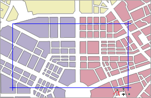
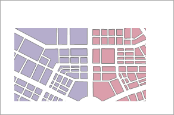
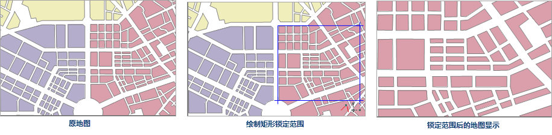
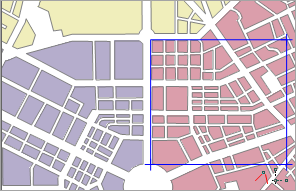
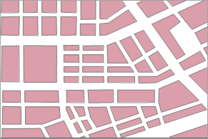
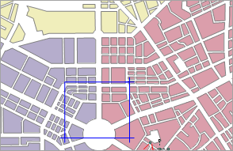
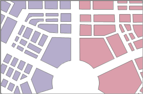

“ **地图属性** ”面板中的“ **范围** ”选项中，包含了地图显示范围相关的参数，包含了比例尺、显示范围、中心点、视图范围、地图范围等。

### 设置地图比例尺

对地图窗口中的地图进行浏览时，可以将该地图按照固定比例尺显示或者按照指定的一系列比例尺进行显示。

**当前比例尺**

用来显示和设置当前地图窗口中地图所用的比例尺。随着地图的缩放，当前比例尺的数值会不断地发生变化。可以在“当前比例尺”标签右侧的文本框中输入要显示的比例尺数值。如果需要按照国家基本比例尺系列进行显示，可通过选择组合框下拉列表中的比例尺将当前地图快速切换为相应比例尺的显示状态。

**固定比例尺**

勾选该复选框，将启用以固定比例尺的方式进行地图缩放，即用户可以定义一系列的固定比例尺，那么当用户进行缩放操作时，每次缩放操作的结果将在这些固定比例尺之间切换，即缩放结果为缩放到与当前比例尺最邻近的固定比例尺状态。当前地图不会以用户定义的固定比例尺之外的比例尺大小进行显示。当勾选了“固定比例尺”复选框后，该复选框右侧的“设置比例尺...”按钮变为可用状态。

**添加比例尺**

“设置比例尺...”按钮与“固定比例尺”复选框配合使用，共同实现以固定比例尺缩放地图的功能。点击“设置比例尺”按钮弹出“设置固定比例尺”对话框，用户可以点击对话框中的“添加比例尺”按钮添加一个固定比例尺。

* 添加一个比例尺后，用户可以编辑比例尺的值，从而设置需要的固定比例尺。单击“添加比例尺”下拉按钮，可选择“添加比例尺”、“添加当前比例尺”或“添加切图比例尺”方式进行添加。

**注意**
：若对话框中没有比例尺记录，通过任意一种方式添加的第一个比例尺都默认为地图当前比例尺。若选中比例尺列表中的最后一个比例尺，通过“添加比例尺”方式添加的比例尺默认为前一个比例尺的两倍；若选中比例尺不是列表中的最后一个，则通过“添加比例尺”方式添加的比例尺为选中比例尺与后一个比例尺和的二分之一。缩放地图后通过“添加当前比例尺”方式即可添加当前地图比例尺。

* 若用户想使用常用切图比例尺，则可选择添加切图比例尺，可方便的将切图比例设置为地图固定比例尺。
* 当用户添加了多个比例尺后，点击“确定”按钮，完成比例尺的添加。当在地图窗口进行缩放操作时，缩放的结果将在所设置的固定比例尺之间进行切换。

### 裁剪显示范围

通过设置一定范围，在当前地图窗口中只显示指定范围的地图内容，而不显示范围之外的地图内容，从而呈现一种剪裁地图的效果。裁剪地图是以显示为目的的一种处理，并未裁剪地图的各个数据集。

勾选“裁剪显示范围”复选框，右侧的下拉按钮变为可用状态。单击该下拉按钮，在弹出的下拉菜单中选择一种裁剪区域的方式，即可在当前地图窗口中确定裁剪区域。下拉菜单中提供了选择对象、绘制矩形、圆形、扇形和多边形
5 种方式，其中，选择对象方式支持选择当前地图窗口中一个或多个面对象作为裁剪显示区域。确定裁剪区域后，当前地图会实时应用裁剪效果。

| |  
---|---|---  
原地图| 绘制矩形裁剪区域| 裁剪后的地图显示  

### 锁定最大显示范围

锁定最大显示范围的功能是指通过最大显示的范围锁定地图特定部分，从而使得在地图浏览过程中，地图的显示范围最大，即使指定范围外的地图内容在“锁定最大显示范围”状态下不可见。该功能与裁剪区域功能类似，区别在于裁剪区域操作后的地图可以自由缩放或平移，不受设置的范围控制；而地图锁定范围时，各种地图浏览操作均不会使显示范围超出指定范围。

* 勾选“锁定最大显示范围”复选框，右侧的下拉按钮变为可用状态，此时，地图最大显示范围默认为地图范围。单击该下拉按钮，在弹出下拉菜单中选择一种锁定范围的方式，即可在当前地图窗口中确定需要被锁定的区域。下拉菜单中提供了一系列确定锁定范围的方式：绘制矩形、圆形、扇形或多边形，以及通过选择当前地图窗口中某个面对象的范围作为锁定范围。
* 确定了锁定范围后，当前地图即时以确定的锁定范围进行最大显示。
* 若用户不满意当前的锁定范围，可通过单击该按钮下拉菜单中的“设为地图范围”选项，将地图锁定的最大范围设为地图范围；或者重新确定新的锁定范围，已执行的锁定范围操作自动撤销，并应用新的锁定范围。  

| |  
---|---|---  
原地图| 绘制矩形锁定范围| 锁定范围后的地图显示  

### 自定义全幅范围

自定义全幅范围的功能是指通过设置，自定义当前地图的全幅显示范围。当用户在当前地图中定义了全幅范围后，则在当前地图窗口进行地图浏览操作后，
若用户单击“地图操作”选项卡中“浏览”组的“全幅显示”按钮，或者按键盘上的 F6 键，当前地图将以自定义的全幅范围全幅显示。

* 勾选“自定义全幅范围”复选框，右侧的下拉按钮变为可用状态。
* 单击该下拉按钮，在弹出下拉菜单中选择一种自定义全幅范围的设置方式，即可在当前地图窗口中设置全幅范围。下拉菜单中提供了一系列确定地图全幅范围的方式：绘制矩形、圆形、扇形或多边形，以及通过选择当前地图窗口中某个面对象的范围作为锁定范围。
* 确定了全幅范围后，当前地图即时以确定的全幅范围进行放大显示。
* 若用户不满意当前的全幅范围，可通过单击该按钮下拉菜单中的“清除全幅范围”选项取消已执行的全幅范围操作；或者重新确定新的全幅范围，已执行的全幅操作自动撤销，并应用新的全幅范围。  

| |  
---|---|---  
原地图的全幅显示状态| 绘制矩形确定地图的全幅范围| 确定全幅范围后的地图显示  

### 中心点位置

中心点位置：以X、Y坐标值显示或设置当前地图窗口的中心点坐标值。在“X:”和“Y:”标签右侧的数字显示框为可用状态，显示了当前地图窗口的中心点的坐标值，用户可以在这两个数字显示框中重新输入数据，确定新的地图窗口中心点。

### 当前视图范围

可用来查看地图在当前地图窗口中可见范围的信息。当前视图范围的信息包括当前窗口显示的左、上、右、下的位置信息。可以对这些文本框进行编辑，输入左、上、右、下的坐标，当前地图比例尺不会改变，相当于地图发生了平移。

应用程序提供了当前窗口、整幅地图、选择对象、复制粘贴四种设置方式，具体说明如下：

* **整幅地图** ：单击选中“整幅地图”单选框，即可将当前地图中的所有图层范围的并集设置为输出范围；
* **选中对象** ：提供了 **选择对象** 和 **绘制范围** 两种方式，“选择对象”是指在当前地图窗口中通过鼠标框选或点选方式，选中一个或多个对象，将选中对象范围设置为输出范围；“绘制范围”是指在当前地图窗口中，通过单击鼠标绘制，确定一个矩形区域为输出范围。
* **复制粘贴** ：单击“ **复制** ”按钮可复制当前设置的范围，在支持粘贴的范围设置处单击“粘贴”按钮，即可将复制范围的左、下、右、上值设置到当前范围。

### 地图范围

“地图范围”显示了当前地图的空间范围信息。地图的空间范围是指包含地图中各个数据集的最小外接矩形。当地图中数据集增加或减少时，空间范围也可能会相应发生变化。地图范围的文本框处于灰色状态，不可编辑改变地图范围。地图范围可进行复制，在支持粘贴的范围设置处单击“粘贴”按钮即可。

**备注**

* 在勾选了裁剪显示范围、锁定最大显示范围、自定义全幅范围其中某种范围方式后，可以通过单击右键，取消鼠标的绘制状态。
* 在进行“裁剪显示范围”等相关范围设置时，如果使用“选择对象”方法进行范围的设置，那么地图窗口中当前可选择图层必须为面图层，即“选择对象”操作方法对点图层和线图层无效。
* 地图裁剪区域只适用于当前地图设置的投影，如果地图投影发生改变，需要重新设置裁剪区域。

