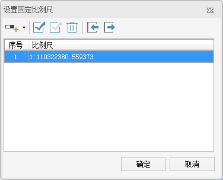
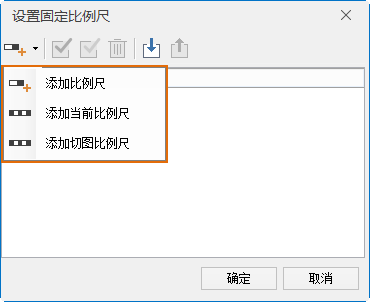
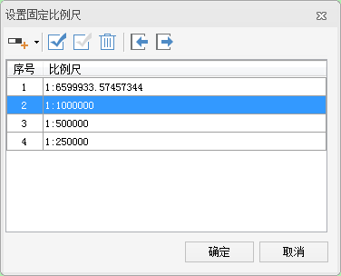

对地图窗口中的地图进行浏览时，可以将该地图按照固定比例尺显示或者按照指定的一系列比例尺进行显示。

### 当前比例尺

“当前比例尺”显示栏用来显示和设置当前地图窗口中地图所用的比例尺。随着地图的缩放，当前比例尺的数值会不断地发生变化。可以在“当前比例尺”标签右侧的文本框中输入要显示的比例尺数值。如果需要按照国家基本比例尺系列进行显示，可通过选择组合框下拉列表中的比例尺将当前地图快速切换为相应比例尺的显示状态。

### 固定比例尺

在“地图属性”界面中勾选该复选框，将启用以固定比例尺的方式进行地图缩放，即用户可以定义一系列的固定比例尺，那么当用户进行缩放操作时，每次缩放操作的结果将在这些固定比例尺之间切换，即缩放结果为缩放到与当前比例尺最邻近的固定比例尺状态。当前地图不会以用户定义的固定比例尺之外的比例尺大小进行显示。当勾选了“固定比例尺”复选框后，该复选框右侧的“设置比例尺...”按钮变为可用状态。

### 添加比例尺

“设置比例尺...”按钮与“固定比例尺”复选框配合使用，共同实现以固定比例尺缩放地图的功能。点击“设置比例尺”按钮弹出如下图所示的“设置固定比例尺”对话框，用户可以点击对话框中的“添加比例尺”按钮添加一个固定比例尺。

  
---  
图：“设置固定比例尺”对话框  
  
添加一个比例尺后，用户可以编辑比例尺的值，从而设置需要的固定比例尺。单击“添加比例尺”下拉按钮，可选择“添加比例尺”、“添加当前比例尺”或“添加切图比例尺”方式进行添加。

**注意**
：若对话框中没有比例尺记录，通过任意一种方式添加的第一个比例尺都默认为地图当前比例尺。若选中比例尺列表中的最后一个比例尺，通过“添加比例尺”方式添加的比例尺默认为前一个比例尺的两倍；若选中比例尺不是列表中的最后一个，则通过“添加比例尺”方式添加的比例尺为选中比例尺与后一个比例尺和的二分之一。缩放地图后通过“添加当前比例尺”方式即可添加当前地图比例尺。

若用户想使用常用切图比例尺，则可选择添加切图比例尺，可方便的将切图比例设置为地图固定比例尺。

当用户添加了多个比例尺后，点击“确定”按钮，完成比例尺的添加。当在地图窗口进行缩放操作时，缩放的结果将在所设置的固定比例尺之间进行切换。

 |   
---|---  
图：添加比例尺方式 | 图：添加多个比例尺  
  
