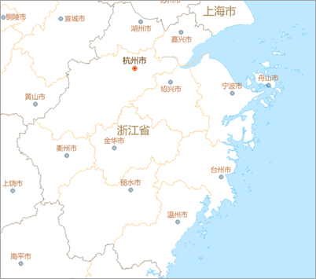
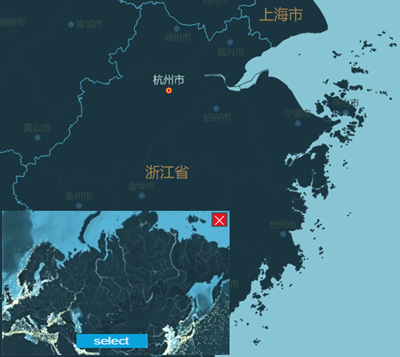
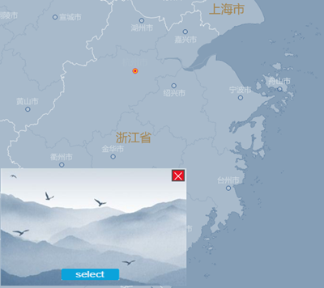
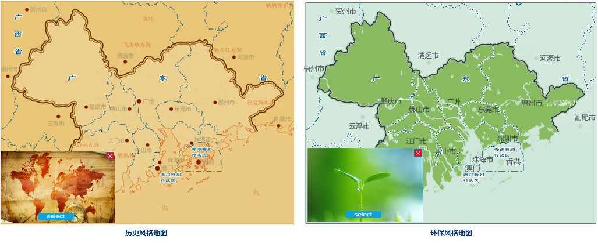
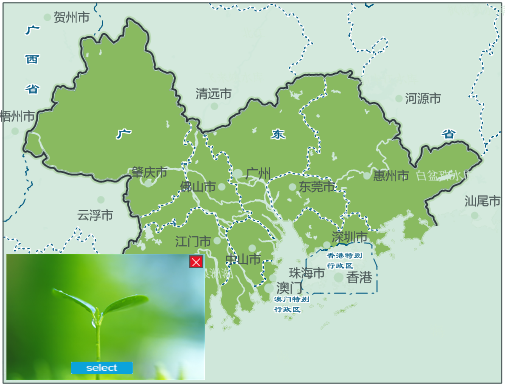

### 功能说明

通过选择一张图片样式，程序自动分析图片的配色，并将图片风格迁移至当前地图中，智能的渲染地图。

**功能原理**

使用 **K-Means 聚类算法**
分别获取图片和地图的主色调，同时将图片的主色调与地图主色调根据面积权重建立联系，将图片的主色调赋予对应地图的颜色，从而得到一幅同图片颜色风格相同的地图。

**应用场景**

* 适用于当用户已经配好了一幅地图，但是想要换一种显示风格应用到其他场景中，例如用户有一幅亮色系的地图，但是需要适配地图大屏展示为暗色系的地图，或者为适配某个会场风格需要改变地图配色风格。
* 适用于地图个性化展示，例如水墨画风格，古建筑风格等个性化展示。  

 |  | 
---|---|---  
原地图 | 图片风格迁移（深色系） | 图片风格迁移（水墨系）  

**注** ：支持通过快捷键 Ctrl+Z 实现地图操作回退。

### 操作说明

**风格迁移** ：目前预定义了暗色系、彩色系、水墨画等多套风格图片，同时支持用户导入自定义图片。

1. 在地图窗口打开已配置好的地图。
2. **使用模板图片** ：单击 **AI配图** 选项卡-> **风格迁移** 组的 Gallery 控件中，单击任一图片，即可基于当前图片渲染地图，地图窗口中显示风格迁移后的地图。 
3. **使用自定义图片** ：单击 **AI配图** 选项卡-> **风格迁移** 组的 Gallery 控件中->“自定义”按钮，上传自定义图片。
4. 在地图窗口左下角弹出图片选择对话框，可单击"..."蓝色按钮，上传或更改自定义图片。

**风格迁移设置** ：在指定图片样式前，支持设置提取颜色时图片的压缩模式和颜色数，以提高图片的处理性能。

1. 在 **风格设置** 选项卡-> **风格迁移** 组的 Gallery 控件中，单击“迁移设置”按钮，弹出“风格迁移设置”对话框。
2. **压缩模式** ：提供4种图片的压缩模式，以提升读取图片速度，提升图片处理性能。有关插值的详细描述请参看：[栅格重采样方法介绍](../../DataProcessing/Registration/resamplemethod.htm)。 
* **无** ：不对图像进行压缩，使用图片的原始长宽比。
* **抗锯齿** ：基于采样的抗锯齿算法，能够很好的处理图片中图物边缘出现渲染失真和锯齿的问题，处理后的图像品质最高（损失最小），但相较于其他模式的处理比较耗费资源性能较低。
* **最近邻插值** ：基于K近邻算法，是将目标图像各点的像素值设为源图像中与其最近的点，优点是处理简单、速度快性能快，但相较于其他模式处理后图片的质量较低。
* **线性插值** ：使用简单的线性插值重新采样图像，输出质量低于三次样条插值，但性能较好。
* **三次样条插值** ：该算法使用三次插值来重新采样图像。 输出质量低于抗锯齿，但性能较高于抗锯齿。
3. **颜色数** ：支持设置提取图片的颜色数，程序默认颜色数范围为50~200，用户可根据当前地图配色，指定合理颜色数。

**颜色调整**
：支持调整色相、亮度、对比度、饱和度、填充柔化、填充锐化，同时支持彩色、灰度、黑白、反色等，对渲染后的文本、线、面图层进行色彩调整，以达到更理想的配图效果。

1. 单击 **风格设置** 选项卡-> **颜色调整** 按钮，弹出颜色调整面板，支持调整如下信息：
2. **亮度** ：通过滑块调整当前地图中填充、轮廓、线以及标注对象的亮度；
3. **对比度** ：通过滑块调整当前地图中填充、轮廓、线以及标注对象的对比度；
4. **饱和度** ：通过滑块调整当前地图中填充、轮廓、线以及标注对象的饱和度。

### 应用实例

现有一幅珠江三角洲政区地图，政府在对外宣传时分为两个专题：珠江三角洲历史发展以及区域环境保护，为适应两种不同的主题，可通过选择古地图和绿色植被两种不同的图片风格，将地图风格适配为对应主题，得到如下图所示的结果：

 |  
---|---  
历史风格地图 | 环保风格地图  

