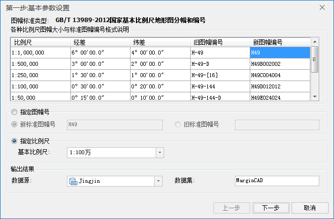

---
id: StandardMargin
title: 标准图幅图框
---  

### 使用说明

标准图幅图框功能用于为地图添加标准图幅的图框数据，结果以 CAD
数据集的形式保存到指定的数据源中。利用标准图幅图框功能，可以方便快捷地创建基于国家基本比例尺的各种图幅，提升地图制作的专业性。在标准图幅内添加具有相同坐标系的居民点、水系、土地利用、等高线、行政区划等国家基础地理信息数据，配以坡度尺、邻接图表、绘制信息等，从而快速创建一幅精美的全要素标准地图。

标准图幅图框功能参照的是最新国标《GBT 13989－2012
国家基本比例尺地形图分幅和编号》。本标准适用于1:100万-1:500国家基本比例尺地形图的分幅和编号。

### 地形图分幅基础知识

我国地形图比例尺有：1:100万、1:50万、1:25万、1:10万、1:5万、1:2.5万、1:1万、1:5000、1:2000、1:1000、1:500，在
SuperMap 中，将地形图比例尺划分为四组：

* 第一组：1:100万，1:50万，1:25万；
* 第二组：1:10万，1:5万，1:2.5万；
* 第三组：1:1万，1:5000；
* 第四组：1:2000， 1:1000 ，1：500。

其中，1:500、1:1000、1:2000归类为大比例尺，其余的都为中小比例尺。

1:100万地形图分幅采用国际的1:100万地图分幅标准，每幅地形图的经差是6°、纬差4°。1:50万-1:5000地形图均以1:100万地形图为基础，按规定的经差和纬差划分图幅。例如，每幅1:100万的地形图划分为2行2列，即为4幅1:50万的地形图，每幅1:50万地形图的经差是3°、纬差2°。以此类推，即可得到其他比例尺地形图的分幅范围和情况。

1:100万-1:5000的地形图是以经纬度进行分幅，1:2000、1:1000、1:500
地形图即可以经纬差进行分幅，也可以矩形分幅方式分幅，即可采用50cmx50cm和40cmx50cm分幅。各比例尺地形图的图幅范围、行列数量关系如下表所示：

表1 1:100万-1:500比例尺地形图的图幅范围、行列数量关系   
比例尺 | 1:100万 | 1:50万 | 1:25万 | 1:10万 | 1:5万| 1:2.5万 | 1:1万 | 1:5000 | 1:2000 | 1:1000 | 1:500  
---|---|---|---|---|---|---|---|---|---|---|---  
图幅范围 | 经差 | 6° | 3 | 1°30′ | 30′ | 15′ | 7′30″ | 3′45″ | 1′52.5″ | 37.5″ |18.75″ | 9.375″  
纬差 | 4° | 2 | 1° | 20′ | 10′ | 5′30″ | 2′30″ | 1′15″ | 25″ | 12.5″ | 6.25″  
行列数 | 行数 | 1 | 2 | 4 | 12 | 24 | 48 | 96 | 192 | 576 | 1152 | 2304  
列数 | 1 | 2 | 4 | 12 | 24 | 48 | 96 | 192 | 576 | 1152 | 2304  

### 第一步：基本参数设置

1. 打开需要制作图幅图框的地图。在“ **地图** ”选项卡的“ **制图** ”Gallery中，单击“ **标准图幅图框** ”按钮，弹出如下图所示的“标准图幅图框”对话框：  

  
---  
第一步：基本参数设置  
2. 对话框列表中显示了各比例尺图幅大小与标准图幅编号格式说明，展示了每个比例尺分幅对应的经差、纬差、就图幅号、新图幅号，供用户参考。
3. **图幅生成方式** ：提供了两种图幅生成方式，通过指定图幅编号或者比例尺都可生成图幅。 
* **指定图幅号** ：根据指定的图幅编号生成图幅图框，图幅号有新、旧标准之分，基本90年之前的，采用的都是旧标准，新旧标准的区别，主要是图框周围整饰内容的不同。例如，选择旧标准，需要绘制“绘制者信息”。
* **指定比例尺** ：根据指定的比例尺和图幅范围生成图幅图框，单击右侧下拉按钮，选择一个基本比例尺即可。
4. **输出结果** ：设置图幅图框数据集保存的名称和数据源。

### 第二步：中小比例尺、大比例尺参数设置

1. 设置好第一步中的参数之后，单击“下一步”按钮，即可设置第二步参数。根据第一步设置的比例尺不同，第二步的参数略有不同，比例尺大致划分为中小比例尺和大比例尺两大类，其中，1:100万-1：5000比例尺的图幅图框参数设置一致，1:2000-1:500比例尺的图幅图框参数设置一致。

中小比例尺参数设置

**图幅范围**

* **起始经/纬度** ：若第一步中设置的图幅生成方式为“指定比例尺”，则用户需要设置图幅的起始经纬度，单击组合框右侧按钮可以切换经纬度的单位。
* **图幅宽度（经差）** ：根据指定的比例尺或者图幅号所属的比例尺，显示该比例尺固定的图幅宽度。
* **图幅高度（纬差）** ：根据指定的比例尺或者图幅号所属的比例尺，显示该比例尺固定的图幅高度。

**绘制图框**

* **图幅外框线宽** ：用于设置外框线的宽度，单位为：毫米，不同比例尺的外框线宽默认值不同。
* **内外框间距** ：用于设置图幅外框与内框的距离。不同的比例尺，内外框的间距默认值不同，单位为：毫米。

**绘制经纬、公里网格**
：勾选该复选框，则表示为生成的图框绘制经纬网或公里网。公里网的绘制仅适用于比例尺为1：5000-1：25万之间的标准图幅图框，绘制公里网时还可以设置公里网的间距。若生成的是1:100万或1:50万的图幅图框，则生成的是经纬网，1:100万的网格经纬度差是1度，1:50万的网格经纬度差是0.5度。

* **网格类型** ：可设置1:25万-1:5000图幅图框的公里网格类型，支持十字丝和实线两种类型。
* **公里网间距** ：设置公里网格的间距，不同比例尺的默认间距不同，单位为公里。

**基本绘制**

* **绘制图幅名** ：勾选该项，则可以在图框中显示用户定义的图幅名称。 
* **绘制出版单位** ：勾选该项，则可以在图框中显示用户定义的出版单位。 
* **绘制密级** ：勾选该项，则可以在图框中显示用户定义的绘制密级。 
* **绘制图幅编号** ：勾选该项，则可以在图框中显示用户选择的图幅编号。
* **绘制四角图幅号** ：勾选该项，则可以在图框的四个角显示用户定义的图幅号。
* **绘制邻带公里网** ：勾选该项，则在外图框用短线绘制邻带的公里网。仅适用于2.5万、5万、10万三种比例尺的标准图幅图框。
* **绘制四角图幅名** ：勾选该项，则可以在图框的四个角显示用户定义的图幅名称。 
* **绘制高度表** ：勾选该项，则会在生成的图框左下方绘制该图框的高度表。仅适用于1：100万比例尺的标准图幅图框。
* **绘制深度表** ：勾选该项，则会在生成的图框左下方绘制该图框的深度表。仅适用于1：50万、1：100万两种比例尺的标准图幅图框。  

  
---  
图框右下角的高度表和深度表示意图  
* **绘制文本比例尺** ：勾选该项，则可以在图框下方显示用户定义的文字比例尺。 
* **绘制基本比例尺** ：勾选该项，则可以在图框左上方显示用户定义的基本比例尺。 
* **绘制公里直线比例尺** ：勾选该项，则可以在图框下方显示用户定义的公里直线比例尺。  

  
---  
文本和公里直线比例尺示意图  
* **绘制海里直线比例尺** ：勾选该项，则可以在图框下方显示用户定义的海里比例尺。仅适用于1：25万比例尺的标准图幅图框 。  

  
---  
文本和公里直线比例尺示意图  

**绘制三北方向图**
：则为生成的图框绘制三北方向图，用户可以设置磁偏角和子午线收敛角。仅适用于以指定图幅方式:1：2.5万、1：5万、1：10万三种比例尺的标准图幅图框。

  
---  
三北方向示意图  
* **磁偏角** ：是指地球磁场磁极北方向与地理北方向的夹角。默认值为 -1.67 度。
* **子午线收敛角** ：是指格网中相邻子午线间的夹角。默认值为 1.4834 度。

**绘制坡度尺**
：则为生成的图框绘制坡度尺，坡度尺的等高距可以用户设置。仅适用于比例尺:1:5000、1:1万、1：2.5万、1:5万、1：10万之间的标准图幅图框。

  
---  
坡度尺示意图  
* **等高距** ：设置坡度尺的等高线间距，各比例尺对应的等高距默认值不同，1:2.5万默认值为5米，1:5万默认值 为10米，1:10万默认值为20米。

大比例尺参数设置

**注意** ：此处列举的是与中小比例尺不一样的参数，与中小比例尺相同的参数请参见“中小比例尺”处的说明。

**大比例尺图幅**

* **分幅类型** ：SuperMap 支持 40*50分幅、50*50分幅、任意矩形分幅三种类型。 
  * **40*50分幅** ：即指定图幅的长度为50厘米，宽度为40厘米。此时可设置横向起始公里数和纵向起始公里数，横向终止公里数和纵向终止公里数会根据起始公里数和图幅大小自动计算终止公里数。
  * **50*50分幅** ：即指定图幅的长度和宽度都为50厘米。此时可设置横向起始公里数和纵向起始公里数，横向终止公里数和纵向终止公里数会根据起始公里数和图幅大小自动计算终止公里数。
  * **任意矩形分幅** ：用户可通过设置起始和终止公里数，自定义地图图幅大小。此时，起始公里数和终止公里数都支持设置。
* **横向起始公里数** ：用于设置图幅横向起点的公里数。
* **横向终止公里数** ：用于显示或设置图幅横向终止的公里数，仅在选择的分幅类型为任意矩形分幅时，才支持设置。
* **纵向起始公里数** ：用于设置图幅纵向起点的公里数。 
* **纵向终止公里数** ：用于显示或设置图幅纵向终止的公里数，仅在选择的分幅类型为任意矩形分幅时，才支持设置。
* **坐标系统** ：用于设置图幅的坐标系，提供选择的坐标系有用户坐标系和国家坐标系两个。其中国家坐标系为 WGS 1984 坐标系。 
* **带号** ：用于设置大比例尺地图的国家坐标系的条带号，用于可直接在右侧文本框中输入。默认值为0。

**绘制公里网** ：勾选该复选框后，可设置公里网格的相关参数

* **网格类型** ：提供了十字公里网和实线公里网两种类型。 
  * **十字公里网** ：根据设置的横向/纵向间距，在图框内用十字生成公里网，横向/纵向间距一般采用默认值，单位为公里。
  * **实线公里网** ：根据设置的横向/纵向间距，在图框内用实线生成公里网，横向/纵向间距一般采用默认值，单位为公里。
* **十字丝长度** ：用来设置十字公里网十字丝的长度，默认为10，其单位为毫米。 
* **水平方向网格长度** ：用来设置公里网水平方向网格长度。默认值为4。 
* **垂直方向网格长度** ：用来设置公里网垂直方向网格长度。默认值为0。 

### 第三步：设置注释信息

1. **绘制邻接图表** ：系统会在绘制图框时自动绘制出邻接图表，以描述该图幅与其他相邻图幅之间的位置关系。而且用户可以直接在相应的文本框中修改接图表的名称。 
* **绘制邻接图幅号** ：系统会将自动在邻接图表上绘制出其图幅号。 
* **绘制邻接图幅名** ：在其下面的编辑框内输入邻接图幅名称，系统会将这些名称在邻接图表中显示。  

  
---  
邻接图标示意图  
2. **绘制附注信息** ：系统会在绘制图框时自动绘制附加注记，包括一些需要说明的信息等。用户可以在下面的文本框中直接输入/修改相应信息。 
* 行间距：可设置附注信息显示的行间距。默认值为2。单位：毫米。 
* 内容：用户可在文本框中直接输入附注信息的内容。 
3. **绘制资料信息** ：系统会在绘制图框时自动绘制一些资料信息，包括制图时间、版式年代、坐标系、基准高程等。用户可以在下面的文本框中直接输入/修改相应信息。 
* **行间距** ：可设置地图资料信息显示的行间距。默认值为2。单位：毫米。 
* 内容：系统会在绘制图框时自动绘制一些资料信息，包括制图时间、版式年代、坐标系、基准高程等。用户可以在下面的文本框中直接输入/修改相应信息。 
4. **样式设置**
* **文本风格** ：单击右侧“文本风格设置...”按钮，在弹出的“文本风格设置”对话框中，可设置图幅元素中各文本的显示风格。  

  
---  
“文本风格设置”对话框  
* **偏移量** ：单击“偏移量设置...”按钮，即可在弹出的对话框中设置所有的偏移量都是向右上角偏移的量，如果要向左下角偏移则要设置负数。偏移量都是相对于默认位置的偏移，默认位置为（0，0）。
  
---  
“偏移量设置”对话框  
* **坐标系** ：单击右侧“设置投影坐标系...”按钮，在弹出的“投影设置”对话框中设置结果图库图框数据集的坐标系，具体操作方式可参考[设置坐标信息](../../DataProcessing/Projection/SetPrjCoordSys)页面。 

根据《GB18315-2001 数字地形图系列和基本要求》中的坐标系说明，各比例尺地形图的坐标系有以下几点说明：

  * 1:100万：采用正轴等角割圆锥投影，如兰伯特投影；
  * 1:25万-1:50万：采用高斯克吕格投影，按 6°分带，默认中央经线为105°；
  * 1:5000-1:10万：采用高斯克吕格投影，按 3°分带，默认中央经线105；
  * 1:500-1:2000：使用矩形分幅，采用平面坐标系。
  
---  
《GB18315-2001 数字地形图系列和基本要求》说明  
5. 设置好标准图幅图框的相关参数之后，单击“生成”按钮，即可为指定比例尺或图幅生成图框数据。将结果 CAD 数据在地图窗口中打开即可查看标准图幅图框结果。如下图所示：  

  
---  
1:500 的标准图幅图框结果  

### 注意事项

1. 当指定的标准图幅图框比例尺小于 1：2000 时，生成的标准图幅图框不可以采用平面坐标系和地理坐标系，只支持设置为投影坐标系。                   
2. 当指定的标准图幅图框对象比例尺大于或等于 1：2000 时，生成的标准图幅图框只支持采用用户自定义和国家坐标系（即西安 1980 坐标系）。

