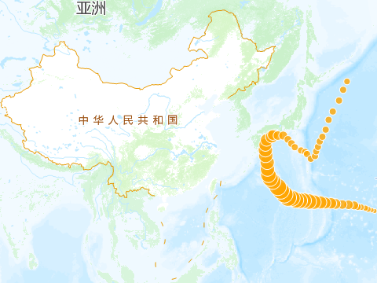
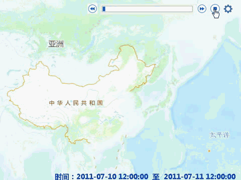

时态数据是表示某个时间点状态的数据，例如某一年的土地利用状态或某一周期连续的暴雨状态等。

SuperMap
桌面支持时态数据播放功能，是将地图中的时态数据按照某种时间序列在地图中播放显示，通过时态数据播放可以方便查看数据随时间推移而呈现出的模式或变化趋势。如下图所示，图1为台风轨迹点要素，时间字段表示台风观测时刻，设置播放参数后，播放效果如图2。  
下图1：待播放显示的台风轨迹点时态数据
   

下图2：按照1小时的时间间隔播放显示的台风轨迹点   
  

  
实现在地图中播放显示时态数据，您需要完成以下步骤：

* 第一步：[准备时态数据](PrepareTemporalData)
* 第二步：[对数据启用时间](SetDataTime)
* 第三步：[播放时态数据](PlayTemporalData)

