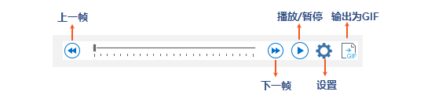
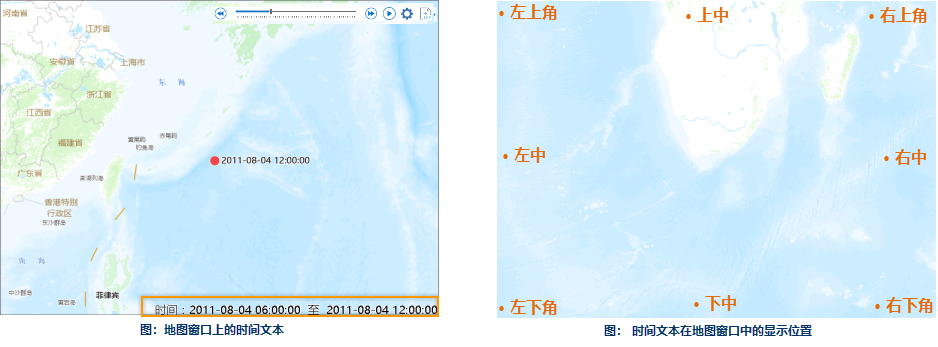

对时态数据进行播放前，需要对时态数据的时间属性进行设置，详情请参考[对数据启用时间](SetDataTime)页面。

###  时态数据播放器

在时态播放器中时间线确定了时态数据播放的起止时间范围，单击播放按钮开始播放，时间滑块将在时间线上移动，每次移动一格，并且移动一次将刷新一次地图窗口，移动一格所跨越的时间等于时间步长间隔。

另外，您也可以拖动时间滑块，或者单击前一帧/下一帧，查看某时刻的数据。（时间滑块从当前时间刻度移动到下一个时间刻度之前，地图窗口中显示的内容为一帧。）

  

* **播放/暂停** ：单击“播放”按钮，自动播放从滑块控制块的当前位置到滑块范围结束的所有步骤。单击“暂停”按钮，将停止播放并将滑块控件保留在最后播放位置。 
* **上一帧** ：单击“上一帧”按钮，即可回看上一个时间刻度的图层状态。
* **下一帧** ：单击“下一帧”按钮，即可查看下一个时间刻度的图层状态。

默认情况下，系统查询所有启用时间且可见的图层的时间字段，取时间值的最小和最大值分别作为时间线的起止时间；用户也可以自定义时间线的起止时间。时间线的刻度间隔等于时间步长间隔，刻度值为从时间线的起始时间加上刻度间隔时间，以此类推。例如：时间线的起始时间为2011/07/23
06:00:00，刻度间隔为6小时，则时间线的起始刻度值为2011/07/23 06:00:00，下一个刻度值为2011/07/23
12:00:00，……。依据时间滑块在时间线上的刻度值可以推算当前窗口的显示时间范围，具体参见下一节“播放”中的相关内容。

###  设置播放参数

  

* **时间步长间隔**

时间步长间隔，是时间滑块在时间线上移动一格的时间。例如，显示台风轨迹点的时态数据，设置时间步长间隔为6小时，那么，时间滑块移动一格也就是前进6小时，所以，如果时间滑块从2011/07/23
06:00:00时间刻度移动到2011/07/23 12:00:00时间刻度时，当前窗口显示的时态数据的时间范围应该是（2011/07/23
06:00:00, 2011/07/23 12:00:00]，以此类推，时间滑块移动到2011/07/23
12:00:00时间刻度时，当前窗口显示的时态数据的时间范围应该是（2011/07/23 12:00:00, 2011/07/23 18:00:00]。

如果地图包含多个启用时间的图层，图层的采集时间间隔也不同，默认情况下，播放数据的时间步长间隔等于最小的图层的采集时间间隔，当然，播放数据的时间步长间隔可以由用户设置

* **时间窗**

时间窗默认为0，此时，随着时间滑块在时间线上移动，当前地图窗口显示时态数据的时间范围为(当前时间点，当前时间点+时间步长间隔]，例如，时间滑块移动到2011/07/23
06:00:00时间刻度，那么，当前地图窗口显示时态数据的时间范围为 (2011/07/23 06:00:00, 2011/07/23 12:00:00
]。如果设置了时间窗，例如时间窗等于12小时，那么，时间滑块当前时间刻度往前12小时内的对象也都将显示。例如，时间滑块移动到2011/07/23
06:00:00时间刻度，时间步长间隔为6小时，时间窗为12小时，那么，当前地图窗口显示时态数据的时间范围为(2011/07/22
18:00:00-2011/07/23 12:00:00]。

* **时间范围**

默认情况下，系统会根据所有启动时间且可见的图层的时间字段，计算出最小时间和最大时间，作为显示时态数据的时间范围，也就是时间线的开始时间和结束时间；用户也可以自定义显示时态数据的时间范围，从而改变时间线的起止时间值。

* **播放间隔**

时间滑块在时间线上移动一格，地图窗口将刷新显示一次，从前一次刷新结束到下一次刷新之前，地图窗口显示的内容我们称为一帧，通过播放速度的设置，可以控制显示一帧所花费的实际时间。

* **显示时间文本**

在地图窗口中，通过勾选“显示时间文本”，可以在地图窗口中显示当前帧播放的时间范围，并可以设置时间范围文本的风格，还可以控制时间文本在地图窗口的显示位置，这里支持9种摆放位置。
  
  下图为地图窗口上的时间文本   

  

图为时间文本在地图窗口中的显示位置                          
  

###  播放

播放时，时间滑块在时间线上按照每一帧设置的时间间隔滑动，系统根据时间滑块移动到的时间刻度、显示数据的时间步长间隔、时间窗三个参数获得当前窗口（当前帧）的显示时间范围，然后，系统去查询启用时间且可见的图层，判断对象的时间值是否在当前窗口的显示时间范围内，这里分为两类情况：

* 对于指定了单个时间字段的图层，如果时间字段的值在当前窗口的显示时间范围内，对象才显示；否则不显示。
* 对于指定了两个时间字段（即起始时间字段和终止时间字段）的图层，如果起止时间字段值构成的时间区间与当前窗口的显示时间范围有交集，对象才显示；否则不显示。

例如：时间滑块移动到2011/07/23
06:00:00时间刻度，显示数据的时间步长间隔为6小时，显示数据的时间窗为12小时，那么，可以确定当前地图窗口的显示时间范围为：(2011/07/22
18:00:00-2011/07/23 12:00:00]；对于单个时间字段的图层，其中某对象的时间值为2011/07/22
21:00:00，可以判断该时间值在当前窗口的显示时间范围内，所以该对象要显示；对于两个时间字段的图层，其中某对象的起止时间值分别为2011/07/22
15:00:00和2011/07/23 8:00:00，经过判断，对象的时间范围（[2011/07/22 15:00:00,2011/07/23
8:00:00]）与当前窗口的显示时间范围存在交集，所以该对象也会显示。

以下是播放镶嵌数据集中某天各观测时刻的卫星云图，设置轮廓属性表中的 Time
字段记录了云图的观测时间，设置播放参数的步长间隔为1小时，时间窗为1小时，以0.5秒的速度播放该数据，得到如下播放结果：

  

###  输出为GIF

SuperMap 桌面支持将时态数据的播放过程输出为GIF，输出范围为当前地图窗口范围。

**操作说明**
：设置好时态数据的播放参数后，单击播放工具条最右侧的“保存为GIF”按钮，指定GIF文件的保存路径和名称，即可在播放时态数据的同时，将其输出为*.gif文件。

**注意** ：将GIF文件的范围为当前地图窗口范围，建议用户在输出前，调整好地图窗口范围及地图比例尺。

**相关内容** ：

 [时态数据概述](LayerPlay)

 [准备时态数据](PrepareTemporalData)

 [对数据启用时间](SetDataTime)

