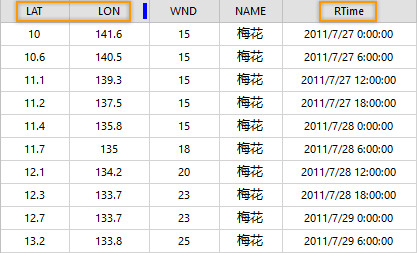

###  时间数据的存储

SuperMap 地图可以播放显示存储在 UDB 数据源、PostGIS 数据库、Oracle 数据库等中的时态数据。

时态数据的属性表中要有存储时间信息的时间字段，表中的每个要素可以具有表示观测时间点的一个时间字段，例如：台风轨迹点要素，时间字段表示台风观测时刻；也可具有两个时间字段，分别表示观测的起始和结束时间，例如：表示洪水淹没范围的面要素具有开始和结束时间。

###  时间字段的处理

时态数据的时间字段必须是 **日期类型**
，这样可以获得更好的查询性能。如果您的数据的时间字段非日期类型，您须将非日期类型字段中的时间值转存到日期类型字段。

  

  
一般情况下，时态数据的时间值可能存储在文本型、字符串或者数值型字段中，SuperMap
提供了文本型、字符串类型（暂不支持数值型）字段中的时间值转换为日期类型的函数，但要求字段中记录的时间值必须符合某种特定的时间格式，才能转换成功。

* 支持的时间值字符串格式：YYYY，YYYYMM，YYYY/MM，YYYY-MM，YYYYMMDD，YYYY/MM/DD，YYYY-MM-DD，YYYYMMDDhhmmss，YYYY/MM/DD hh:mm:ss，YYYY-MM-DD hh:mm:ss。
* 其中：YYYY = 四位数年份；MM = 两位数月份（01= 1 月）；DD = 月份中两位数的日（从 01 到 31）；hh = 两位数小时（从 00 到 23）（不支持 A.M./P.M.）；mm = 两位数分钟（从 00 到 59）；ss = 两位数秒（从 00 到 59）**

将非日期类型字段中的时间值转存到日期类型字段的操作如下，更多有关字段类型转换的功能，请参看“
**[更新列**](../../DataProcessing/EditTabular/UpdateButton.htm)”。

  1. 打开时间字段所在的属性表，为属性表创建一个日期类型的字段，用于存储转换后的时间值。
  2. 在新创建的日期类型的字段使用“更新列”功能，并设置更新参数： 
  * 选择“整列更新”；
  * 选择“函数运算”；
  * 选择运算字段为存储时间值的字段，这里为“Time”，存储时间值的宽字符型字段；
  * 选择运算函数为“to_date”，转换为日期的函数，同时必须指明待转换的时间字段的时间格式，即以什么规则记录年、月、日、小时、分钟、秒这些时间值，支持的内容参见上文“时间值字符串格式”。这里，时间字段使用“YYYY/MM/DD hh:mm:ss”格式记录时间值。
  3. 通过以上操作完成字段类型的转换。

此外，可以为日期类型的时间字段建立索引，进一步改善可视化和查询的性能。

###  时态数据的格式

具有时间属性的矢量数据和影像数据都可以在 SuperMap 地图中实现播放显示，其中，对于影像数据需要添加到镶嵌数据集后才能在地图中播放显示。

  * **矢量** :矢量数据可以表达随着时间推移，几何对象的形状和位置变化的地理信息。例如：记录台风随时间推移的轨迹，那么矢量数据中的每个点为台风某个时刻的位置，时间字段记录了该位置的观测时刻。在显示时态数据时，根据播放的时间线，依次显示对应时刻的台风轨迹点。   
     

  * **影像** :影像必须添加到镶嵌数据集中，使用镶嵌数据集的轮廓数据集属性表存储影像的时间值。 

首先，创建一个镶嵌数据集，将目标多时相影像添加到该镶嵌数据集中。然后，在镶嵌数据集的轮廓数据集属性表中新建日期类型的字段存储时间值。根据影像反映的时间特征来决定新建时间字段的数目，例如影像为一个时间段的观测结果，就需要创建起始和结束两个时间字段。最后，编辑时间字段，填写影像对应的时间值。如下图所示，镶嵌数据集中添加了某天各观测时刻的卫星云图，在轮廓属性表中的Time字段记录了云图的观测时间。

  

###  添加时态数据到地图

将时态数据添加到地图，并设置图层风格，关于风格设置请参见[设置图层的风格](../LayerStyle/LayerStyleTab.htm)。另外，在地图中播放时态数据时，建议非时态数据图层添加到快照图层中管理，这样，在播放时态数据时，可以有效提升地图的刷新显示效率，使播放显示更加流畅。

[快照图层](../LayerManagement/LayerSnapshot.htm)，该图层组包含的多个图层将作为地图的一个快照图层，快照图层只在地图视图范围变化时绘制，在播放时态数据时，地图视图范围通常不会变化，整个地图显示只需刷新随着时间变化的图层即可，从而获得更快的性能以及流畅的交互体验。

  
---  
  
**相关内容** ：

 [时态数据概述](LayerPlay.htm)

 [对数据启用时间](SetDataTime.htm)

 [播放时态数据](PlayTemporalData.htm)

