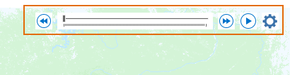
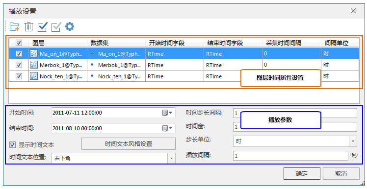

使用播放器显示随时间变化的时态数据，必须对时态数据图层启用时间并完成时间属性的设置，以下为设置的详细说明：

###  操作说明

1. 将时态数据添加到地图后，单击“ **地图** ”选项卡->“ **浏览** ”组->“ **时态数据** ”按钮，即可是地图窗口进入时态数据播放显示模式，同时，在地图窗口中出现播放器，如下图所示：   
   

2. 单击播放条右侧的“设置”按钮，弹出“播放设置”对话框，在该对话框中对数据时间和图层播放时间进行设置。  
    

3. **管理图层列表** ：首先加载数据图层，单击“添加”按钮，在弹出的“选择”对话框中选择数据，添加至图层列表，支持添加多个数据图层。在图层列表区域对图层的时间属性进行设置.
4. **图层启用时间** ：在图层列表中，每一个图层前面都有一个复选框，勾选复选框，表示图层启用时间，在播放显示时，对应的图层才会参与播放参数的计算以及参与播放显示；不勾选复选框，图层未启用时间，对应的图层不会参与播放参数的计算以及最后的播放显示。
5. **指定时间字段** ：时态数据可以具有一个时间字段，记录数据观测时间点，也可以具有开始和结束两个时间字段，记录数据观测的时间范围，所以，根据具体情况进行如下设置： 
* 数据含有一个时间字段，开始和结束时间字段都指定为该字段即可。
* 数据含有两个时间字段中，分别指定开始时间和结束时间的字段名称。

**注** ：上述指定的时间字段必须是日期类型，若不是，请参见[时间字段的处理](PrepareTemporalData#1)。

6. **数据采集时间间隔** ：时态数据一般是以固定的时间间隔采集，如每小时或每天。采集时间间隔用于指定时态数据的时间间隔长度。这里，图层的采集时间间隔用于呈现数据的采集时间间隔特征，并用于计算播放器显示数据的时间步长间隔的默认值；若地图包含多个启用时间的图层，而且图层数据的采集时间间隔不同，默认情况下，播放器的显示数据的时间步长间隔将取最小的采集时间间隔。
7. 图层的时间属性设置完成后，就可以播放显示地图中启用时间的数据了，接下来您需要对播放参数进行设置，详细请参看[播放时态数据](PlayTemporalData)。

**相关内容** ：

 [时态数据概述](LayerPlay)

 [准备时态数据](PrepareTemporalData)

 [播放时态数据](PlayTemporalData)

