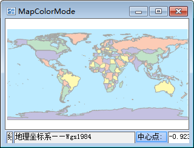
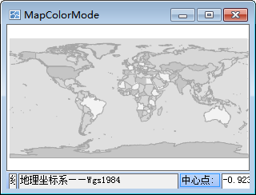

“ **地图属性** ”界面中包含了地图名称信息、地图显示参数设置等功能控件。

### 颜色模式

“颜色模式:”标签控件右侧的组合框用来设置当前地图窗口中所有矢量数据集的颜色模式，方便用户提前预览地图的输出效果。地图窗口中矢量数据集的默认颜色显示模式为“默认彩色模式”，用户可以通过点击该标签控件右侧的下拉按钮，在弹出的下拉列表中选择需要实现的地图颜色模式。

|   
---|---  
默认颜色模式的显示效果| 灰度模式的显示  效果
