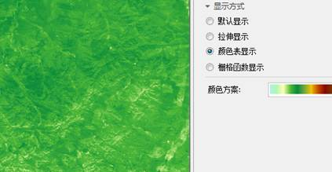
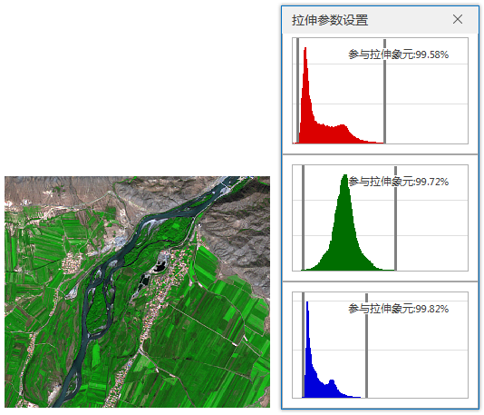
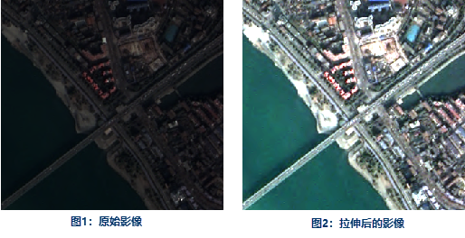

在图层管理器中选中影像图层作为当前图层，“图层属性”界面中的会出现影像参数的设置选项，其中包含了影像图层的亮度、对比度、透明色、插值方式、显示方式及拉伸等属性设置的功能控件。

### 无值设置

* **无值** ：可在文本框中直接输入某一栅格值，或单击拾取按钮，在影像图层中的适当位置拾取像元值（支持捕捉），即可将指定的像元值设置为无值。根据影像的本身的颜色模式，设置不同颜色值，例如单波段只需要设置单个像元值，RGB模式可分别指定R、G、B三种颜色不同的数值。
* **无值透明** ：该复选框用于设置指定无值的显示颜色。当勾选该复选框，无值默认透明显示。当不勾选该复选框，可单击右侧下拉按钮，在弹出的颜色面板中选择某一种颜色，则该数据的无值像元将显示为指定的色彩。

### 背景值设置

可将指定背景值像元的颜色替换为其他颜色。

* **背景值** ：可单击拾取按钮，在地图窗口的影像图层中拾取一个像元值设置为背景值（支持捕捉），也可直接在数值框中输入一个数值作为背景值。
* **背景值透明** ：单击下拉按钮，在弹出的颜色面板中设置替换颜色。

### 透明色设置

透明色设置用来将影像图层中某种颜色设置为透明色，即将影像中指定颜色覆盖的区域设置为透明效果。
完成透明色的设置需要将“透明色”和“透明色容限”两个命令配合使用。

* **透明色** ：勾选该复选框，即可将指定无值像元设置为透明显示；不勾选该项，指定无值颜色仍以指定的颜色显示。可单击拾取按钮，在地图窗口的影像图层中拾取一个像元色设置为透明色（支持捕捉），也可单击下拉按钮选择一个颜色，将其设置为透明色。
* **透明色容限** ：设置透明色容限值后，假设原始颜色设置为 (r, g, b)、容限设置为 a，则需透明显示的颜色范围在 (r-a, g-a, b-a) 到 (r+a, g+a, b+a)之间。

**操作步骤**

1. 在图层管理器中选中将要调整颜色表的影像图层,将该图层设置为当前图层。
2. 通过勾选“透明色”复选框来启用影像图层的透明色设置，同时，“透明色”复选框右侧的颜色按钮变为可用状态。
3. 点击透明色颜色设置下拉按钮，指定影像图层中透明效果的颜色。
4. 设置透明色容限，用户可直接输入数值，或者单击“透明色容限”数字调整框右侧的下拉按钮，使用滑块来调整透明色容限值，透明色容限的数值为 0-255之间的整数。
5. 设置完成后，该影像图层将实时显示设置之后的效果。

### 亮度

当前图层为影像图层时，“亮度”数字调整框用来调整影像图层的明暗亮度。用户可在“亮度”数字调整框中直接输入亮度值，调整当前图层亮度。或者点击“亮度”数字调整框右侧下拉按钮，使用滑块来调整亮度度，实时浏览设置结果。

### 对比度

当前图层为影像图层时，“对比度”数字调整框用来调整影像图层的对比度。用户可在“对比度”数字调整框中直接输入对比度值，调整当前图层对比度。或者单击“对比度”数字调整框右侧的下拉按钮，使用滑块来调整对比度，实时浏览设置结果。

### 影像插值

在缩放浏览影像图层时，需将原始图像映射为较大或较小的一组像素，SuperMap提供了5种插值方式，分别为最临近插值、低质量插值、高质量插值、高质量双线性插值、高质量三次插值。不同的插值方式决定了影像显示的质量，但是输出图像的显示质量越高，所需的时间就越长。

* **最临近插值** ：是一种较简单的影像插值方式，该方式处理速度较快，但是图像显示效果最差。
* **低质量插值** ：该方式会执行预筛选以确保高质量的收缩，插值后图像放大显示质量不好。
* **高质量插值** ：缩放时图像显示质量较高，但是输出图像时间较长。
* **高质量双线性插值** ：通过指定的高质量双线性插值法，执行预筛选，以确保缩放影像的高质量显示效果。
* **高质量双三次插值** ：通过指定的高质量双三次插值法，执行预筛选，以确保缩放影像的高质量显示效果，此方式输出的图像显示质量最高。

### 显示方式

根据影像数据的波段数目分为单波段影像和多波段影像，所提供的显示方式的设置有所不同，下面分别介绍。另外，对于位深度为32和24的影像数据不支持显示方式的修改。

* **单波段影像**
* **默认显示** ：采用无拉伸进行影像数据的显示，若影像数据有颜色表将以颜色表进行显示，若没有颜色表将以灰度显示。  

  

* **拉伸显示** ：可以选择最值拉伸、标准差拉伸、高斯拉伸、百分比截断拉伸对影像进行显示效果的调整，还可以调整影像的颜色显示方案。
  

* **颜色表显示** ：使用影像数据的颜色表进行显示，并且可以调整颜色方案。
  
    
 
* **栅格函数显示** ：栅格函数直接应用于影像和栅格数据数据，快速获得数据处理后的显示结果，应用栅格函数后，以上显示方式都将无效；但是，可以通过颜色方案修改应用栅格函数后的影像和栅格数据的颜色显示效果。
 
   

* **多波段影像**
* **组合显示** ：组合显示是对影像多个波段按照指定的颜色模式（如RGB、CMYK模式）进行组合来获取彩色影像显示效果，并且支持影像拉伸显示设置。
  
    

* **单波段拉伸显示** :选择某个波段用于显示，然后选择一种拉伸方式，可以选择最值拉伸、标准差拉伸、高斯拉伸、百分比截断拉伸等方式对影像进行显示效果的调整，还可以调整影像的颜色显示方案。   

  

* **单波段颜色表显示** :选择某个波段用于显示，然后可以调整颜色方案。  

  
  
* **单波段栅格函数显示** :选择某个波段用于显示，然后应用栅格函数获得需要的显示效果。  

  

### 影像的颜色模式

由于成色原理的不同，决定了显示器、投影仪这类靠色光直接合成颜色的颜色设备和打印机、印刷机这类靠使用颜料的印刷设备在生成颜色方式上的区别。
针对上述不同成色方式，SuperMap 提供 7 种色彩空间，分别为 RGB、CMYK、RGBA、CMY、YIQ、YUV 和 YCC。

颜色模式组合框的下拉列表中列出了所支持的色彩空间，用来设置影像数据的颜色显示模式。单击“颜色模式:”标签右侧的下拉按钮，在弹出的下拉菜单中选择需要的颜色模式，即可完成颜色模式的设置。默认的颜色模式为
RGB。

颜色模式|描述    
---|---  
RGB | 主要在显示系统中使用。RGB 是红色，绿色，蓝色的缩写。RGB 颜色模式使用 RGB 模型为图像中每一个像素的 RGB 分量分配一个 0~255范围内的强度值。  
CMYK | 主要在印刷系统使用。CMYK 分别为青色，品红，黄，黑。它通过调整青色、品红、黄色三种基本色的浓度混合出各种颜色的颜料，利用黑色调节明度和纯度。  
RGBA | 主要在显示系统中使用。RGB 是红色，绿色，蓝色的缩写，A 则用来控制透明度。  
CMY | 主要在印刷系统使用。CMY (Cyan,Magenta,Yellow)分别为青色，品红，黄。该类型通过调整青色、品红、黄色三种基本色的浓度混合出各种颜色的颜料。  
YIQ | 主要用于北美电视系统(NTSC)。  
YUV | 主要用于欧洲电视系统(PAL)。  
YCC | 主要用于 JPEG 图像格式。  

### 影像的颜色方案

图层属性支持对影像参数的颜色方案进行修改。点击标签控件右侧的组合框，选择适用分组的颜色方案。需要注意的是，修改影像图层颜色方案需要满足数据必须是单波段像素格式为的 8 位和 16 位的影像数据集，当影像图层为多波段、合成波段时，不可更改影像的颜色方案。

### 影像拉伸

在获取影像数据的过程中，由于多种因素的影响，导致图像质量多少会有所退化，对影像数据进行拉伸的主要目的就是改善影像数据的显示效果和显示质量，从而提高影像清晰度，突出便于人或机器分析某些感兴趣的信息，抑制一些无用的信息，以提高影像数据的使用价值。对影像数据进行拉伸其实质是改变影像的亮度、对比度，从而使得影像中的地物更易辨识。

目前，SuperMap 对于影像数据的拉伸提供了几种类型，包括：无拉伸、标准差拉伸、最值拉伸、直方图均衡化、直方图匹配、高斯拉伸以及百分比截断拉伸。

支持批量设置影像图层的拉伸方式，在图层管理器中，选择多个影像图层，在图层属性面板中统一设置拉伸方式，便于统一调整影像显示效果。

* **无拉伸** ：对影像不进行任何拉伸处理，但是这种绝对的无拉伸实际上只对无符号整型8-bit存储格式的影像数据有效。影像数据在计算机上所显示的像元值都在0至255范围之间，因此，对于使用非无符号整型8-bit进行存储的影像数据，在进行无拉伸显示时，SuperMap对其处理方式是使用最值拉伸进行显示，使其数值在0至255范围之间。如下图所示，左图为无符号整型8-bit影像无拉伸状态，影像偏暗，右图为红色波段的直方图，像元显示值集中在灰度级较低的区域。   

  

* **最值拉伸** ：即最大最小值的线性拉伸。此种方式将像元值的最小值和最大值做范围值域，进行线性拉伸，使像元值分布在[0,255]之间。通过这样的拉伸处理，影像的对比度和亮度都得到的明显提高，从而使得影像中的地物会更加容易辨识。一般适用于拉伸像素值分布密集的栅格影像。 

如下图所示，左图为拉伸处理后的结果，影像较无拉伸变得更为清晰，影像的对比度得到了的增强，右图灰色为拉伸前的直方图，红色为拉伸之后的直方图。

  

* **标准差拉伸** ：是通过修剪影像的极值，然后对其他像素值进行线性拉伸来使影像的对比度增加。对原始影像的数据进行统计，主要是获得一个标准差取值范围，然后根据标准差拉伸系数重新计算标准差范围，将最后计算的标准差范围内的数值进行线性拉伸，使其分布在[0,255]之间，拉伸后的像元显示值与平均值偏离度减小。

标准差：即方差的算术平方根，反映组内个体间的离散程度。简单来说就是表示组内大多数值和平均值的偏离程度。标准差越大，表示组内大多数数值和平均值偏离的越多。标准差越小，表示组内大多数值和平均值比较接近。

如下图所示，一个标准差系数像元值占比为68%，二个标准差系数像元占比为95%，三个标准差系数像元占比为99%。当定义标准差系数为2。那么超过2个标准差的像素值会被推到0或者255的位置。在两个标准差之间的像素值被线性拉伸至0-255。标准差拉伸经常用来使色调较暗的栅格数据集变亮。

  
---  

下面通过直方图来形象地描述标准差这种拉伸方式。如下图所示，左图为影像经过标准差拉伸后的效果，右图为拉伸前后直方图对比图，可以看出，拉伸后，影像的直方图形状符合一个正态分布的曲线，并且拉伸后的影像的直方图的标准差增大，即影像数据的像元显示值与平均值偏离度减小。

标准差拉伸经常用来使色调较暗的影像变亮。

  

* **高斯拉伸** ：目的是使影像数据的像元值趋于正态分布，高斯拉伸属于线性拉伸。 
  * **高斯拉伸系数** ：影像的像元值乘以系数后，再拉伸到[0,255]区间上。
  * **高斯拉伸使用中间值** ：若勾选了“高斯拉伸使用中间值”，则进行影像拉伸时，以像元中间值为为中心轴进行高斯拉伸；若不勾选，则默认以像元最大值为中心轴进行高斯拉伸。
  

* **百分比截断拉伸** ：通常情况下，可以假设影像数据中大部分像素都处于上限和下限范围内。可以通过设置百分比把范围之外的像素值都推到两个端点处。然后在对范围内的像素值进行线性拉伸。这种拉伸方式将直方图中处于小值部分的一些像元和处于大值部分的一些像元从拉伸中排除，剩下的部分再应用最值拉伸方式进行拉伸。使用时，需要设置最小值和大值的排除的比例。 

可对多波段影像数据的各个波段单独设置拉伸显示，可单击组合框右侧的
“直方图”按钮，打开各波段的直方图，指定从拉伸中排除的最小和最大百分比值，分别代表需要从拉伸中排除的处于小值部分的像元百分比和处于大值部分的像元百分比。

例如：一幅影像像元的值域为[0,100]，将最小和最大的排除比例定义为10，应用“百分比截断拉伸”会将[10,90]之间的值拉伸到[0,255]这个区间来显示，而[0,10]显示为0，[90,100]显示为255。

如下图所示，其中第一幅图为不设置拉伸范围的显示效果以及直方图，从直方图可以看出处于小值和大值区域的像元比较少，因此影响了影像的对比度，影像不清晰，如果将这些像元从拉伸中排除，则可以增加影像对比度和清晰度。下面第二幅图为设置拉伸范围排除两端的像素之后，只拉伸设置范围内的百分比截断的效果。

 |   
---|---  
图一：不设置拉伸范围 | 图二：设置拉伸范围  
* **直方图均衡化** ：属于直方图修正法，实质是对图像进行非线性拉伸。通过重新分配图像像元值，使一定灰度范围内像元的数量大致相等，这样，原来直方图中间的峰顶部分对比度得到增强而两侧谷底部分对比度降低，从而所输出图像的直方图是一较平的分段直方图，从而增强图像的对比度。  
如下图为均衡化前后的图像的直方图示意(图片来源网络)  ：
  
---  
下图为直方图均衡化拉伸及拉伸前后直方图   

  
 

直方图均衡化拉伸之后，图像的整体对比度很强。直方图均衡的实质是减少图像的灰度等级换取对比度的扩大。所以有时候可能会造成我们需要某个灰度的图像信息时，在转换之后可能这些信息会有所丢失。当原始遥感数据的质量比较差、数据动态范围小、直方图分布极不均匀时，进行直方图均衡增强运算，变换后的图像层次感更差，更易丢失信息。

* **直方图匹配** ：是对图像查找表进行数学变换使一幅图像的直方图与另一幅图像的直方图类似。直方图匹配经常作为相邻图像拼接或应用多时相遥感影像进行动态变化研究的预处理工作；通过直方图匹配可以部分消除由于太阳高度角或大气影响造成的相邻图像的效果差异。

直方图匹配类似于直方图均衡，不同之处在于直方图均衡的输出结果是固定的，较均衡的图像，而直方图匹配的结果则是导入一个直方图xml文件，使用新的直方图文件指定的直方图对影像进行显示。

**拉伸系数**

只有当选择拉伸方式为“标准差拉伸”或“高斯拉伸”时，才支持设置“拉伸系数”。

* 标准差拉伸系数：仅当拉伸方式为标准差拉伸时，此参数可用。标准差拉伸系数确定了标准差的取值范围。假设标准差范围为[a,b]，标准差拉伸系数为 n，则进行标准差拉伸时，标准差的取值范围为[an,bn]。应用程序默认的标准差拉伸系数为2，即默认使用2倍标准差进行拉伸。
* 高斯拉伸系数：仅当拉伸方式为高斯拉伸时，此参数可用。假设影像数据像元值范围为[a,b]，高斯拉伸系数为n，则进行高斯拉伸时，保持中心轴不变，将像元值进行n倍拉伸，最后以[0，255]的范围显示。应用程序默认的高斯拉伸系数为2。

如下图所示，图1为不经过任何处理的影像显示效果，整体色调偏暗，非常不利于区分地物信息；但是经过拉伸后（如图2所示），影像对比度增强，很多地物特征都突显出来了。

 |   
---|---  
图1：原始影像 | 图2：拉伸后的影像  

### 注意事项

影像拉伸不支持像素格式为真彩色24位和32位的影像数据拉伸，支持单波段和多波段的影像数据拉伸。

