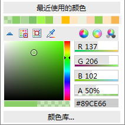

### Alpha通道

开启地图Alpha通道后，图层颜色设置的 A
值即可生效，从而使地图中的要素达到透明或半透明的效果，也富了地图的颜色，同时，支持输出半透明效果的地图。支持设置Alpha通道的图层有：矢量图层、专题图图层、文本图层。

1. **可用于调同一色系的颜色**

在“ **地图属性**
”面板中勾选“Alpha通道”复选框之后，设置点线面标签等图层颜色时，不仅可以设置RGB值，还可设置A值（即Alpha值）。如下图所示：

  
---  
  
相同的RGB值设置不同的Alpha值之后，可衍生出多种同色系的颜色，如下图所示，设置绿地颜色的RGB为（137,206,102）值，调整不同的颜色透明值（Alpha值）后，绿地的颜色不同。

 |  |   
---|---|---  
未设置A值 | 设置A值为70% | 设置A值为30%  
  
2. **制作半透明地图**

在实际应用中，有时需要图层中某个图斑做透明处理，从而使该区域下面的要素显示出来；或者，不希望地图中的某些要素完全遮挡其下叠加的要素。可通过设置Alpha值来实现半透明效果，满足这些应用需求。

例如，一些关于范围的地理空间分析结果，与地图叠加，可以对分析结果的图斑设置半透明效果，从而更直观清晰的展示分析范围内的地物内容，便于从视觉上详细描述分析结果。下图为服务区分析结果与地图叠加，设置分析结果范围为半透明效果，从而清晰的反应出所覆盖范围内的地物状况：

  
---  
服务区半透明显示  
  
3. **支持半透明出图**

8C以前的版本在输出地图时，不支持透明或半透明的地图输出，该情况常应用于地图缓存的输出，输出的瓦片背景透明，这样的地图缓存就可以很好地与其他地图内容进行叠加显示，下图为输出背景透明的地图缓存与卫星影像地图叠加显示图：

  
---  
道路与卫星影像图叠加显示  

### 注意事项

* 设置场景中图层颜色或属性表背景颜色的 A 值，可直接生效，与地图属性面板中的 Alpha 通道是否开启无关。

