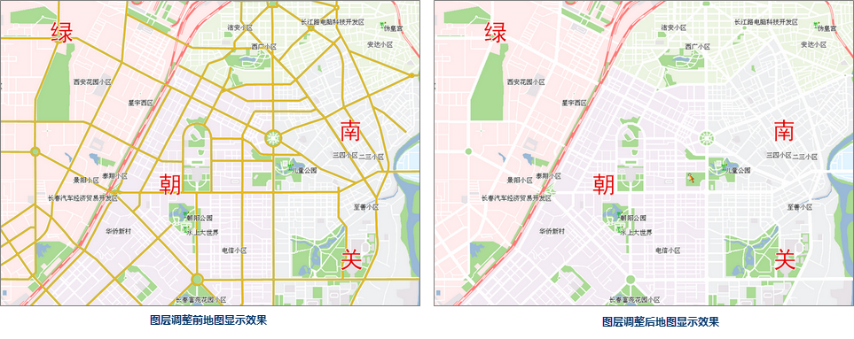
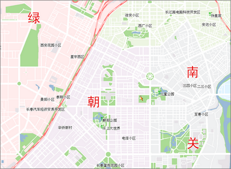

不管图层类型为矢量、栅格或影像，都可设置图层的透明度、顺序、可见比例尺及过滤显示对象等。

### 设置图层透明度

透明度是图层的显示属性，可以在“ **图层属性** ”界面中“透明度”的数字调整框中进行设置。

“透明度:”的数字调整框和下拉按钮可以设置当前图层的透明程度。用户可以直接输入透明度值，或者单击该标签右侧的下拉按钮，使用滑块来调整透明度，实时浏览设置结果。默认透明度的数值为
0，表示图层完全不透明，随着数值的增加图层会变得更透明；当 透明度的数值设为100时，图层完全透明。透明度数值的范围为0至100之间的整数。

### 调整图层顺序

图层的层叠顺序的排序将直接影响地图显示效果。一般地图图层层叠的顺序规则有两条：

* 根据对象的地图范围，从上至下依次为：小->中->大； 
* 根据图层的类型，从上至下依次为：文本->点->线->面。 

注意：以上层叠顺序规则只是一个一般化的推荐顺序，根据不同地图制作需求也会有其他的图层排序方式。

下面两幅地图分别为某一图层（RoadLine）置底前和置底后的地图效果。从这两幅地图中，可以很明显的看出，图层层叠顺序的对地图显示的重要性。

 |   
---|---  
图层调整前地图显示效果| 图层调整后地图显示效果  

从上图中可以看出，有一个线图层从地图上“消失”了，它并没有被移除，而是移动至最下一层，置底显示了。

调整图层顺序主要通过以下两种方式：

**使用图层控制**

1. 若当前工作空间中已有打开的地图，通过以下步骤之一，打开“图层控制”对话框。
* 在图层管理器中，单击图层控制按钮；
* 在图层管理器中，单击右键单击任一图层，选择“图层控制”命令。
2. 在“图层控制”对话框中，选中一个或多个图层后，通过工具栏中的置顶、上移、下移、置底等按钮，调整图层顺序。关于图层控制的详细内容，请参见 [图层控制](../LayerManagement/LayerControl.html)。

**直接拖拽**

1. 在图层管理器中，选中一个或多个图层。
2. 将选中的图层拖拽至目标位置。
3. 松开鼠标。

**图层节点可拖拽**

在图层管理器工具栏中，通过“图层控制”下拉菜单中的 **图层节点可拖拽** 设置图层节点是否可拖拽：

* 如勾选 **图层节点可拖拽** ，用户可在图层管理器中通过拖拽方式调整图层顺序。
* 如若不勾选 **图层节点可拖拽** ，则可固定图层管理器中图层顺序，用户无法对图层管理器中的图层调整顺序，防止图层过多时拖拽导致的误操作；

### 设置图层可见比例尺范围

通过设置图层属性可见比例尺或者设置过滤条件对图层中的对象进行过滤。

**最小可见比例尺**

“最小可见比例尺:”组合框用来设置当前图层的最小可见比例尺。图层设置最小可见比例尺后，若地图的比例尺小于该图层设置的最小可见比例尺，该图层将不可见。

用户可以通过在“最小可见比例尺”右侧的数字调整框输入比例尺数值，如
1：500000，将当前地图比例尺设置为最小可见比例尺。也可单击右侧下拉按钮选择比例尺设置为最小可见比例尺，下拉项可选比例尺为默认 1:5000 至
1:1000000 的 8 个比例尺；若地图设置了固定比例尺，则下拉项可选比例尺为固定的比例尺。

**最大可见比例尺**

“最大可见比例尺:”组合框用来设置当前图层的最大可见比例尺。图层设置最大可见比例尺后，若地图的比例尺大于该图层所设置的最大可见比例尺时，该图层将不可见。

用户可以通过在“最大可见比例尺”右侧的数字调整框输入比例尺数值，如
1：500000，将当前地图比例尺设置为最大可见比例尺。也可单击右侧下拉按钮选择某个比例尺设置为最大可见比例尺，下拉项可选比例尺为默认 1:5000 至
1:1000000 的 8 个比例尺；若地图设置了固定比例尺，则下拉项可选比例尺为固定的比例尺。

### 显示过滤条件

“显示过滤条件:”用来设置当前图层的显示过滤条件，过滤图层中哪些对象可显示哪些对象不可显示，便于用户根据需要显示感兴趣的要素而过滤掉暂时不需要显示的要素。

用户可以在“显示过滤条件”的文本框中输入 SQL 表达式作为过滤条件，单击 Enter
（回车）键即可应用图层的过滤条件，使图层中满足过滤条件的对象可见；用户还可以单击文本框右侧的按钮，在弹出的[“SQL
表达式”对话框](../../Query/SQLQueryDia.html)中构建过滤表达式，设置完成后单击“确定”按钮即可应用图层的过滤条件，使图层中满足过滤条件的对象可见。

单击“设置图层关联属性表...”按钮，弹出[“连接表设置”对话框](../../Query/JoinItemsDia.html)，通过关联字段连接外部表，进而通过构建有外部表字段参与的过滤条件来过滤显示图层中的内容。

