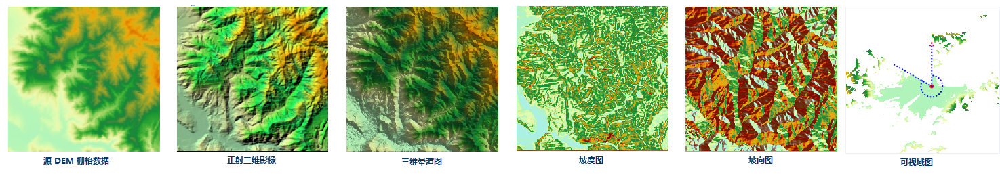
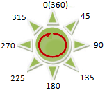
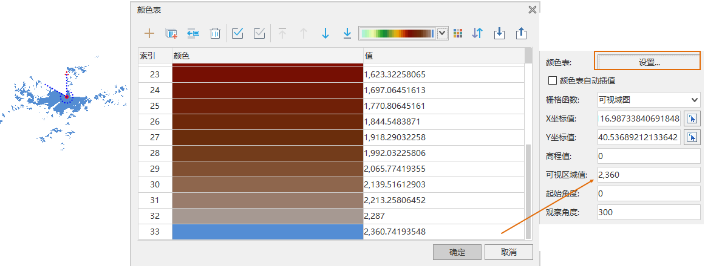

在图层管理器中选中栅格图层作为当前图层，“图层属性”界面中的会出现栅格参数的设置选项，其中包含了栅格图层的亮度、对比度、颜色表、指定栅格值风格、栅格函数等属性设置的功能控件。

### 特殊值设置

* **特殊值** ：可单击拾取按钮，在地图窗口的影像图层中拾取一个像元值设置为特殊值（支持捕捉），也可直接在数值框中输入一个数值作为特殊值。即用户需要对某些特定值的栅格像元的显示效果进行设置。
* **特殊值风格** ：标签用来设置已指定栅格值的显示颜色。可点击“特殊值风格：”标签右侧的下拉按钮，在弹出的颜色面板中选择某一种颜色，则该栅格值的像元将显示为指定的色彩。 
* **特殊值透明显示** :复选框用来设置已指定栅格值是否透明显示。勾选该复选框，即可将指定栅格值像元设置为透明显示；不勾选该项，指定栅格值颜色仍以指定的颜色显示。 

### 背景值设置

可将指定背景值像元的颜色替换为其他颜色。

* **背景值** ：可单击拾取按钮，在地图窗口的影像图层中拾取一个像元值设置为背景值（支持捕捉），也可直接在数值框中输入一个数值作为背景值。
* **背景值透明** ：单击下拉按钮，在弹出的颜色面板中设置替换颜色。

### 透明色设置

透明色设置用来将栅格图层中某种颜色设置为透明色，即将栅格数据中指定颜色覆盖的区域设置为透明效果。
完成透明色的设置需要将“透明色”和“透明色容限”两个命令配合使用。

* **透明色** ：勾选该复选框，即可将指定无值像元设置为透明显示；不勾选该项，指定无值颜色仍以指定的颜色显示。
* **透明色容限** ：设置透明色容限值后，假设原始颜色设置为 (r, g, b)、容限设置为 a，则需透明显示的颜色范围在 (r-a, g-a, b-a) 到 (r+a, g+a, b+a)之间。

### 亮度

当前图层为栅格图层时，“亮度”数字调整框用来调整栅格图层的明暗亮度。用户可在“亮度”数字调整框中直接输入亮度值，调整当前图层亮度。或者点击“亮度”数字调整框右侧下拉按钮，使用滑块来调整亮度度，实时浏览设置结果。

### 对比度

当前图层为栅格图层时，“对比度”数字调整框用来调整栅格图层的对比度。用户可在“对比度”数字调整框中直接输入对比度值，调整当前图层对比度。或者单击“对比度”数字调整框右侧的下拉按钮，使用滑块来调整对比度，实时浏览设置结果。

### 插值方式

在缩放浏览栅格数据时，需将原始图像映射为较大或较小的一组像素，SuperMap提供了 5 种插值方式，分别为最临近插值、低质量插值、高质量插值、高质量双线性插值、高质量三次插值。不同的插值方式决定了栅格显示的质量，但是输出图像的显示质量越高，所需的时间就越长。

* 最临近插值：是一种较简单的插值方式，该方式处理速度较快，但是图像显示效果最差。
* 低质量插值：该方式会执行预筛选以确保高质量的收缩，插值后图像放大显示质量不好。
* 高质量插值：缩放时图像显示质量较高，但是输出图像时间较长。
* 高质量双线性插值：通过指定的高质量双线性插值法，执行预筛选，以确保缩放栅格的高质量显示效果。
* 高质量双三次插值：通过指定的高质量双三次插值法，执行预筛选，以确保缩放栅格的高质量显示效果，此方式输出的图像显示质量最高。

### 设置颜色表

当前图层为栅格图层时，“设置...”按钮可以用来设置地图中栅格图层中像元的颜色。单击“设置...”按钮，弹出的编辑颜色表对话框。用户可通过编辑颜色表对话框设置栅格图层的颜色方案，或设置某个像元值所使用的颜色；也可通过添加新的像元值或者删除部分像元值来调整栅格数据的颜色显示方案。

 [颜色表设置对话框的使用与说明](ColorTableDia)

### 栅格函数

通过栅格函数的方式，对栅格数据应用一些分析处理方式，在访问和查看栅格数据时，这些函数将动态应用到栅格数据，因此，可以快速地展现这些分析处理操作的结果；而通过相应的分析方法实现这些处理任务，处理时间长而且还会产生庞大的处理结果文件。

目前，应用程序提供了五种栅格函数设置：三维晕渲图、正射影像、坡度图、坡向图、可视域图(仅iDesktopX提供)。方便在不进行专题分析的情况下，快速浏览三维晕渲效果、正射影像效果、坡度图、坡向图以及可视域图。如下图所示，对某地区 DEM 数据设置不同栅格函数得到的显示效果。



* **无** ：不应用任何栅格函数。将无法对光源方位角、光源高度角以及高程缩放系数进行设置。
* **正射三维影像** ：是采用数字微分纠正技术，通过周边邻近栅格的高程得到当前点的合理日照强度，对栅格数据进行影像纠正。系统默认将无法对光源方位角、光源高度角以及高程缩放系数进行设置。
* **三维晕渲图** ：是通过考虑栅格表面照明源的角度和阴影，生成三维晕渲效果图。三维晕渲图是通过模拟实际地表的阴影从而反映出地形起伏状况的栅格图。通过采用假想的光源照射地图，结合栅格数据得到的坡度坡向信息，获得各像元的灰度值。面向光源的斜坡的灰度值最高，背向光源的灰度值较低，即为阴影区，从而形象地表现栅格实际的地貌和地势。由于栅格数据计算得到的这种山体阴影图具有非常逼真的立体效果，因此称为三维晕渲图。当栅格参数选择“三维晕渲图”时，系统默认设定的光源方位角为315度、光源高度角为45度、高程缩放系数为1。
* **坡度图** ：对 DEM 栅格数据生成坡度图。系统默认设定的光源方位角为315度、光源高度角为90度、高程缩放系数为1。
* **坡向图** ：对 DEM 栅格数据生成坡向图。系统默认设定的光源方位角为360度、光源高度角为45度、高程缩放系数为1。
* **光源方位角** :光源方位角是用来确定光源的方向，是用角度来表示的。如下图，以正北方向为0度开始，沿顺时针方向测量，从0度到360度来给各方向赋角度值，因而正北方向也是360度。正东方向为90度，正南方向为180度，正西方向为270度。方位角的默认值采用315度。  

  
---  
* **光源高度角** ：光源高度角是光源照射时倾斜角度，范围是从0度到90度，如图所示，当光源高度角为90度时，光源正射地表。高度角的默认值采用45度。

  
---  

当光源的方位角为315度，高度角为45度时，其与地表的相对位置如下图所示。

  
---    

* **高程缩放系数** ：当地形栅格值（即高程值）的单位与 x，y 坐标的单位不相同时，通常需要将高程值乘以一个高程缩放系数，使得三者单位一致。例如，X、Y 方向上的单位是米，而 Z 方向的单位是英尺，由于 1 英尺等于 0.3048 米，则需要指定缩放系数为 0.3048。如果设置为 1，表示不缩放。

建议进行分析的数据为投影坐标系统（单位：米）。如果选择使用球坐标系运行分析，需要为该纬度指定一个适当的 z 因子。如果 x,y 单位是经纬度而 z
单位是米，则可使用下表列出的某些适当的 z 因子：


```
    Latitude      Z-factor
        0        0.00000898
      10         0.00000912
      20         0.00000956
      30         0.00001036
      40         0.00001171
      50         0.00001395
      60         0.00001792
      70         0.00002619
      80         0.00005156
```  

* **可视域图**：是某一观察点的可视区域范围图，通过拾取或设置该点的观察高度、观察角度范围生成可视域。默认观察范围为360度。   
  * X坐标值：观察点的经度。   
  * Y坐标值：观察点的纬度。 
  * 高程值：观察点的高程值。 
  * 可视区域值：当前可视区域的颜色，通过颜色表中栅格值设置当前可视区域颜色。  
  * 起始角度：观察点开始观察的角度，单位度，以正北方向为0度开始，沿顺时针方向度数增大，默认起始角度为0。 
  * 观察角度：观察点结果观察的角度，单位度，以正北方向为0度开始，沿顺时针方向度数增大，默认观察角度为360。 

    

**渲染类型**

渲染类型系统默认为渲染。


