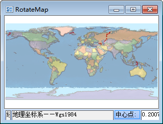
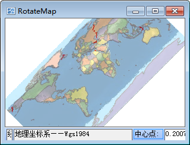
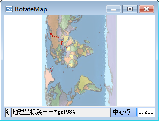

“ **地图属性** ”界面中的“ **基本** ”选项卡中包含了地图名称信息、地图显示参数设置等功能控件。

### 旋转地图

“旋转角度:”标签控件用来设置当前地图窗口中地图的旋转角度。用户可输入 [-360, 360
]范围内的任意数值，单位为度，精度到0.1度，正值代表地图沿逆时针方向旋转，负值代表地图沿顺时针方向旋转。当用户输入完角度值后，当前地图会即时按照指定的角度值进行旋转。

当前地图进行旋转时，每一次旋转操作都是相对于原始状态的地图进行的，即没有进行任何旋转操作时的地图。旋转的基点为地图在当前地图窗口中可视范围的中心点。同时，地图旋转的操作不会改变地图中各个图层对应的数据。

| |  
---|---|---  
地图的初始状态| 旋转角度为45度的地图显示效果| 旋转角度为90度的地图显示效果  
  
### 注意事项

不推荐对生成的缓存地图进行旋转。如想得到较佳的旋转效果，建议先配好地图，对地图进行旋转，然后再生成缓存文件。
