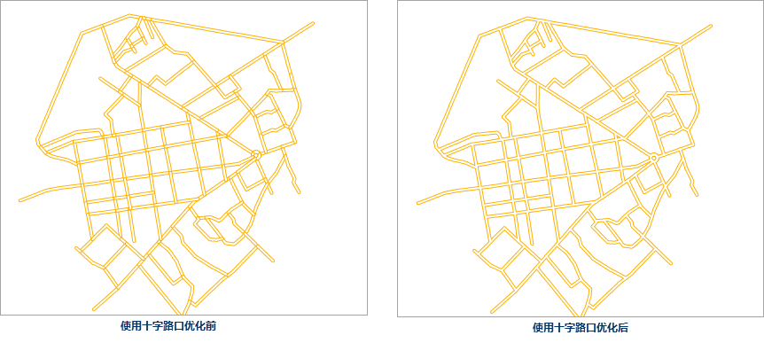
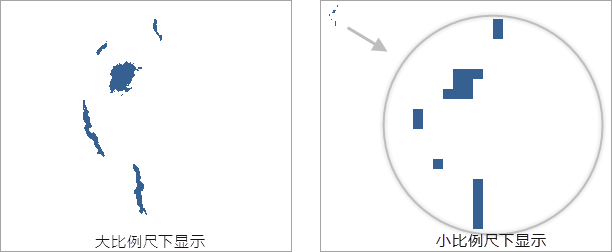

在图层管理器中选中矢量图层作为当前图层，“图层属性”界面中的会出现矢量参数的设置选项，其中包含了显示完整线型、十字路口优化、符号随图缩放、对象最小尺寸、显示过滤条件等属性设置的功能控件。

### 显示完整线型

显示完整线型保证线对象的线型符号能完整地显示，帮助用户优化线符号的显示效果。

如果线对象的长度小于线符号周期长度，或者线对象长度不够线符号周期长度的整数倍时，不足线符号的周期的那部分线就不能完全显示。使用显示完整线型命令就会把线符号长度重新整除，计算出一个和线对象长度非常近似的长度绘制。

如下图1线符号风格效果，在线对象长度不足线符号一个周期时，使用显示完整线型和不使用显示完整线型的示意图对比：
  

因此，显示完整线型命令对于长度较短以及折线较多的线图层的显示效果较好，可以达到美化地图的目的。

### 十字路口优化

对于线图层，常会出现多个线对象相互交叉的情况，例如水系、道路。如果不作处理，按照正常情况显示，不仅不够美观，而且可能与实际情况不相符，不能正确表达交叉的线对象之间的连通性。我们往往需要对相互交叉的线进行优化，去除“路口”位置相互交叠的部分，最终达到真实的十字路口显示效果。

如下图所示，我们往往需要对相互交叉的线进行优化，去除“路口”位置相互交叠的部分，最终达到真实的十字路口显示效果。

 

* 十字路口优化功能适用于普通线图层、网络数据线图层，不适用于 CAD 数据的线图层和路由数据。
* 十字路口优化功能，只对图层风格为双线线型的线对象起作用，而对于一些线型符号，如单线线型符号不适用。  

 

**启用十字路口优化**   
勾选“十字路口优化”复选框即可在当前图层中的线型对象启用十字路口功能。如果勾选该复选框，表示对图层中的线型应用十字路口优化效果；否则，不应用十字路口优化效果。

 

### 符号随图缩放

用来设置在地图放大、缩小浏览操作过程中，图层中的地图符号对象是否也随之放大或者缩小。“符号随图缩放”复选框可应用于点状符号、线状符号、面填充符号及其边框。

勾选“符号随图缩放”复选框后，当前图层中的地图符号会随地图缩放。用户每执行一次地图放大或缩小操作，当前图层中的符号对象缩放的程度由缩放基准比例尺和地图缩放后的比例尺共同来确定。

**缩放基准比例尺**

用户每执行一次地图放大或缩小操作，当前图层中的符号对象缩放的程度由缩放基准比例尺和地图缩放后的比例尺共同来确定。如果当前地图的比例尺大于缩放基准比例尺，则地图符号会按相同的放大比例进行放大；反之，地图符号会按相同的缩小比例缩小。例如，若符号缩放基准比例尺为
1：500000，此时符号的大小为 30，则当地图比例尺为 1：100000 时，即地图放大五倍，符号的大小也会随之放大五倍，符号大小变为 150。

勾选“符号随图缩放”复选框后，“缩放基准比例尺”组合框变为可用状态，用户可点击其下拉按钮，选择下拉列表中的“设置为当前比例尺”项，设置当前地图窗口中地图的比例尺作为缩放基准比例尺；用户也可选择下拉列表中的“清除”项，即可取消缩放基准比例尺的设置，此时“缩放基准比例尺”组合框中的显示为空，表示符号不随地图缩放。

**备注**：当缩放基准比例尺和地图当前比例尺不一致时，勾选掉符号缩放（即不启用符号随图缩放时），可能导致当前地图窗口中的符号大小发生变化，此时符号显示会由缩放基准比例尺大小缩放至当前地图比例尺大小显示。

### 反走样显示

反走样：在光栅图形显示器上绘制非水平且非垂直的直线或多边形边界时，或多或少会呈现锯齿状或台阶状外观。这是因为直线、多边形、色彩边界等是连续的，而光栅则是由离散的点组成，在光栅显示设备上表现直线、多边形等，必须在离散位置采样。由于采样不充分重建后造成的信息失真，就叫"走样"。而用于减少或消除这种效果的技术，就称为反走样。

“反走样显示”复选框用于减少或消除图层信息失真的现象，优化图层显示效果。反走样需要同时开启地图反走样和图层反走样才可生效，“地图反走样”操作请参见：[地图显示优化](../../Optimization/MapOptimization/MapOptimization#1)。

### 显示压盖对象

用于控制是否显示产生压盖现象的对象，若勾选该复选框，发生压盖现象的所有对象都会显示，需同时勾选“地图属性”面板中“显示压盖对象”复选框，图层显示压盖对象效果才生效，还可在压盖设置中进行详细设置，具体内容请参阅地图属性中的[压盖设置](CommonSetting)。

### 对象最小尺寸

“对象最小尺寸(毫米):”标签右侧的文本框用来设置当前图层中对象显示的最小尺寸。当前地图放大或缩小时，若该图层中任意一个几何对象的最小外接矩形的宽度和高度之中的较大值小于此处设置的对象最小显示尺寸，则几何对象不可见。用户可在该标签右侧的文本框中输入特定的数值，设置当前图层中对象的最小显示尺寸，数值的单位为毫米。

### 抽稀显示

当线对象或面对象的边界线上的节点太多时，可对其进行抽稀显示，
通过设置阈值将设定容限像素内的节点进行抽稀，以提高地图显示性能。注：只支持对线数据集和面数据集进行抽稀显示的设置。

* **容限(像素)** ：设置一个容限值，在这个值的范围内，当线对象和面对象的节点数大于设定的阈值，则对其进行抽稀。容限单位为 **像素** ，默认容限值为0.5，即为在0.5个像素内，大于默认阈值设定的500个节点，则对该对象进行抽稀显示。
* **阈值(个)** ：通过给定一个阈值，在设定的容限范围内，节点数大于该阈值，则对该对象进行抽稀，反之则不抽稀。

当对面数据集进行抽稀显示，设定容限过大或者阈值过小，地图中对象与对象相连接的地方会显示为断开的，是由于抽稀显示只是对屏幕可见范围的数据进行了显示控制，不涉及对象与对象之间的拓扑关系。

### 过滤重叠小对象

支持设置过滤重叠小对象，指定容限区域内对于小于设定尺寸的所有小对象只绘制一个对象。降低大量小对象在小比例尺显示时的耗时，以提升浏览性能。

* **容限** ：该属性用来设置单位像素区域的大小。该容限值的有效范围为大于等于1，小于等于10，单位为像素。
* **对象最小尺寸** ：该属性用来设置参与过滤的对象的尺寸阈值。对象最小尺寸的有效范围为大于等于1，小于等于10，单位为像素。 

**重叠小对象** ：对象的Bounds的长宽同时小于重叠小对象阈值，则该对象被视为小对象。而重叠小对象是在指定的单位像素区域
（一个正方形区域，正方形边长等于对象最小尺寸属性值），若该区域内绘制了多个小对象（小对象Bounds的中心点在这个正方形区域，则认为该小对象绘制在了该区域内。），就认为这些小对象为重叠小对象。

**过滤重叠小对象** ：是指在显示图层中的小对象时，单位像素区域只进行一次绘制，因此，该区域只会显示一个小对象，其他重叠小对象不显示。

通过如下的示意图，可以帮助您理解过滤小对象功能，图1为大比例尺下和小比例尺下未过滤重叠小对象的显示，图2为设置容限为8像素，对象最小尺寸为8像素过滤重叠小对象。

若重叠小对象容限设置为8像素，Bounds长和宽都小于8像素的对象参与过滤；指定单位像素区域为边长8像素的正方形区域，单位像素区域的起算点为地图窗口左上角点。如图3所示，基于设定的单位像素区域，对地图窗口划分了规则的格网，以绘制图中第2行第2列区域的对象为例，假设标记紫色箭头的对象先于标记红色箭头对象绘制，当绘制紫色箭头所指对象时，判断该对象为小对象，中心点位于正方形区域内，并且判断该正方形区域没有绘制其他小对象，则该小对象保持显示，同时，标记该区域已绘制了小对象；当绘制红色箭头所指的对象时，该对象也为小对象，中心点在正方形区域内，但是该区域已经标记有小对象绘制，所以该对象不显示。

有关默认对象显示顺序请参看对象显示顺序字段。

过滤重叠小对象可以降低大量小对象在小比例尺下的显示耗时。过滤重叠小对象与通过对象最小尺寸来过滤小对象的区别在于：显示对象的最小尺寸设定后，所有小于这个最小尺寸的对象都将不显示，这会导致地图显示时，小对象集中的大片区域没有对象可显示；而过滤重叠小对象可以保证在单位像素区域内至少有一个小对象显示，避免了小对象集中的大片区域没有对象显示的问题。

### 显示过滤条件

“显示过滤条件:”空间组合框用来设置当前图层的显示过滤条件，过滤图层中哪些对象可显示哪些对象不可显示，便于用户根据需要显示感兴趣的要素而过滤掉暂时不需要显示的要素。其具体的操作步骤请参见：[显示过滤条件](LayerCommonSetting#1)。

### 对象显示顺序字段

对象的绘制顺序会影响对象在地图上的显示顺序。地图中的对象会依据设置的字段中数值的顺序进行显示。支持设置 **多字段显示排序**
，单击对象显示顺序显示框右侧按钮，弹出“显示顺序字段设置”对话框，在该对话框中可添加一个或多个排序字段，并对已添加字段顺序进行编辑和删除等操作。当添加多个字段时，先按照列表框第一个字段进行排序，在第一次排序的基础上按照第二字段值排序，依次类推，可通过对话框右下角“置顶”、“置底、“上移”、“下移”调整多字段的顺序。

如果无排序字段，则采用该引擎默认的显示顺序，即绘制顺序显示。一般情况下取字段
SmID、排序为升的规则相同的显示。目前仅支持对单个矢量图层或单个专题图图层设置对象显示顺序字段。如下图所示，对象1的 SmID 为1，对象2的 SmID
为2，按照 SmID 字段分别进行升序和降序排列，结果如下所示：

如下图所示：调整 A、B、C 三个对象的显示顺序，先按照 ID 字段进行第一次升序排序，再以第二字段 Name 进行降序排序，得到如下图所示的结果。

  
---  

**注意事项** ：

* 设置对象显示顺序后， **十字路口优化** 将失效。
* 若需设置多个顺序字段，各个字段设置之间可调用“,”号进行分割，例如： **field1 asc,field2 desc** 。
* 设置显示顺序会保存至当前地图及工作空间，避免用户重复设置提升了配图效率。

### 设置图层关联属性表

单击“设置图层关联属性表...”按钮，设置关联字段连接外部表，进而通过构建有外部表字段参与的过滤条件来过滤显示图层中的内容，其具体的操作步骤请参见：[过滤显示地图中的对象](../VisualSetting/LayerCommonSetting#1)。

