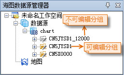

###  使用说明

若用户需修改标准S-57（000 文件）海图数据，但需对该海图数据信息进行修改。将该数据导入到
中后，数据集分组为只读类型，需将其转换为可编辑类型，才可对数据信息进行编辑修改。

###  操作步骤

下面以将 CN5JYSD1_12000 只读海图数据分组转换为可编辑海图数据集分组为例，详细介绍相关操作：

1. 转换为可编辑海图数据集分组需在  的海图编辑模式下进行，若当前工作环境不是海图编辑模式，则需在“开始”选项卡的“海图”组中，单击“切换到海图编辑模式”按钮，将当前工作空间切换至海图编辑模块。
2. 在“海图数据源管理器”中，单击“CN5JYSD1_12000”分组结点右键，选择“生成可编辑海图分组”项，或在“开始”选项卡的“海图数据”组中，单击“分组转换”下拉按钮，选择“生成可编辑海图分组”，弹出“转换可编辑海图分组”对话框。 
3. 单击“目标数据源”右侧下拉按钮，转换成功后的可编辑数据集分组存放于目标数据源中。
4. 单击“特征标识序列”右侧下拉按钮，选择一个特征标识序列，并设置“特征标识区分号”。
5. 单击“确定”按钮即可将该分组转换为可编辑分组，转换成功后目标数据源结点目录下会增加一个CN5JYSD1分组，该海图数据分组即为CN5JYSD1_12000的可编辑数据分组。  

  