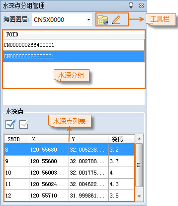
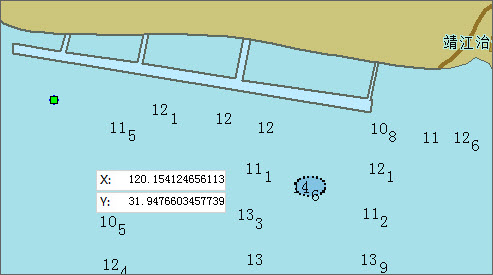

### 使用说明

水深点通常通过追加水深物标数据集得到，将水深点数据追加至可编辑分组中后，将对水深点进行自动分组，即将属性相同（深度除外）的水深点自动划分为一组。对新增的或未分组的水深点进行分组非常必要，以保证将 SuperMap 海图导出为符合 S-57 标准的 S-57 文件（000 文件）。

提供了向一个已有的水深组中添加水深点，或从中删除水深点的功能。

### 操作步骤

1. 在海图编辑模式下，打开可编辑海图分组，单击“地图”选项卡“数据管理”组的“水深管理”按钮，弹出“水深点分组管理”参数面板。该面板中列举了当前海图数据中的水深点分组和每个分组中的水深点信息。  
  
2. 在“图层管理器”中选择“水深”图层，并在“对象操作”选项卡的“对象绘制”组中，单击“点”按钮，将鼠标移至海图中，当鼠标状态变为 时，即可参照海图相关资料，在合适的位置单击鼠标左键，绘制水深点。也可在参数框中输入 X、Y 坐标值作为绘制的点对象位置，按 Enter 键确认绘制。
3. 双击绘制的水深点，或者右键选择“属性”项，打开水深点物标的属性对话框，参照需添加至的水深分组设置其属性，单击“水深点分组管理”面板工具栏处的“水深点分组”按钮，即可将绘制的水深点添加至相应的水深分组中。
4. 重复上述步骤，可绘制多个水深点。绘制完成后，单击鼠标右键结束绘制。选中一个或多个水深点，按 delete 即可将选中水深点删除，或通过右键菜单中的“删除”项删除水深点。  
  
