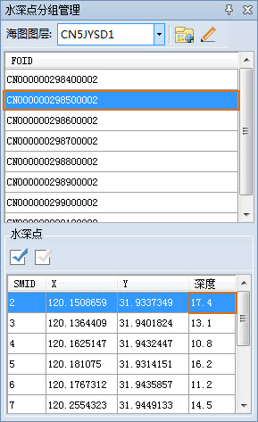
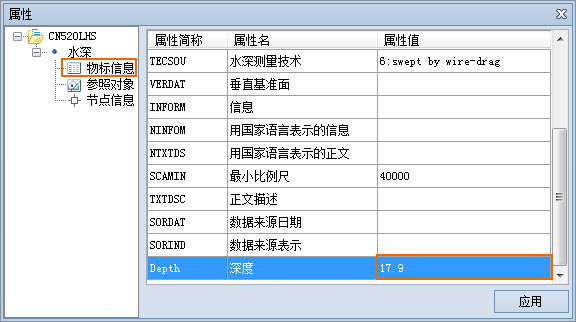

### 使用说明

一个水深组中的水深点对象的水深值有所不同，水深值不能通过编辑分组同样以设置，可通过水深点对象属性编辑深度值，也可在水深点分组管理面板中进行深度值编辑。

### 操作步骤

**方法一：**

  1. 在窗口中打开可编辑海图分组，单击“地图”选项卡“数据管理”组的“水深管理”按钮，弹出“水深点分组管理”参数面板。
  2. 在“水深点分组管理”面板的水深点分组列表中选中某一水深分组，在水深点列表中选中某个水深点，此时，地图窗口会高亮显示该水深点。双击列表中的水深点记录，地图窗口会自动定位到该物标要素的位置，并高亮居中显示。
  3. 单击“深度”列对应的单元格，直接输入水深点对应的深度值即可。  
  

**方法二：**

  1. 在窗口中打开可编辑海图分组，在地图中选中水深点，单击右键选中“属性”项，打开“属性”对话框。
  2. 在对话框左侧的水深树结点下，选择“物标信息”结点，在属性列表中选中“深度”项，单击对应的“属性表”单元格，直接输入水深点的深度值。
  3. 单击“应用”按钮，即可修改水深点的深度值。   
  
